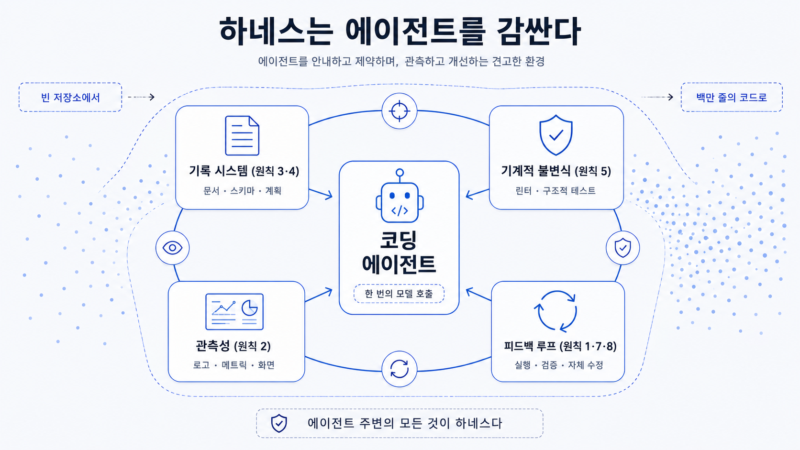

## 이 장에서 배우는 것

이 장을 끝내면 "하네스(harness)"가 무엇이고, 코딩 에이전트의 신뢰성에 어떻게 영향을 주는지 설명할 수 있습니다. 그리고 이 책 전체를 관통할 질문 하나를 손에 쥐게 됩니다.

_"에이전트가 실패할 때, 나는 프롬프트를 수정해야 하는가, 아니면 에이전트가 일하는 환경을 고쳐야 하는가?"_

## 핵심 개념

**하네스란, 코딩 에이전트가 안정적으로 일할 수 있도록 설계된 환경 전체다.** 에이전트가 읽고 의지하는 기록 시스템(문서·스키마·계획), 실수를 빌드 단계에서 막는 기계적 불변식(린터·구조적 테스트), 에이전트가 자기 작업을 직접 검증하게 해주는 관측성, 그리고 실패를 스스로 고치게 하는 피드백 루프까지. 모델이 토큰을 뱉는 그 한 번의 호출은 *에이전트*가 사용하는 모델의 몫입니다. 하지만 그 모델이 기대대로 동작하게 만드는 일은 하네스가 떠맡습니다.

**harness**는 말에게 씌우는 **마구(馬具)**라는 뜻입니다. 마구는 말의 힘 자체를 만들어내지는 않지만, 말의 힘이 엉뚱한 데로 새지 않고 수레를 끄는 방향으로 향하도록 잡아줍니다. 코딩 에이전트가 사용하는 모델이 말이라면, 하네스는 모델의 능력을 원하는 방향으로 제어해주는 마구인 셈입니다. 즉, 모델을 더 똑똑하게 만드는 일이 아니라, 똑똑한 모델이 *제대로 일할 환경*을 만드는 일입니다.

이 책의 토대는 OpenAI가 공개한 **하네스 엔지니어링(Harness Engineering)**(Ryan Lopopolo, 2026) 입니다. OpenAI의 한 팀이 빈 리포지터리에서 시작해 5개월 동안 사람이 코드 한 줄도 직접 작성하지 않고 약 100만 줄짜리 코드로 이루어진 제품을 구축해 내부 베타로 출시하고 실제로 사용했습니다. 모든 코드를 코딩 에이전트(Codex)가 작성했고, 사람이 직접 코드를 작성하는것 대비 약 1/10 시간이 걸렸다고 합니다. 그들이 내린 핵심 명제가 이 책의 출발점입니다.

> **사람이 조종하고, 에이전트가 실행한다(Humans steer, agents execute).**

즉 사람의 일은 더 이상 코드를 작성하는 것이 아니라, **에이전트가 안정적으로 일할 환경을 설계하고, 의도를 명시하고, 피드백 루프를 거는 것**으로 옮겨갑니다. 이 책이 다루는 8원칙은 바로 그 환경, 하네스를 어떻게 설계해야 에이전트가 신뢰할 수 있게 일하는가에 대한 답입니다.

> **8원칙은 OpenAI의 ["하네스 엔지니어링: 에이전트 우선 세계에서 Codex 활용하기"](https://openai.com/ko-KR/index/harness-engineering/)에서 도출했음을 밝혀둡니다.** 원문은 서술형 글이라 원칙을 번호로 매기지 않지만, 이 책의 원문에서 **원칙으로 정의할 수 있는 항목을 선별해** 총 8개의 원칙으로 도출했습니다. 각 원칙은 원문의 글과 매칭됩니다.

## 왜 중요한가

코딩 에이전트를 사용해 간단한 데모를 진행할 땐 항상 문제없는 결과를 만들어냅니다. 게다가 "OO 버그 고쳐줘", "ㅁㅁ 기능 추가해줘"라고 자연어로 요청하면 그럴듯하게 수정 후 PR이 생성됩니다. 문제는 그 다음, 규모와 시간이 더해졌을 때 발생합니다.

특히 잘 구축된 하네스 없이 에이전트에게 코드베이스를 계속 맡기면 이런 일이 벌어집니다:

- 에이전트가 접근할 수 없는 곳(슬랙, 메일, 미팅, 문서)의 결정 사항을 모르기 때문에 매번 다른 가정 위에서 코드를 작성한다
- 거대한 단일 지침 파일은 낡은 규칙들의 무덤이 되고, 에이전트는 무엇이 최신인지 모르게 된다.
- 문서로만 적어둔 규칙은 강제되지 않아, 장시간 자율적으로 실행하게 되면 구조가 점진적으로 무너진다.
- 자기 작업을 검증할 눈(로그·화면·메트릭)이 없어, 에이전트는 고쳤다고 주장하지만 동작을 보장하지 않는다.

이건 모델이 덜 발전해서 벌어지는 일이 아닙니다. OpenAI의 원문 속 표현을 빌리면, 초기 진척이 더딘것은 _"Codex의 역량이 부족해서가 아니라 환경이 제대로 갖춰지지 않았기 때문"_ 입니다. 에이전트가 실패할 때 "더 분발하라"고 프롬프트를 수정하는 대신, 에이전트가 일을 잘하기 위해 "어떤 역량(capability)이 필요한지"를 물어 환경을 고치는 것, 이 전환이 하네스 엔지니어링의 핵심입니다. 간단한 데모를 만들 때 코딩 에이전트를 쓰는 것과 프로덕션 수준의 제품을 만들 때 쓰는 것, 이 둘을 가르는 기준은 모델의 지능이 아니라 그 지능이 일하는 환경의 견고함입니다.

## 하네스에 적용하기

"환경을 설계한다"는 말은 추상적으로 들리지만, 실은 에이전트가 읽고 따를 수 있는 **구체적인 아티팩트**를 리포지터리에 두는 일입니다. 원문이 빈 레포에서 시작해 환경을 갖춰 나간 것을 간략한 구조로 보면 이렇습니다.

| 아티팩트 | 역할 | 원칙 |
|---|---|---|
| `AGENTS.md` | 약 100줄. 백과사전이 아니라 '맵' — 어디에 무엇이 있는지 | 원칙 3 |
| `ARCHITECTURE.md` | 도메인·계층의 최상위 지도 | 원칙 4 |
| `docs/design-docs/` | 핵심 신념·설계 결정 (버전 관리되는 기록 시스템) | 원칙 3 |
| `docs/exec-plans/` | 일급 아티팩트로서의 '실행 계획' | 원칙 3 |
| `docs/tech-debt-tracker.md` | 드리프트를 추적·정리 | 원칙 8 |
| 린터 + 구조적 테스트 | 문서가 아니라 빌드가 규칙을 강제 | 원칙 5 |
| 관측성 (로그·메트릭·화면) | 에이전트가 자기 작업을 직접 검증 | 원칙 2 |

핵심은 코딩 에이전트가 사용자의 요청을 *얼마나 잘 따르냐*가 아니라, 코딩 에이전트가 볼 수 없는 지식을 없애고, 어겨선 안 될 규칙을 기계적으로 막고, 결과를 스스로 확인하게 만든다는 점입니다. 8원칙은 이 환경을 빠짐없이 갖추기 위한 기준이 되는데, 2부에서 한 원칙 씩 자세히 살펴보도록 하겠습니다.

**이 책은 OpenAI의 원문을 바탕으로 정리한 8원칙을 이용해 작성되었습니다. 이 레포가 8원칙의 살아있는 예시입니다.** 진입점은 `CLAUDE.md`, 구조는 `docs/toc.json`, 사실은 `docs/verified-facts.md`, 규칙 강제는 `scripts/verify.py`, 교차검증은 Codex, Claude는 주로 책을 쓰고, 전체적인 조율을 담당했습니다. 4부에서 이 책이 쓰여지는 환경인 하네스를 직접 해부하고 8원칙을 기준으로 평가해 하네스의 성숙도를 L1에서 L5 사이의 값으로 표현해보겠습니다.

> 이 책의 예제는 빈 레포에서 하네스 성숙도 L1에서 시작해 8원칙을 하나씩 적용해가며 에이전트가 안정적으로 일하는 코드베이스(L5)로 키워 가겠습니다. 원문의 "빈 레포 → 100만 줄" 서사를 책의 분량에 맞춰 조절하되 원칙을 이해하고 활용할 수 있게 만드는걸 목표로 하고 있습니다.

## 안티패턴과 함정

- **"프롬프트 수정":** 에이전트가 헤맬 때마다 지침을 수정하는 것. 빠진 것은 보통 프롬프트가 아니라 에이전트가 읽을 문서, 강제할 불변식, 검증할 눈입니다. 실패는 환경을 고치라는 신호입니다(원칙 1·2).
- **거대한 단일 지침 파일:** 모든 규칙을 하나의 거대한 AGENTS.md에 몰아넣는 것. "모든 게 중요하면 아무것도 중요하지 않다"는 말처럼, 에이전트는 의도적 탐색 대신 로컬 패턴 매칭에 빠집니다(원칙 3).
- **문서로만 규칙을 두기:** "이렇게 하세요"라고 적어두고 강제는 안 하는 것. 강제되지 않는 규칙은 자율적으로 동작하는 환경에서는 반드시 깨집니다. 규칙은 린터와 구조적 테스트로 기계적으로 막아야 합니다(원칙 5).
- **눈 없는 에이전트:** 로그, 화면, 메트릭을 에이전트에 노출하지 않은 채 "잘 됐겠지" 하는 것. 검증할 수 없으면 고친 게 아닙니다(원칙 2).

## 핵심 정리 / 체크리스트

- [ ] 하네스 = 코딩 에이전트가 사용자의 요청을 처리해 안정적으로 일하도록 설계한 모델을 제외한 환경 전체(기록 시스템·기계적 불변식·관측성·피드백 루프).
- [ ] 데모와 프로덕션 제품을 가르는 건 모델 지능이 아니라 **환경의 견고함**입니다.
- [ ] 핵심 명제는 **사람이 조종하고, 에이전트가 실행한다**입니다. 사람의 일은 코딩이 아니라 환경 설계로 옮겨가고 있습니다.
- [ ] 에이전트가 실패하면 "프롬프트를 수정할 일인가? 아니면 환경을 개선할 차례인가?"를 묻습니다.
- [ ] 이 책의 8원칙은 OpenAI 하네스 엔지니어링 원문에서 도출한 커리큘럼입니다(원문은 8원칙으로 명시하지 않음).

## 공식 출처

- https://openai.com/index/harness-engineering/
- https://code.claude.com/docs
- https://modelcontextprotocol.io
