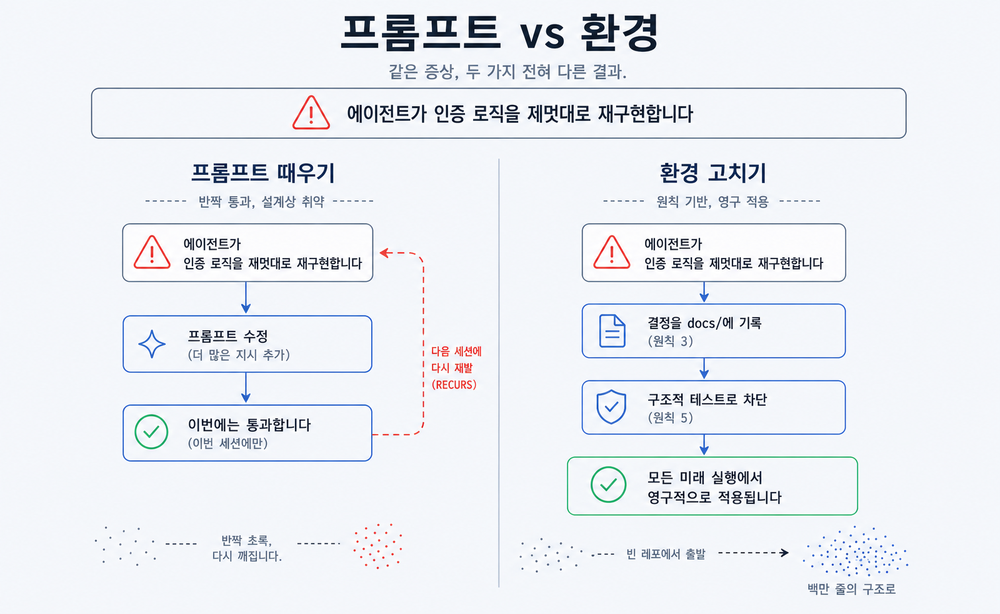

## 이 장에서 배우는 것

이 장을 끝내면 **왜 코딩 에이전트 시대에 "환경 설계"가 "코드 작성"을 대체하는 핵심 기술이 되는지**, 그리고 그 환경을 다루는 분야가 왜 **하네스 엔지니어링**이라 불리는지 설명할 수 있습니다. 1장이 "하네스가 무엇인가"였다면, 이 장은 "왜 하필 지금, 왜 프롬프트가 아니라 환경인가"다. 이 책의 8원칙이 어디서 왔고 어떻게 정직하게 도출됐는지도 짚습니다.

## 핵심 개념

하네스 엔지니어링의 한 줄 명제는 1장에서 본 그대로입니다.

> **사람이 조종하고, 에이전트가 실행한다(Humans steer, agents execute).**
> — OpenAI, *Harness Engineering* (Ryan Lopopolo, 2026)

이 문장이 뒤집는 것은 사람의 일이 무엇인가입니다. 코딩 에이전트의 처리량이 사람의 주의력을 넘어서는 순간, 사람이 코드를 한 줄씩 타이핑하는 것은 더 이상 병목을 푸는 방법이 아닙니다. 정본의 표현을 빌리면, 엔지니어링 팀의 주된 업무가 *"코드 작성에서 벗어나, 환경을 설계하고 의도를 명시하며 에이전트가 안정적으로 작업할 피드백 루프를 구축하는 것"* 으로 옮겨갑니다.

비유하면 이렇다. 한 명의 목수가 직접 톱질하던 작업장이, 수십 대의 자동 절삭기가 도는 공장으로 바뀌었습니다. 이제 사람의 가치는 톱질 솜씨가 아니라 **작업 지시서·치공구·검사 라인을 설계하는 능력**에 있습니다. 기계가 빠르고 지치지 않을수록, 기계가 헛돌지 않게 만드는 환경의 가치가 커집니다. 하네스 엔지니어링은 코딩 에이전트라는 기계를 위한 그 작업장 설계다.

이게 "프롬프트 엔지니어링"과 갈리는 지점입니다. 프롬프트 엔지니어링이 *한 번의 호출*을 잘 빚는 일이라면, 하네스 엔지니어링은 에이전트가 수백 번 일하는 *환경 전체*를 설계하는 시스템 공학입니다. 정본의 실험이 그 규모를 보여줍니다. 빈 git 리포지터리에서 시작해 5개월간 사람이 코드 한 줄도 손으로 쓰지 않고 약 100만 줄을 출시했고, 그 기간 세 명(나중에 일곱 명)의 엔지니어가 약 1,500개의 PR을 다뤘다. 사람은 거의 전적으로 프롬프트로만 시스템과 상호작용했습니다.



## 왜 중요한가

"환경이 아니라 프롬프트를 손보면 되지 않나?"라는 반론이 자연스럽습니다. 이 원칙을 어기는 길, 곧 실패할 때마다 프롬프트를 더 세게 쓰는 길이 어디서 무너지는지가 이 장의 핵심입니다.

정본이 초기에 겪은 일이 정확한 사례입니다. 처음 진척은 예상보다 느렸는데, 그 원인은 *"에이전트의 역량이 부족해서가 아니라 환경이 제대로 갖춰지지 않았기 때문"* 이었습니다. 환경이 부실하면 다음이 무너진다.

- **못 보면 존재하지 않는다.** 결정이 채팅 스레드·구글 독스·사람 머릿속에 있으면, 에이전트에겐 없는 것과 같습니다. 매번 다른 가정 위에서 코드를 짭니다.
- **강제되지 않은 규칙은 깨진다.** "이렇게 하세요"라고 문서에만 적어두면, 무인 장시간 실행 동안 구조가 조용히 드리프트합니다. 문서는 점검할 손잡이가 없습니다.
- **검증할 눈이 없으면 고친 게 아니다.** 로그·화면·메트릭이 에이전트에 노출되지 않으면, 에이전트는 "고쳤다"고 주장하지만 실제 동작은 아무도 모릅니다.
- **"더 분발"은 확장되지 않는다.** 프롬프트를 조이는 것은 한 번의 호출을 달랠 뿐, 같은 실패가 매 실행 반복됩니다. 빠진 *역량*을 환경에 인코딩해야 그 수정이 모든 실행에 한 번에 적용됩니다.

데모와 프로덕션을 가르는 격차가 여기 있습니다. "버그 하나 고쳐줘"는 환경 없이도 됩니다. 하지만 에이전트에게 코드베이스를 장기간·대규모로 맡기는 순간, 환경의 부재가 드리프트·오염·재현 불가로 터집니다. 하네스 엔지니어링은 이 격차를 "더 똑똑한 모델"이 아니라 "더 단단한 환경"으로 메운다.

## 하네스에 적용하기

"환경을 설계한다"를 실천으로 옮기면, 실패를 프롬프트가 아니라 리포지터리의 변경으로 갚는 습관이 됩니다. 에이전트가 헤맬 때의 두 가지 반응을 비교해 보면 분명합니다.

```text
증상: 에이전트가 매번 인증 로직을 제멋대로 다시 구현한다.

[프롬프트로 때우기]                    [환경을 고치기 — 하네스 엔지니어링]
프롬프트에 "인증은 authlib를          docs/design-docs/auth.md 에 결정 기록   (원칙 3)
쓰고 직접 만들지 마"를 추가            + 직접 구현을 막는 구조적 테스트 추가     (원칙 5)
   → 이번 호출만 반짝 통과               → 모든 미래 실행에 영구 적용
   → 다음 세션에서 같은 실수 재발         → 빌드가 위반을 자동 차단
```

왼쪽은 한 번 달래고 끝이지만, 오른쪽은 한 번 인코딩하면 어디에나 한 번에 적용됩니다. 정본의 표현대로 "인간의 취향은 한 번 포착되면 코드의 모든 라인에 지속적으로 반영"됩니다. 이 책의 8원칙은 바로 이 "오른쪽 반응"을 부품별로 체계화한 것이다.

이 책은 그 8원칙을 **OpenAI 정본의 각 절에서 도출**했습니다. 정직하게 밝혀둘 점이 있습니다.

> **정본은 원칙을 번호로 세지 않습니다.** OpenAI의 글은 서술형이라 "N개 원칙"이라는 목록을 제시하지 않습니다. 정본 본문은 11개 절로 이뤄지는데, 이 책의 8원칙은 그중 **원칙을 담은 8개 절을 한 원칙씩 선별·도출**한 *이 책의 커리큘럼*입니다. 나머지 절(실험 도입부·"agent-generated"가 뜻하는 바를 짚는 개념 절·맺음)은 원칙으로 세지 않고 맥락으로만 씁니다. 그러니 "절마다 원칙이 하나씩"인 1:1 매핑은 아닙니다. 그래서 본문은 "정본이 정한 8원칙"이 아니라 **"정본에서 도출한 8원칙"** 으로 부릅니다. 각 원칙은 2부에서 정본의 해당 절을 직접 인용하며 접지합니다.

이 정직성 자체가 하네스 엔지니어링의 태도입니다. 출처가 리포지터리(이 경우 공개된 정본)에 있고, 검증 가능해야 합니다. 이 책의 집필 하네스도 그래서 8원칙·출처를 `docs/verified-facts.md`에 박아두고, 독립 모델(codex)이 정본에 비추어 교차검증합니다.

## 안티패턴과 함정

- **프롬프트 엔지니어링으로 오해하기.** "더 좋은 시스템 프롬프트면 된다"는 한 번의 호출 최적화입니다. 하네스 엔지니어링은 환경·피드백 루프·강제를 다루는 시스템 공학이라 층위가 다릅니다.
- **사람을 루프에서 빼기.** "에이전트가 실행한다"를 "사람은 필요 없다"로 오독하는 것. 정본에서도 사람은 항상 루프에 남아 우선순위를 정하고, 피드백을 수용 기준으로 바꾸고, 결과를 검증합니다. 바뀐 건 추상화 층위지 책임이 아닙니다.
- **정본에 없는 권위 부여하기.** "OpenAI가 정한 8원칙"이라고 단정하는 것. 정본은 번호를 매기지 않으므로 이는 사실 오류입니다. "도출한 8원칙"으로 표기해야 합니다.
- **환경 투자 회피하기.** "지금은 빨리 가야 하니 환경은 나중에"라는 것. 정본은 정반대를 말합니다. 코딩 에이전트에는 *초기 전제 조건*으로 제약이 있어야 속도가 납니다. 환경 부채는 고금리 대출처럼 빠르게 불어납니다.

## 핵심 정리 / 체크리스트

- [ ] 하네스 엔지니어링의 명제: **사람이 조종하고, 에이전트가 실행한다.** 사람의 일은 코딩에서 환경 설계로 옮겨간다.
- [ ] 프롬프트 엔지니어링(한 번의 호출) ≠ 하네스 엔지니어링(환경 전체의 시스템 공학).
- [ ] 실패는 "더 분발"이 아니라 **빠진 역량을 환경에 인코딩**해 갚는다. 한 번 인코딩하면 모든 실행에 적용된다.
- [ ] 데모→프로덕션 격차는 모델 지능이 아니라 **환경의 견고함**이 메운다(규모·시간에서 드러난다).
- [ ] 이 책의 8원칙은 정본을 번호로 옮긴 게 아니라 **정본 절에서 도출한 커리큘럼**이다(정직한 표기: "도출한 8원칙").

## 공식 출처

- https://openai.com/index/harness-engineering/
