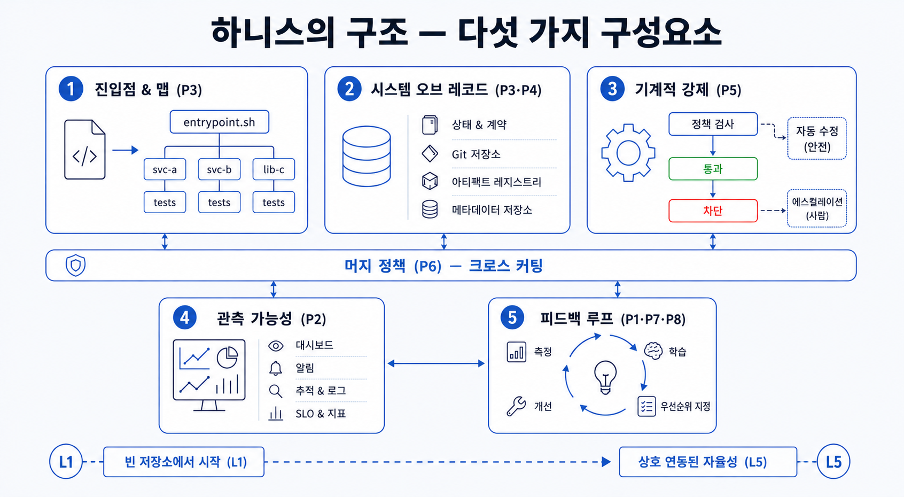

## 이 장에서 배우는 것

이 장을 끝내면 하네스를 다섯 개의 부품으로 분해해서 볼 수 있고, 8원칙이 각각 어디에 위치하는지 알 수 있게 됩니다. 동시에 이 책을 따라하며 성장시킬 **샘플 프로젝트**와 그 성숙도를 재는 스코어카드(L1~L5), 그리고 실습에 쓰는 도구(코딩 에이전트·린터·관측성)를 미리 둘러봅니다. 2장이 "왜 환경을 설계하나"였다면, 이 3장은 "환경이 실제로 어떤 부품으로 되어 있나"를 알아보겠습니다.

## 핵심 개념

1장에서 하네스를 "코딩 에이전트가 안정적으로 일하도록 설계한 환경 전체"라고 뭉뚱그렸습니다. 이제 그 환경을 **다섯 개의 부품**으로 해부합니다. 어떤 에이전트 친화 코드베이스든 결국 이 다섯 개의 부품이 맞물려 일하게 됩니다.

| 부품            | 책임                                          | 원칙                                  |
| --------------- | --------------------------------------------- | ------------------------------------- |
| **진입점과 맵** | 에이전트가 어디서 시작하고 무엇이 어디 있는지 | 3원칙 (기록 시스템 — 맵, not 매뉴얼)  |
| **기록 시스템** | 결정, 계획, 스키마를 프로젝트 저장소에 버전 관리   | 3/4원칙 (기록 시스템·에이전트 가독성) |
| **기계적 강제** | 어겨선 안 될 규칙을 빌드가 막음               | 5원칙 (아키텍처·취향 강제)            |
| **관측성(눈)**  | 에이전트가 자기 작업을 직접 검증              | 2원칙 (애플리케이션 가독성)           |
| **피드백 루프** | 실패를 스스로 재현·수정·정리                  | 1/7/8원칙 (조종/실행·자율 루프·GC)    |

하네스 엔지니어링의 핵심 부품을 공장의 작업 환경과 비교하면 다음과 같습니다. "로봇을 조립한다"라는 한 문장 안에는 작업 지시서(맵), 부품 창고(기록 시스템), 불량을 막는 치공구(기계적 강제), 불량 검사 카메라(관측성), 재작업 라인(피드백 루프)이 따로 돌고 있습니다. 로봇 조립 라인에는 자주 멈추는 취약점이 존재하는데, 하네스가 구축된 환경도 마찬가지로 "에이전트가 코드베이스를 망쳤어요"라는 진단이 아니라 "어느 부품이 취약한가" 로 좁혀야 고칠 수 있습니다.

위 표에는 등장하지 않은 6원칙은 "처리량에 맞춰 병합 방식을 바꾸라"라는 원칙으로 특정 부품이 아니라 부품 전체를 가로지르는 운영 정책에 가깝습니다. 사람이 병목이 될 때 병합 방식을 어떻게 바꿀 수 있는지 3부에서 자세히 살펴보겠습니다.

## 왜 중요한가

에이전트가 자율적으로 실행하다 6시간 뒤 구조를 망가뜨렸다라는 증상을 만났다고 합시다. 에이전트가 실행하는 환경을 AGENTS.md 한 점으로 보는 사람은 경고 문구를 더 적어 넣으며 운에 맡깁니다. 하지만 부품으로 보는 사람은 다르게 묻습니다. **"기록 시스템에 그 결정이 없었나(원칙 3), 기계적 강제가 빠져 규칙이 안 막혔나(원칙 5), 아니면 관측성이 없어 에이전트가 망가진 걸 못 봤나(원칙 2)?"** 증상 하나를 부품별 질문으로 쪼개면, 운에 맡기지 않고, 문제를 진단하고 고칠 수 있는 좋은 출발점이 됩니다.

이런 이유로 이 책은 **장 = 원칙 = 부품의 한 단면**으로 구성했습니다. 2부의 각 장은 추상적인 격언이 아니라, 이 분해도의 한 부품에서 무엇이 어떻게 부족하고, 이를 어떻게 채우는지를 다룹니다.

## 하네스에 적용하기

다섯 부품은 추상적인 개념이 아니라 프로젝트 저장소 안에 위치합니다. 이 책의 샘플 프로젝트를 할 일 관리 API 서버라고 가정하고 이를 빈 레포(`todo-api/`, L1 → L5로 키운다)에서 키운다고 할 때, 프로젝트 저장소에 부품 이름을 달면 아래와 같습니다.

| 경로                         | 부품        | 역할                               |
| ---------------------------- | ----------- | ---------------------------------- |
| `AGENTS.md`                  | 진입점·맵   | 약 100줄, 어디에 무엇이 있는지     |
| `ARCHITECTURE.md`            | 진입점·맵   | 계층·도메인 지도                   |
| `docs/`                      | 기록 시스템 | 결정·실행 계획·스키마 (버전 관리)  |
| `lint/`, `tests/structural/` | 기계적 강제 | 빌드가 규칙을 막음                 |
| `obs/`                       | 관측성      | 로컬 로그·메트릭, 앱 부팅 스킬     |
| `src/`                       | (제품 코드) | 에이전트가 생성·수정하는 제품 코드 |

빈 레포의 `todo-api`는 이 중 `src/` 하나뿐이고 나머지가 비어 있습니다. 성숙도 **L1**입니다. 2부를 지나며 원칙을 하나씩 적용해 부품을 채우면, 같은 프로젝트가 에이전트가 무인으로도 안정적으로 키워 나가는 **L5** 코드베이스가 됩니다. 각 장 끝에서 스코어카드로 점수 변화를 확인합니다.

| 성숙도 | 상태                                                           |
| ------ | -------------------------------------------------------------- |
| **L1** | 진입점·강제·관측성 없음. 에이전트가 매번 다른 가정 위에서 작업 |
| **L3** | 맵과 기록 시스템은 있으나 강제가 부분적, 드리프트 잔존         |
| **L5** | 다섯 부품이 맞물려 에이전트가 무인 장시간 실행에도 안정        |

이 책의 **실습 환경**은 이 부품들을 실제로 만져볼 수 있는 공개 도구로 구성됩니다.

- **코딩 에이전트(OpenAI Codex·Claude Code 등)** — 환경을 갖추면 처리량이 오르는 주체. 사람은 거의 프롬프트로만 상호작용합니다.
- **Claude Agent SDK** — 에이전트 루프·도구 연동(MCP)·세션·권한을 다루는 실습 도구. 공식 문서는 [code.claude.com/docs](https://code.claude.com/docs).
- **MCP(Model Context Protocol)** — 외부 도구·관측성을 에이전트에 꽂는 표준 인터페이스(명세: modelcontextprotocol.io).
- **린터·구조적 테스트** — 기계적 강제 부품의 실물. 규칙을 문서가 아니라 빌드로 막습니다.
- **Codex 교차 검증을 위한 독립 모델** — 검증 부품. 한 모델이 만든 것을 다른 모델이 교차검증하는 모델 다양성 실습에 사용됩니다.

> **자기참조 — 지금 이 책이 실습 환경 위에서 작성되었습니다.** 이 원고는 위 도구들로 만든 하나의 하네스로 집필되었습니다. 진입점은 `CLAUDE.md`, 기록 시스템은 규약·사실 문서, 기계적 강제는 검증 스크립트, 교차검증은 codex가 맡습니다. 다만 이 레포만의 사적인 부품(자체 스크립트·커맨드)은 본문에서 *보조 예시*로만 비추고, 그 전체 해부도와 8원칙 채점은 **4부 케이스 스터디**에서 부품 하나하나 열어 봅니다.

## 안티패턴과 함정

- **부품 하나로 전부 때우기:** AGENTS.md 하나에 규칙·결정·관측 결과를 다 포함하기. AGENTS.md 파일이 지도 역할을 하고, 기록 시스템, 기계적 강제, 관측성을 분리하고 지도 역할을 하는 AGENTS.md 문서가 이를 안내해야 합니다.
- **실습 도구를 마법 상자로 쓰기:** 코딩 에이전트를 "알아서 다 해주는 것"으로 받아들이면 1장의 프롬프트로 때우는 함정으로 빠지게 됩니다. 이 책은 도구를 쓰면서도 부품을 직접 갖추는 법을 가르칩니다.
- **검증 부품을 생략하기:** 같은 모델을 통해 한번 더 물은 뒤, 검증됐다라고 착각하는 것. 같은 모델은 같은 실수를 합니다. 교차검증의 핵심은 **다른 모델**을 사용해 검증의 독립성을 지키는 것입니다.

## 핵심 정리 / 체크리스트

- [ ] 하네스는 다섯 부품으로 분해됩니다: **진입점·맵 · 기록 시스템 · 기계적 강제 · 관측성 · 피드백 루프.**
- [ ] 8원칙은 이 부품들에 흩어져 산다(예: 3→기록 시스템, 5→기계적 강제, 2→관측성). 원칙 6은 부품을 가로지르는 운영 정책입니다.
- [ ] "에이전트가 망쳤다"가 아니라 **"어느 부품이 부족한가"** 로 디버깅합니다.
- [ ] 샘플 프로젝트를 **L1에서 시작해 L5로 키우며** 매 장에서 스코어카드로 성숙도를 검사합니다.

## 공식 출처

- https://openai.com/index/harness-engineering/
- https://code.claude.com/docs
