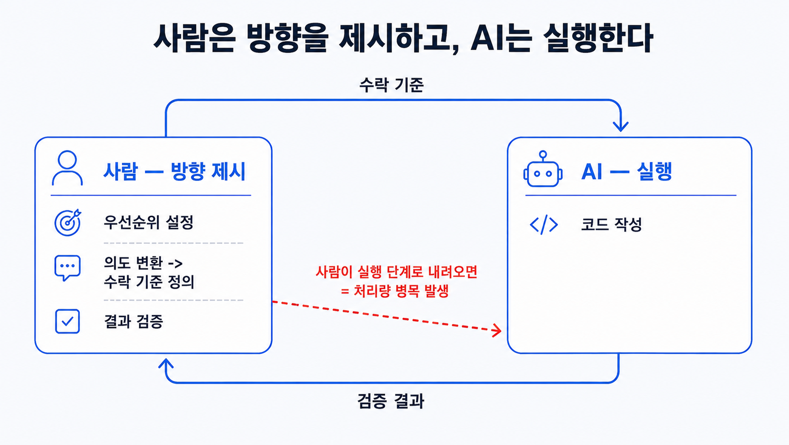

## 이 장에서 배우는 것

이 장을 끝내면 **코딩 에이전트와 일할 때 "사람의 일"이 어떻게 바뀌는지** 구체적으로 말할 수 있습니다. 직접 코드를 작성하는 대신, 의도를 해석하고 환경을 설계해가며 결과를 검증하는 조종사의 자리로 옮겨가는 법을 배웁니다. 그리고 샘플 프로젝트 `todo-api`의 첫 기능을 이 방식으로 시작해, 하네스 성숙도가 L1에서 어떻게 올라가는지 봅니다. 이 장은 8원칙의 첫 원칙이자 나머지 일곱 원칙이 서는 토대입니다.

## 핵심 개념

**원칙 1 — 사람이 조종하고, 에이전트가 실행한다(Humans steer, agents execute).** 원문 설명을 그대로 옮기면 한 줄로 **사람은 무엇을, 왜를 해석하고, 코드 작성은 에이전트에게 맡긴다.**

> "사람은 거의 전적으로 프롬프트를 통해 시스템과 상호작용합니다."
> — OpenAI, _Harness Engineering_ (§ 엔지니어의 역할 재정의)

OpenAI에서 발행한 아티클 속 팀은 5개월간 코드를 한 줄도 손으로 작성하지 않았습니다. 그렇다고 해서 사람이 사라진 게 아닙니다. 사람의 역할이 위로 올라갔습니다. 원문의 표현을 빌리면, 사람은 항상 루프에 남아 **업무를 우선시하고, 사용자 피드백을 수용 가능한 기준으로 바꾸며, 결과를 검증**합니다. 바뀐 것은 추상화의 계층이지 책임이 아닙니다.

비유하면 **택시 기사에서 관제사로**의 이동입니다. 예전엔 사람이 직접 운전대를 잡았습니다. 개발자가 코드를 직접 작성했습니다. 하지만 이제는 관제실에 앉아 동시 다발적으로 움직이는 수십 대의 택시에 **목적지와 우선순위를 정하고, 경로가 막히면 신호 체계를 고칩니다.** 관제사가 차 한 대를 직접 몰려고 내려가는 순간 나머지 수십 대가 멈춥니다. 조종의 가치는 운전을 안 하는 데 있습니다.

여기에서 "조종"을 세 가지 구체적 행위로 분리할 수 있습니다.

- **우선순위 정하기** — 무엇을 먼저, 무엇은 나중에
- **의도를 수용 가능한 기준으로 해석하기** — "OO 기능이 잘 되게 해줘"가 아니라 "이 네 경로의 응답이 2초를 넘지 않게 처리해줘"처럼 검증 가능한 조건으로
- **결과 검증하기** — 에이전트가 "됐다"고 할 때 정말 됐는지 확인(이건 원칙 2 "애플리케이션을 에이전트가 읽게 하라"로 이어집니다. 검증의 눈이 거기서 나옵니다).



## 왜 중요한가

이 원칙을 어기는 가장 흔한 길은 **사람이 실행으로 다시 내려가는 것**입니다. 에이전트가 헤매면 답답해서 직접 코드를 작성하거나, 반복되는 실패를 일회성 프롬프트 패치로 덮게 됩니다. 직접 코딩은 실행으로 내려가는 것이고, 일회성 프롬프트 패치는 하네스에 남지 않는 임시 처방입니다.

원문이 정확히 그 함정을 지적합니다. 프로젝트 초기에 진행이 느렸을 때, **"사용자의 요청이 실패했을 때 프롬프트 때우기로는 문제를 해결할 수 없었다"** 는 것입니다. 진전을 낸 유일한 방법은 매번 이렇게 묻는 것이었습니다 **"어떤 부품이 누락되어 있으며, 에이전트가 읽기 쉽고 실행 가능하게 만들려면 어떻게 해야 할까?"**

조종을 포기하고 실행으로 내려가면 무엇이 무너지는지는 분명합니다.

- **사람이 병목이 된다.** 에이전트 처리량은 사람이 직접 작성하는 코드의 속도에 묶이고, 도입한 자동화가 무의미해진다.
- **같은 실패가 반복된다.** 직접 고친 한 줄은 이번 한 번만 고쳐질 뿐, 다음 세션의 에이전트는 같은 실수를 반복한다. 수정이 환경에 남지 않기 때문이다.
- **검증이 사라진다.** 사람이 코드 디테일에 매몰되면, 정작 "이게 맞는 결과인가"를 보는 눈이 사라진다.

프로덕션이 아닌 데모 프로젝트라면 문제가 생길 때 코드를 직접 작성해도 됩니다. 한 번의 데모에서만 잘 동작하면 되기 때문입니다. 하지만 에이전트가 수백 번 일하는 규모에서는, 사람이 실행에 끼면 사람의 처리량이 생산성의 천장이 됩니다.

## 하네스에 적용하기

샘플 프로젝트 `todo-api`의 첫 기능, "할 일 생성 엔드포인트"를 만든다고 합시다. **L1**(빈 레포)에서 사람은 보통 이렇게 시작합니다.

```text
[실행자 모드 — 안티패턴]
사람이 직접 POST /todos 핸들러를 타이핑한다.
   → 에이전트는 자동완성 도구로만 쓰인다.
   → 사람 속도가 곧 프로젝트 속도. L1에 머문다.
```

원칙 1을 적용하면, 사람은 코드가 아니라 **수용 가능한 기준**을 작성합니다. 에이전트가 그걸 읽고 실행합니다.

```text
[조종자 모드 — 원칙 1]
docs/exec-plans/active/create-todo.md
─────────────────────────────────────
## 의도
할 일을 생성하는 API. 빈 제목은 거부.

## 수용 가능한 기준 (검증 가능)
- [ ] POST /todos {title} → 201 + 생성된 id 반환
- [ ] title이 빈 문자열/공백 → 400, 상태 변경 없이 거부
- [ ] 응답 p95 < 200ms
- [ ] 통합 테스트가 위 셋을 커버

→ 에이전트가 이 계획을 받아 구현·테스트·PR을 연다.
→ 사람은 수용 가능한 기준의 충족 여부만 검증한다(통과/반려).
```

핵심은 `## 수용 가능한 기준`이 **검증 가능한 조건**이라는 점입니다. "잘 만들어줘"는 검증할 수 없지만, "빈 제목 → 400"은 검증 가능합니다. 사람은 이 기준으로 결과를 통과시키거나 반려할 뿐, 구현 디테일에 내려가지 않습니다. 원문이 PR을 완성하는 방식이 이 루프입니다. 에이전트에게 자기 변경을 검토하게 하고, 에이전트 검토자들이 모두 만족할 때까지 반복합니다(원문은 이를 "사실상 Ralph Wiggum Loop"라 부릅니다).

> **자기참조 — 이 책의 집필이 그 루프입니다.** 저자는 "원칙 1 장을 써줘"라고 *조종*하고, 수용 기준은 `docs/conventions.md`의 템플릿과 4중 게이트입니다. 실행(문장 쓰기)은 모델이, 검증(사실·문체)은 codex와 humanize 게이트가 맡습니다. 저자가 문장을 직접 고쳐 쓰기 시작하면 그게 바로 "실행자 모드로 추락"입니다.

**스코어카드 — 이 원칙을 적용하면:**

| 항목             | 적용 전(L1)      | 적용 후                          |
| ---------------- | ---------------- | -------------------------------- |
| 사람의 입력      | 코드 타이핑      | 수용 기준 작성                   |
| 프로젝트 속도    | 사람 손코딩 속도 | 에이전트 처리량                  |
| 첫 기능의 결과물 | 핸들러 코드      | 핸들러 + 통합 테스트 + 검증된 PR |

성숙도는 아직 L1에서 크게 못 벗어납니다. 조종의 *습관*은 잡혔지만, 에이전트가 읽을 환경(기록 시스템·강제·관측성)이 비어 있기 때문입니다. 그걸 원칙 2부터 하나씩 채웁니다.

## 안티패턴과 함정

- **답답해서 직접 고치기.** 에이전트가 두 번 헤매면 사람이 키보드를 뺏는 것. 한 번은 빠를지 몰라도 수정이 환경에 남지 않아 같은 실패가 재발합니다. 직접 고치고 싶을 땐 "이 수정을 어떻게 환경에 인코딩할까"를 먼저 물으세요.
- **수용 기준 없이 시키기.** "할 일 API 만들어줘"처럼 검증 불가능한 지시. 무엇이 "완료"인지 정의되지 않으면 검증할 수 없고, 검증할 수 없으면 조종이 아니라 방치입니다.
- **사람을 루프에서 빼기.** 반대 극단입니다. "에이전트가 알아서 다 한다"며 검증·우선순위까지 놓는 것. 원문에서도 사람은 항상 루프에 남습니다. 자동화되는 건 실행이지 판단이 아닙니다.
- **프롬프트로만 조종하려 하기.** 같은 지시를 매번 프롬프트에 길게 적는 것. 반복되는 의도는 프롬프트가 아니라 `docs/`의 수용 기준·계획으로 *기록*해야 다음 실행에도 남습니다(원칙 3).

## 핵심 정리 / 체크리스트

- [ ] 원칙 1 = **사람이 조종, 에이전트가 실행.** 사람의 일은 우선순위·수용 기준·검증으로 옮겨간다.
- [ ] "조종"은 세 가지다: 우선순위 정하기 · 의도를 **검증 가능한 수용 기준**으로 번역하기 · 결과 검증하기.
- [ ] 실패할 때 직접 고치는 것은 **실행으로의 추락**이고, 일회성 프롬프트 패치는 환경에 남지 않는다. "어떤 역량이 빠졌나"를 물어라.
- [ ] 사람은 자동화 뒤에도 **항상 루프에 남는다.** 자동화되는 건 실행이지 판단이 아니다.
- [ ] 반복되는 의도는 프롬프트가 아니라 `docs/`에 기록한다(→ 원칙 3으로 이어짐).

## 공식 출처

- https://openai.com/index/harness-engineering/
