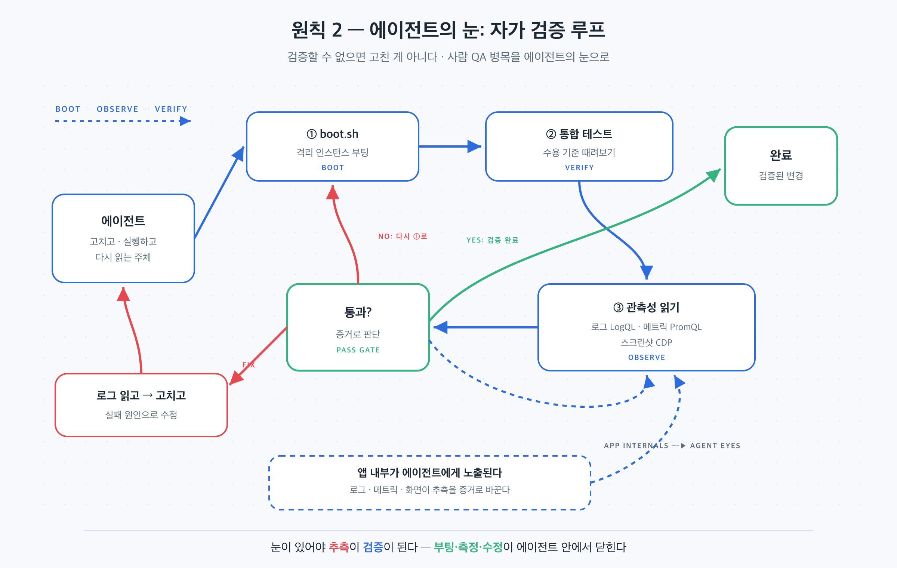

## 이 장에서 배우는 것

이 장을 끝내면 에이전트가 자기 작업을 스스로 검증할 수 있게 "눈"을 달아주는 법을 압니다. 앱을 띄워 보고, 로그·메트릭을 쿼리하고, 화면을 캡처해 읽는 능력을 에이전트에게 주는 것입니다. 샘플 프로젝트 `todo-api`에 이 눈을 달아, 1장의 사람 QA 병목을 어떻게 없애는지 봅니다. 원칙 1에서 *검증*이 사람의 몫이었다면, 이 원칙은 그 검증의 *눈을 에이전트에게도 준다*는 이야기입니다.

## 핵심 개념

**원칙 2 — 애플리케이션을 에이전트가 읽게 하라(Make the application legible to agents).** 한 줄로: *에이전트가 자기가 만든 것을 직접 실행·관찰·검증할 수 있도록, 앱의 동작을 에이전트가 읽을 수 있는 형태로 노출한다.* 정본이 이 원칙에 다다른 계기는 병목이었습니다.

> "코드 처리량이 증가하면서, 인적 QA 역량에 병목 현상이 발생했습니다."
> — OpenAI, *Harness Engineering* (§ 애플리케이션의 가독성 향상)

에이전트가 코드를 빠르게 쏟아내도, 그게 *진짜 동작하는지* 사람이 일일이 확인해야 한다면 사람이 병목입니다. 해법은 사람을 갈아넣는 게 아니라, 에이전트가 스스로 보게 만드는 것이었습니다. 정본의 팀은 변경마다 git worktree별로 앱을 부팅해 에이전트가 인스턴스를 직접 띄우게 했고, Chrome DevTools Protocol을 런타임에 연결해 DOM 스냅샷·스크린샷·탐색 스킬을 줬습니다. 이를 통해 *"Codex는 버그를 재현하고, 수정사항을 검증하며, UI 동작에 대해 직접 추론"* 할 수 있었습니다.

비유하면 눈을 가린 채 요리하던 주방에 불을 켜는 것입니다. 눈을 가리면 간을 보지 못해 매번 다른 사람(QA)이 맛을 봐줘야 합니다. 불을 켜고 직접 맛보게 하면, 요리사 스스로 짠지 싱거운지 알고 고칩니다. 에이전트에게 "눈"이란 앱을 띄워 보고, 로그·메트릭을 읽고, 화면을 캡처해 확인하는 능력입니다.

핵심 통찰 하나. *검증할 수 없으면 고친 게 아닙니다.* 에이전트가 "고쳤다"고 말해도, 직접 띄워서 확인하지 못하면 그건 추측입니다. 눈이 있어야 "추측"이 "검증"이 됩니다.



## 왜 중요한가

이 원칙을 어기면 에이전트는 장님으로 일합니다. 코드는 쓰지만 결과를 못 봅니다. 데모에서는 사람이 대신 봐주니 티가 안 나지만, 규모가 커지면 무너지는 곳이 분명합니다.

- **QA가 사람 손에 묶인다.** 모든 변경을 사람이 띄워 확인해야 하면, 처리량은 사람이 클릭하는 속도에 갇힌다. 에이전트를 늘려도 소용없다.
- **"고쳤다"를 믿을 수 없다.** 눈 없는 에이전트는 자기 수정이 동작하는지 모른 채 PR을 연다. 검증은 전부 하류로(사람·프로덕션) 떠넘겨진다.
- **무인 장시간 실행이 불가능하다.** 정본은 한 번의 실행이 6시간 이상, 종종 사람이 자는 동안 돈다고 했습니다. 에이전트가 스스로 보고 고치지 못하면, 사람이 깨어 있어야만 일이 됩니다.

정본 팀은 눈이 생기자 무엇이 가능해지는지 직접 보여줬습니다. 로그·메트릭이 노출되니 *"서비스 시작이 800ms 이내에 완료"* 되도록, *"이 네 가지 핵심 사용자 여정에서 어떤 스팬도 2초를 초과하지 않도록"* 같은 프롬프트가 다루기 쉬워졌습니다. 검증 가능한 목표를 던지면, 눈 달린 에이전트가 알아서 측정하고 맞춥니다.

## 하네스에 적용하기

`todo-api`에 눈을 답니다. 원칙 1에서 쓴 수용 기준("빈 제목 → 400", "p95 < 200ms")을 에이전트가 *스스로 판정*하려면, 다음 세 가지가 노출돼야 합니다.

```text
todo-api/obs/                  # [관측성 부품] 에이전트의 눈
├── boot.sh           # 변경마다 격리 인스턴스 부팅 (worktree별)
├── logs/             # 구조화 로그 — 에이전트가 쿼리 (예: LogQL)
└── metrics/          # p95·에러율 — 에이전트가 쿼리 (예: PromQL)

에이전트 루프(의사):
  boot.sh                         # 1) 내 변경으로 앱을 띄운다
  run integration tests           # 2) 수용 기준을 실제로 때려본다
  query metrics "p95 < 200ms?"    # 3) 눈으로 결과를 읽는다
  if 실패: 로그를 읽고 → 고치고 → 1)로            # 사람 없이 자가 수정
```

여기서 결정적인 변화는 검증 루프가 에이전트 안에서 닫힌다는 점입니다. 원칙 1에서는 사람이 "통과/반려"를 눌렀지만, 이제 에이전트가 부팅·테스트·측정·수정을 스스로 돌립니다. 사람은 여전히 최종 수용 기준을 *정하지만*, 매 반복을 지켜볼 필요가 없습니다. UI가 있다면 스크린샷을, API라면 로그·메트릭을, 무엇이든 에이전트가 *읽을 수 있는 형태*로 두는 게 이 원칙의 전부입니다.

> **자기참조 — 이 책에도 눈이 있습니다.** 원고가 "동작하는지"는 `scripts/verify.py`(규약·링크·denylist)와 다이어그램 렌더 PNG로 확인합니다. 저자가 일일이 눈으로 훑는 대신, 검증 스크립트가 에이전트의 눈이 되어 "이 원고가 규약을 통과하는가"를 기계적으로 읽어줍니다. 스크린샷이 필요한 화면은 캡처해 `assets/`에 둡니다.

**스코어카드 — 이 원칙을 적용하면:**

| 항목 | 적용 전(L1) | 적용 후 |
|---|---|---|
| 검증 주체 | 사람이 직접 띄워 확인 | 에이전트가 스스로 부팅·측정 |
| QA 병목 | 사람 클릭 속도 | 대폭 완화(에이전트 자가 검증, 사람은 기준만) |
| 무인 실행 | 불가(사람이 깨어 있어야) | 가능(자가 수정 루프) |

성숙도가 L1에서 한 칸 올라갑니다. 에이전트가 *스스로 보고 고칠* 수 있게 됐기 때문입니다. 다만 아직 "무엇을 어떻게 보라"는 지식이 흩어져 있습니다. 그 지식을 리포지터리에 모으는 게 원칙 3입니다.

## 안티패턴과 함정

- **사람을 QA로 계속 쓰기.** "에이전트가 짜면 내가 띄워서 확인하지"가 기본값이 되는 것. 이건 처리량을 사람 속도에 묶는 가장 흔한 병목입니다. 사람이 보는 것을 *에이전트도 보게* 만드세요.
- **로그를 사람만 읽는 곳에 두기.** 메트릭 대시보드가 사람용 웹 UI에만 있고 에이전트가 쿼리할 길이 없는 것. 에이전트가 `LogQL`/`PromQL` 같은 *쿼리 가능한* 형태로 읽을 수 있어야 눈입니다.
- **검증 없이 "고쳤다" 받기.** 에이전트가 앱을 띄워 확인하지 않은 수정을 그대로 병합하는 것. 눈 없는 수정은 추측이고, 추측은 프로덕션에서 깨집니다.
- **눈을 너무 비싸게 만들기.** 변경마다 전체 환경을 무겁게 띄워 한 번 검증에 수십 분이 걸리면 루프가 안 돕니다. 정본처럼 worktree별 *격리·경량* 인스턴스로, 끝나면 로그·메트릭을 버리는 일회성으로 둡니다.

## 핵심 정리 / 체크리스트

- [ ] 원칙 2 = **애플리케이션을 에이전트가 읽게 하라.** 에이전트가 자기 작업을 직접 실행·관찰·검증하게 만든다.
- [ ] 사람 QA가 병목이면, 사람을 갈지 말고 **에이전트에게 눈**을 줘라(앱 부팅·로그·메트릭·화면).
- [ ] 눈은 **쿼리 가능한 형태**여야 한다(LogQL/PromQL처럼). 사람만 보는 대시보드는 에이전트의 눈이 아니다.
- [ ] 검증 루프가 에이전트 안에서 닫히면 **무인 장시간 실행**이 가능해진다.
- [ ] 검증할 수 없으면 고친 게 아니다 — "고쳤다"는 띄워서 확인한 뒤에만 참이다.

## 공식 출처

- https://openai.com/index/harness-engineering/
