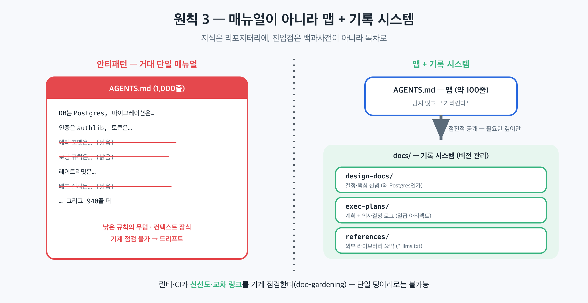

## 이 장에서 배우는 것

이 장을 끝내면 **에이전트에게 줄 지식을 "거대한 매뉴얼" 대신 "맵 + 기록 시스템"으로 구성하는 법**을 압니다. 짧은 진입점(맵)과 구조화된 `docs/`(기록 시스템), 그리고 일급 아티팩트로서의 계획이 어떻게 맞물리는지 보고, 샘플 프로젝트 `todo-api`의 지식을 프롬프트와 사람 머릿속에서 리포지터리로 옮깁니다. 원칙 2가 "에이전트에게 눈을 줬다"면, 이 원칙은 그 눈으로 *읽을 지식을 어디에 어떻게 둘 것인가*다.

## 핵심 개념

**원칙 3 — 리포지터리 지식을 기록 시스템으로(Repository knowledge as a system of record).** 한 줄로: *에이전트가 의지할 지식을 버전 관리되는 리포지터리 아티팩트로 두되, 백과사전이 아니라 목차(맵)로 구성한다.* 정본이 먼저 시도한 것은 정반대였습니다.

> "Codex에 1,000페이지의 설명서가 아닌 맵을 제공해야 한다."
> — OpenAI, *Harness Engineering* (§ 리포지터리 지식을 기록 시스템으로 만듦)

정본의 팀은 처음에 "하나의 큰 `AGENTS.md`"를 시도했다가 예측 가능하게 실패했습니다. 정본이 든 실패 이유가 그대로 이 원칙의 근거입니다.

- **컨텍스트는 희소 자원이다.** 거대한 지침 파일이 작업·코드·관련 문서를 밀어내, 에이전트가 핵심 제약을 놓치거나 엉뚱한 제약에 최적화한다.
- **지침이 너무 많으면 지침이 안 된다.** 모든 게 "중요"하면 중요한 건 아무것도 없다. 에이전트는 의도적 탐색 대신 로컬 패턴 매칭에 빠진다.
- **순식간에 망가진다.** 획일적 거대 매뉴얼은 낡은 규칙들의 무덤이 된다. 무엇이 아직 사실인지 알 수 없고, 아무도 유지하지 않는다.
- **확인하기 어렵다.** 단일 덩어리는 기계적 점검(커버리지·신선도·소유권·교차 링크)에 부적합해 드리프트가 불가피하다.

그래서 정본은 `AGENTS.md`를 **백과사전이 아니라 목차로** 취급합니다. 짧은 `AGENTS.md`(약 100줄)는 컨텍스트에 삽입되어 *맵* 역할을 하고, 더 깊고 신뢰할 수 있는 정보는 구조화된 `docs/`에 둔다. 이 `docs/`가 **기록 시스템(system of record)** 이다.

비유하면 **백과사전과 도서관 안내도**의 차이입니다. 1,000페이지 백과사전을 통째로 머리에 넣으라고 하면 아무도 못 한다. 대신 "3층 동쪽에 결제 관련 자료가 있다"는 *안내도*를 주면, 필요할 때 그 서가로 걸어갑니다. 맵은 모든 걸 담지 않는다. *어디에 무엇이 있는지*만 담습니다.

여기에 두 가지가 따라옵니다.

- **계획을 일급 아티팩트로.** 복잡한 작업은 진행 상황·의사결정 로그와 함께 실행 계획(execution plans, active/completed로 구분)에 담겨 리포지터리에 버전 관리됩니다. 에이전트가 외부 상황 없이도 작업할 수 있게.
- **점진적 공개(progressive disclosure).** 에이전트는 작고 안정적인 진입점에서 시작해, 맵을 따라 필요한 깊이로 들어갑니다. 처음부터 모든 걸 떠안지 않습니다.



## 왜 중요한가

이 원칙을 어기는 길은 둘입니다. **지식을 한 파일에 몰아넣거나(거대 매뉴얼), 아예 리포지터리 밖에 두는 것(채팅·머릿속).** 둘 다 규모에서 무너집니다.

- **거대 매뉴얼**은 위 네 가지(컨텍스트 잠식·지침 무력화·드리프트·점검 불가)로 무너진다. 데모에서는 한 페이지로 충분하지만, 지식이 쌓일수록 그 페이지가 무덤이 된다.
- **리포지터리 밖 지식**은 더 조용히 무너진다. 정본의 표현대로, *에이전트가 검색할 수 없는 지식은 3개월 뒤 입사한 신입이 알 수 없는 것과 같다.* Slack에서 합의한 아키텍처 패턴은, 리포지터리에 적히지 않으면 에이전트에겐 존재하지 않는다(이건 원칙 4로 더 깊이 이어집니다).

핵심은 **점검 가능성**입니다. 지식이 구조화된 `docs/`에 흩어져 있으면, 전용 린터와 CI가 "이 문서가 최신인가, 교차 링크가 멀쩡한가, 코드 동작과 일치하는가"를 *기계적으로* 검사할 수 있다. 정본은 반복 실행되는 "doc-gardening" 에이전트가 낡은 문서를 찾아 수정 PR을 연다고 했습니다. 단일 덩어리로는 이게 불가능하다.

## 하네스에 적용하기

`todo-api`의 지식을 옮깁니다. 흔한 출발점은 모든 규칙이 프롬프트나 한 파일에 있는 상태입니다.

```text
[안티패턴] 거대 AGENTS.md 또는 프롬프트
  - DB는 Postgres, 마이그레이션은 ... (300줄)
  - 인증은 ..., 에러 포맷은 ..., 로깅은 ...
  → 컨텍스트를 잠식하고, 낡으면 무덤이 된다.
```

원칙 3을 적용하면 **맵 + 기록 시스템**으로 쪼갭니다.

```text
todo-api/
├── AGENTS.md              # 맵 (약 100줄): "어디에 무엇이 있나"만
├── docs/                  # 기록 시스템 (버전 관리)
│   ├── design-docs/       #   결정·핵심 신념 (왜 Postgres인가)
│   ├── exec-plans/
│   │   ├── active/        #   진행 중 계획 + 의사결정 로그
│   │   ├── completed/
│   │   └── tech-debt-tracker.md
│   ├── product-specs/     #   무엇을 만드나
│   └── references/        #   외부 라이브러리 요약(*-llms.txt)
└── src/
```

`AGENTS.md`는 "DB 결정은 `docs/design-docs/db.md`, 진행 중 작업은 `docs/exec-plans/active/`"라고 *가리킬* 뿐, 내용을 품지 않습니다. 에이전트는 할 일 생성 기능을 만들 때 맵을 보고 `exec-plans/active/create-todo.md`(원칙 1에서 쓴 그 계획)로 걸어 들어갑니다. 필요한 깊이만, 필요할 때.

> **자기참조 — 이 책이 바로 이 구조입니다.** `CLAUDE.md`가 맵(약 100줄, "구조는 `docs/toc.json`, 사실은 `docs/verified-facts.md`")이고, 실제 지식은 구조화된 `docs/`에 삽니다 — `toc.json`(구조 SoT), `verified-facts.md`(사실 SoT), `conventions.md`(규약), `adr/`(결정 로그). 각 원고의 진행 상태는 front-matter에 버전 관리됩니다. 그리고 `verify.py`가 front-matter·링크·금지표현이 규약과 일치하는지 기계적으로 점검합니다. 정본의 doc-gardening처럼 낡은 문서를 *자동으로 보수*하는 단계까지는 아니지만, 같은 결의 기계 점검입니다.

**스코어카드 — 이 원칙을 적용하면:**

| 항목 | 적용 전 | 적용 후 |
|---|---|---|
| 지식 위치 | 프롬프트·한 파일·머릿속 | 버전 관리되는 `docs/` 기록 시스템 |
| 진입 비용 | 1,000줄을 다 읽어야 | 맵에서 필요한 깊이로 점진 진입 |
| 점검 | 불가(단일 덩어리) | 린터·CI가 신선도·링크 기계 점검 |

성숙도가 한 칸 더 오릅니다. 에이전트가 의지할 지식이 *리포지터리에* 생겼고, 점검까지 가능해졌기 때문이다. 다만 "리포지터리에 둔다"의 더 근본적인 함의, 곧 *에이전트가 못 보면 존재하지 않는다*는 점은 원칙 4에서 끝까지 밀어붙입니다.

## 안티패턴과 함정

- **거대 AGENTS.md.** 모든 규칙을 진입점 한 파일에 쌓는 것. 컨텍스트를 잠식하고 낡으면 무덤이 됩니다. 진입점은 *맵*(가리키기)이지 백과사전(담기)이 아닙니다.
- **리포지터리 밖 지식.** 결정을 Slack·구글 독스·머릿속에 두는 것. 에이전트가 검색할 수 없으면 없는 것입니다. 합의가 났으면 `docs/`에 적으세요.
- **계획을 휘발시키기.** 복잡한 작업을 프롬프트로만 지시하고 끝내는 것. 의사결정 로그와 함께 실행 계획(execution plans)으로 버전 관리해야 다음 실행이 이어받습니다.
- **점검 없는 문서.** `docs/`를 만들고 방치하는 것. 신선도·교차 링크를 린터/CI로 점검하지 않으면, 구조화했어도 드리프트는 똑같이 옵니다.

## 핵심 정리 / 체크리스트

- [ ] 원칙 3 = **리포지터리 지식을 기록 시스템으로.** 단 진입점은 백과사전이 아니라 **맵(약 100줄)**.
- [ ] 거대 단일 매뉴얼은 4가지로 무너진다: 컨텍스트 잠식 · 지침 무력화 · 드리프트(무덤) · 점검 불가.
- [ ] 지식은 구조화된 `docs/`에, **계획은 일급 아티팩트(실행 계획, execution plans)** 로 버전 관리한다.
- [ ] 에이전트는 맵에서 **점진적으로** 필요한 깊이로 들어간다.
- [ ] 구조화하면 린터·CI로 **신선도·링크를 기계 점검**할 수 있다(doc-gardening).

## 공식 출처

- https://openai.com/index/harness-engineering/
