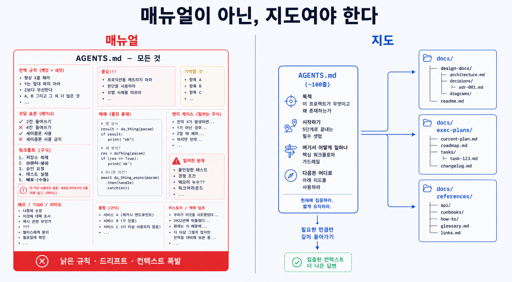

## 이 장에서 배우는 것

이 장을 끝내면 **에이전트에게 전달할 지식을 "거대한 매뉴얼" 대신 "맵 + 기록 시스템"으로 구성하는 법**을 알게 됩니다. 맵 역할을 하는 `CLAUDE.md`와 같은 짧은 진입점과 구조화된 `docs/`(기록 시스템), 그리고 일급 아티팩트로서의 계획이 어떻게 맞물리는지 보고, 샘플 프로젝트 `todo-api` 개발을 위한 지식을 프롬프트와 사람 머릿속에서 리포지터리로 옮겨 봅시다. 원칙 2가 "에이전트에게 눈을 줬다"면, 이번 장에서 살펴볼 원칙 3은 에이전트에게 주어진 눈으로 **읽을 지식을 어디에 어떻게 둘 것인가**입니다.

## 핵심 개념

**원칙 3 — 리포지터리 지식을 기록 시스템으로(Repository knowledge as a system of record).** 한 줄로: **에이전트가 의지할 지식을 버전 관리되는 리포지터리 아티팩트로 두되, 백과사전이 아니라 목차로 구성한다.**

> "Codex에 1,000페이지의 설명서가 아닌 맵을 제공해야 한다."
> — OpenAI, _Harness Engineering_ (§ 리포지터리 지식을 기록 시스템으로 만듦)

원문의 팀은 처음에 "하나의 큰 `AGENTS.md`"를 시도했다가 실패했습니다. OpenAI 팀이 먼저 시도한 것은 원칙 3과 정반대였습니다. 이 실패 경험이 원칙 3의 근거가 됐습니다.

- **컨텍스트는 희소 자원이다.** 거대한 지침 파일이 작업·코드·관련 문서를 밀어내, 에이전트가 핵심 제약을 놓치거나 엉뚱한 제약에 최적화한다.
- **지침이 너무 많으면 지침이 적용이 안 된다.** 모든 게 "중요"하면 중요한 건 아무것도 없다. 에이전트는 의도적 탐색 대신 로컬 패턴 매칭에 빠진다.
- **순식간에 망가진다.** 획일적인 거대한 규모의 단일파일로 구성된 매뉴얼은 낡은 규칙들의 무덤이 된다. 무엇이 유효한지 알 수 없고, 아무도 유지하려 들지 않는다.
- **확인하기 어렵다.** 거대한 단일 파일은 기계적인 유효성 확인이 어려워 점진적으로 문제를 야기한다.

그래서 OpenAI 팀은 `AGENTS.md`를 **백과사전이 아니라 목차로** 취급하라고 이야기합니다. 짧은 `AGENTS.md`(약 100줄)는 컨텍스트에 삽입되어 지도 역할만 하고, 구체적이고 신뢰할 수 있는 정보는 구조화된 `docs/` 디렉토리 하위에 둡니다. 이 `docs/` 디렉토리가 일종의 **기록 시스템(system of record)**이 됩니다.

비유하면 **백과사전과 도서관 안내도**의 차이입니다. 1,000페이지 백과사전을 통째로 머리에 넣으라 하면 아무것도 할 수 없습니다. 대신 "3층 동쪽에 결제 관련 자료가 있다"는 **안내도**가 주어진다면, 필요할 때 안내도에 따라 자료를 찾으면 됩니다. 지도는 모든 걸 담지 않고, **어디에 무엇이 있는지**만 담습니다.

여기에 두 가지 생각할 거리가 따라옵니다.

- **계획을 일급 아티팩트로.** 복잡한 작업은 진행 상황·의사결정 로그와 함께 실행 계획(execution plans, active/completed로 구분)에 담겨 리포지터리에 버전으로 관리합니다. 에이전트가 외부 상황 없이도 작업할 수 있게 됩니다.
- **점진적 공개(progressive disclosure).** 에이전트는 작고 안정적인 진입점에서 시작해, 맵을 따라 필요한 지식에 다다릅니다. 처음부터 모든 걸 떠안지 않습니다.



## 왜 중요한가

이 원칙을 어기는 길은 쉽습니다. **지식을 한 파일에 몰아넣거나(거대 매뉴얼), 아예 리포지터리 밖에 두는 것(채팅·머릿속).** 둘 다 프로젝트 규모가 조금만 커지면 금세 무너져 내립니다.

- **거대 매뉴얼**은 컨텍스트 잠식, 지침 무력화, 프로젝트 제어 불가, 점검 불가 상황을 만듭니다. 데모 목적의 프로젝트에서는 한 페이지로 충분하지만, 지식이 쌓일수록 그 페이지가 유지 불가능하고 문제 투성이인 거대한 무덤이 됩니다.
- **리포지터리 밖 지식**은 조용히 문제를 일으킵니다. OpenAI 팀의 표현대로, **에이전트가 검색할 수 없는 지식은 3개월 뒤 입사한 신입이 알 수 없는 것과 같다.** Slack에서 채팅으로 합의한 아키텍처 패턴이 프로젝트 저장소에 기록되지 않으면 에이전트는 절대 알 수 없습니다(이건 원칙 4에서 더 깊이 다루겠습니다).

원칙 3의 핵심은 **점검 가능성**입니다. `AGENTS.md`라는 지도 아래 여러 지식들이 `docs/` 하위에 구조화되어 있으면, 전용 린터와 CI가 "이 문서가 최신인가, 교차 링크가 멀쩡한가, 코드 동작과 일치하는가"를 기계적으로 검사할 수 있게 됩니다. OpenAI 팀은 원문에서 반복 실행되는 "doc-gardening" 에이전트를 소개하며, doc-gardening 에이전트가 낡은 문서를 찾아 문서 수정을 위한 PR을 보내는 활용 사례를 소개합니다. 거대한 단일 파일로는 이러한 방식의 운용이 불가능합니다.

## 하네스에 적용하기

`todo-api`의 지식을 프로젝트 저장소에 기록해 봅시다. 흔한 출발점은 모든 규칙이 프롬프트나 한 파일에 있는 상태입니다.

```text
[안티패턴] 거대 AGENTS.md 또는 프롬프트
  - DB는 Postgres, 마이그레이션은 ... (300줄)
  - 인증은 ..., 에러 포맷은 ..., 로깅은 ...
  → 컨텍스트를 잠식하고, 낡으면 무덤이 된다.
```

원칙 3을 적용하면 **지도 + 기록 시스템**으로 쪼갭니다.

```text
todo-api/
├── AGENTS.md              # 맵 (약 100줄): "어디에 무엇이 있나"만
├── docs/                  # 기록 시스템 (버전 관리)
│   ├── design-docs/       #   결정·핵심 신념 (왜 Postgres인가)
│   ├── exec-plans/
│   │   ├── active/        #   진행 중 계획 + 의사결정 로그
│   │   ├── completed/
│   │   └── tech-debt-tracker.md
│   ├── product-specs/     #   무엇을 만드나
│   └── references/        #   외부 라이브러리 요약(*-llms.txt)
└── src/
```

`AGENTS.md`에는 "DB 결정은 `docs/design-docs/db.md`, 진행 중 작업은 `docs/exec-plans/active/`"라고 가리킬 뿐, 문서의 내용을 자세히 설명하고 있지 않습니다. 에이전트는 할 일 생성 기능을 만들 때 `AGENTS.md` 파일을 지도 삼아 `exec-plans/active/create-todo.md`와 같은 파일을 조회합니다.

> **자기참조 — 이 책이 바로 이 구조로 작성되었습니다.** `CLAUDE.md`가 맵(약 100줄, "구조는 `docs/toc.json`, 사실은 `docs/verified-facts.md`")이고, 실제 지식은 구조화된 `docs/`에 삽니다 — `toc.json`(구조 SoT), `verified-facts.md`(사실 SoT), `conventions.md`(규약), `adr/`(결정 로그). 각 원고의 진행 상태는 front-matter에 버전 관리됩니다. 그리고 `verify.py`가 front-matter·링크·금지표현이 규약과 일치하는지 기계적으로 점검합니다. 원문의 doc-gardening처럼 낡은 문서를 *자동으로 보수*하는 단계까지는 아니지만, 같은 결의 기계 점검입니다.

**스코어카드 — 이 원칙을 적용하면:**

| 항목      | 적용 전                 | 적용 후                           |
| --------- | ----------------------- | --------------------------------- |
| 지식 위치 | 프롬프트·한 파일·머릿속 | 버전 관리되는 `docs/` 기록 시스템 |
| 진입 비용 | 1,000줄을 다 읽어야     | 맵에서 필요한 깊이로 점진 진입    |
| 점검      | 불가(단일 덩어리)       | 린터·CI가 신선도·링크 기계 점검   |

원칙 3을 적용하면 하네스 성숙도가 한 단계 더 높아집니다. 에이전트가 의지할 지식이 프로젝트 저장소에 생겼고, 점검까지 가능해졌기 때문입니다. "프로젝트 저장소에 지식 저장소를 둔다"라는 의미는 **에이전트가 볼 수 없는 지식은 존재하지 않는 것과 같다**라는 점은 원칙 4에서 자세히 살펴보겠습니다.

## 안티패턴과 함정

- **거대 AGENTS.md(또는 CLAUDE.md).** 모든 규칙을 진입점 한 파일에 쌓는 것. 관리되지 않는 거대한 파일은 컨텍스트를 잠식하고 낡으면 관리할 수 없는 지식의 무덤이 됩니다. 진입점은 지도(가리키기)이지 백과사전(담기)이 아닙니다.
- **리포지터리 밖 지식.** 주요한 의사 결정을 Slack·구글 독스·머릿속에 두는 것을 피해야 합니다. 프로젝트 저장소 밖에 있어 에이전트가 참조할 수 없으면 에이전트를 원하는 방향으로 끌고 갈 수 없습니다. 합의가 된 의사결정은 `docs/`에 작성하세요.
- **계획을 휘발시키기.** 복잡한 작업을 프롬프트로만 지시하고 끝내는 것을 피해야 합니다. 의사결정 로그와 함께 실행 계획(execution plans)과 실행 상태를 버전으로 관리해야 세션과 상관없이 이어서 실행이 가능합니다.
- **점검 없는 문서.** `docs/`를 만들고 방치하는 것도 피해야 합니다. 문서의 최신화, 링크 검증 등은 린터/CI를 사용해 검증하지 않으면 프로젝트가 진행될수록 문제가 발생하게 됩니다.

## 핵심 정리 / 체크리스트

- [ ] 원칙 3 = **리포지터리 지식을 기록 시스템으로.** 단 진입점은 백과사전이 아니라 **지도**.
- [ ] 거대 단일 매뉴얼은 4가지로 무너진다: 컨텍스트 잠식, 지침 무력화, 드리프트(무덤), 점검 불가.
- [ ] 지식은 구조화된 `docs/`에, **계획은 일급 아티팩트(실행 계획, execution plans)** 로 버전 관리한다.
- [ ] 에이전트는 맵에서 **점진적으로** 필요한 깊이로 들어간다.
- [ ] 구조화하면 린터·CI로 **최신화, 링크 점검 등은 기계적으로 관리**할 수 있다(doc-gardening).

## 공식 출처

- https://openai.com/index/harness-engineering/
