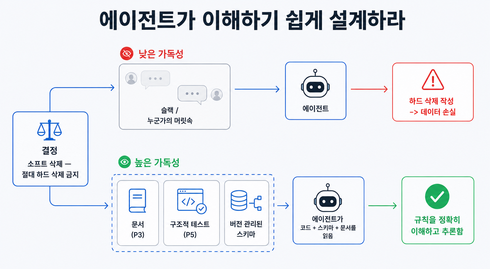

## 이 장에서 배우는 것

이 장을 끝내면 **"에이전트가 못 보면 존재하지 않는다"**는 기준으로 코드베이스의 하네스 성숙도를 높여보겠습니다. 특히 제품 개발 과정의 의사 결정과 규칙을 프로젝트 저장소로 끌어들이고, 의사 결정이 필요할 때 에이전트가 판단할 수 있는 구조로 만들어보겠습니다. 샘플 프로젝트 `todo-api`에 이 기준을 적용해, 원칙 3에서 살펴본 "지식을 리포지터리에 둔다"를 **"에이전트가 실제로 추론할 수 있는가"** 까지 확장해 보겠습니다.

## 핵심 개념

**원칙 4 — 에이전트 가독성에 최적화하라(Optimize for agent legibility).** 한 줄로: **코드베이스와 그 의존성을, 에이전트가 컨텍스트 안에서 검사, 추론, 검증할 수 있는 형태로 만든다.** 이 원칙의 뿌리는 한 문장입니다.

> "에이전트의 관점에서 보면, 실행 중에 컨텍스트 내에서 접근할 수 없는 것은 사실상 존재하지 않는 것입니다."
> — OpenAI, _Harness Engineering_ (§ 에이전트의 가독성이 목표)

OpenAI 팀의 프로젝트 저장소는 전적으로 에이전트가 생성했기 때문에, 우선순위가 **에이전트의 가독성**에 맞춰졌습니다. Google Docs, 채팅 스레드, 사람 머릿속의 지식은 에이전트에게 닿지 않습니다. 닿는 것은 리포지터리 안의 버전 관리되는 아티팩트, 곧 코드, 마크다운, 스키마, 실행 계획뿐입니다. 그래서 OpenAI 팀은 제품 원칙, 엔지니어링 규범, 심지어 팀 문화(이모지 선호도까지)를 새 팀원을 합류시키듯 프로젝트 저장소에 적어 에이전트에게 전달했습니다.

원칙 3과의 차이가 중요합니다. 원칙 3이 **"지식을 프로젝트 저장소에 둬라"** 였다면, 원칙 4는 **"그 코드베이스 자체를 에이전트가 읽을 수 있게 만들어라"** 입니다. 지식을 둔다고 끝이 아니라, 에이전트가 그 지식으로 추론할 수 있어야 합니다.

에이전트가 읽을 수 있는 지식은 일종의 **신입에게 주는 코드베이스**와 같습니다. 입사 3개월 차 신입이 코드만 읽고도 전체 도메인을 파악할 수 있다면, 그 코드베이스는 "읽기 쉬운" 코드베이스입니다. 에이전트는 매번 그 신입과 같습니다. 사전 지식도, 어제의 기억도 없이 프로젝트 저장소만 보고 추론합니다. 가독성을 최적화한다는 건, 매번 처음 보는 사람이 이해할 수 있게 코드베이스를 만드는 일입니다.

여기서 의외의 결론이 따라옵니다. **의존성 선택의 기준이 바뀝니다.** OpenAI 팀은 리포지터리 안에서 완전히 내부화하고 추론할 수 있는 종속성과 추상화를 선호했습니다. "지루하다"고 불리는 기술이 오히려 결합성, API 안정성, 학습 데이터 내 표현 덕분에 에이전트가 모델링하기 쉬운 경우도 생깁니다. 어떤 경우엔 불투명한 외부 라이브러리에 맞추기보다, 작은 기능을 직접 구현하는 게 더 저렴했습니다. 원문의 예를 보면, 범용 `p-limit` 스타일 패키지를 가져오는 대신 자체 `map-with-concurrency` 헬퍼를 구현했고, 이 헬퍼는 관측성 계측과 긴밀히 통합되고 테스트 커버리지 100%에 런타임이 기대하는 대로 정확히 동작했습니다.

## 왜 중요한가

이 원칙을 어기면, 에이전트는 **자기가 볼 수 없는 것에 의존하는 코드**를 만들게 됩니다. 사람에게는 보이는 것(머릿속, 위키, 불투명한 라이브러리 내부)이 에이전트에겐 보이지 않으므로, 데모 수준의 제품 개발에서는 문제를 일으키지 않다가도 프로덕션 수준의 제품을 개발하다보면 문제를 자주 일으킵니다.

- **암묵지가 폭탄이 된다.** "이 서비스는 원래 이렇게 동작해"가 코드와 문서 어디에도 없으면, 에이전트는 매번 다른 가정으로 그 부분을 고치다 결국 문제를 발생시킨다.
- **불투명한 의존성이 막다른 길이 된다.** 에이전트가 내부를 추론할 수 없는 외부 라이브러리는, 그 경계에서 에이전트의 자율성을 끊는다. "왜 이렇게 동작하는지" 읽을 수 없으니 추측을 기반으로 구현한다. 하지만 추측은 틀리기 마련이다.
- **레버리지가 줄어든다.** OpenAI 팀의 통찰이 여기 있다. 시스템을 에이전트가 검사, 검증, 수정할 수 있는 형태로 끌어올수록, 에이전트의 레버리지도 커진다. 가독성은 한 에이전트만의 문제가 아니라 모든 에이전트의 작업 가능 범위를 정한다.

데모와 프로덕션의 차이가 여기서도 같은 모양으로 나타납니다. 사람이 메우던 "기록되지 않은 맥락"을, 규모가 커지면 에이전트가 메울 수 없습니다. 메울 수 없으면 그 자리에서부터 문제가 발생하기 시작합니다.

## 하네스에 적용하기

`todo-api`에 "에이전트가 못 보면 존재하지 않는다"는 기준을 적용해 봅시다. 각 결정에 대해 **"이 결정이 리포지터리의 버전 관리되는 아티팩트로 존재하는가?"** 를 묻습니다.

결정: **"할 일은 소프트 삭제한다(`deleted_at`), 물리 삭제 금지."**

| 구분        | 결정이 있는 곳                                                                                                                                                                                | 에이전트에게 벌어지는 일                                                                              |
| ----------- | --------------------------------------------------------------------------------------------------------------------------------------------------------------------------------------------- | ----------------------------------------------------------------------------------------------------- |
| 가독성 낮음 | 팀 Slack과 시니어 머릿속에만 있다                                                                                                                                                             | DELETE 핸들러에서 물리 삭제를 짠다(그게 기본값이니까) → 사람이 리뷰에서 잡지 못하면 데이터가 사라진다 |
| 가독성 높음 | `docs/design-docs/soft-delete.md`에 결정+이유 기록(원칙 3과 협력), `src`의 삭제 경로가 `deleted_at`만 쓰도록 구조적 테스트(원칙 5와 협력), 스키마(`schema.sql`)에 `deleted_at` 컬럼 버전 관리 | 코드·스키마·문서만 읽고도 규칙을 추론한다                                                             |

의존성에도 같은 잣대를 댑니다. 동시성 제한이 필요할 때, 불투명한 외부 패키지를 가져올지 작은 헬퍼를 직접 둘지를 **"에이전트가 이걸 추론할 수 있나"** 로 판단합니다. 원문의 사례처럼 자체 `concurrency.ts` 헬퍼(작고, 테스트 커버리지 100%, 관측성과 통합)를 두면, 에이전트가 그 동작을 리포지터리 안에서 끝까지 읽을 수 있습니다. 무겁고 검증된 라이브러리가 늘 정답은 아닙니다. 기준은 "유명한가"가 아니라 "에이전트가 읽을 수 있나"입니다.

> **자기참조 — 이 책에서도 의사 결정 과정을 프로젝트 저장소에 위치시켰습니다.** 원칙 명칭, 출처, 수치 같은 반복 사실은 사람 머릿속이 아니라 `docs/verified-facts.md`에 버전으로 관리했습니다. 집필 모델이 "이 책의 8원칙이 뭐였지"를 추측하지 않고 읽어서 확인하게 만들기 위해서입니다. 못 보면 존재하지 않으므로, 존재해야 할 모든 사실을 리포지터리에 둡니다.

**스코어카드 — 이 원칙을 적용하면:**

| 항목        | 적용 전                      | 적용 후                       |
| ----------- | ---------------------------- | ----------------------------- |
| 결정의 위치 | 머릿속·채팅(에이전트 불가시) | 코드·스키마·문서(버전 관리)   |
| 의존성 기준 | "유명한가"                   | "에이전트가 추론할 수 있나"   |
| 자율 범위   | 불투명 경계에서 끊김         | 리포지터리 안에서 끝까지 추론 |

원칙 4를 적용하면 하네스 성숙도가 한 단계 더 올라갑니다. 이제 에이전트가 코드베이스를 읽고 추론할 수 있게 됐기 때문입니다. 하지만 "읽을 수 있다"가 "어겨선 안 될 규칙을 지킨다"를 보장하지는 않습니다. 그 강제는 원칙 5에서 살펴보겠습니다.

## 안티패턴과 함정

- **암묵지에 의존하기.** "이건 다들 아는 거잖아"라며 코드와 문서에 적지 않는 것. 에이전트에겐 "다들 아는 것"이 없습니다. 적히지 않은 것은 매번 새로 추측하게 됩니다.
- **무조건 유명 라이브러리 쓰기.** "검증된 패키지니까"라며 불투명한 외부 의존성을 들이는 것. 에이전트가 내부를 추론할 수 없으면, 그 경계가 자율성의 벽이 됩니다. 때로는 작은 자체 구현이 더 읽기 쉽습니다.
- **사람 전용 맥락 남기기.** 위키, 디자인 툴, 말로만 전하는 결정. 사람에게 보이는 것과 에이전트에게 보이는 것을 혼동하면 안 됩니다. 기준은 **리포지터리에 버전 관리되는가**입니다.
- **가독성을 "주석"으로 오해하기.** 주석을 많이 단다고 가독성이 높아지는 게 아닙니다. 결정, 스키마, 구조 자체가 에이전트가 추론 가능하게 짜여 있어야 합니다(주석은 보조 수단일 뿐입니다).

## 핵심 정리 / 체크리스트

- [ ] 원칙 4 = **에이전트 가독성에 최적화하라.** 기준은 한 문장: **못 보면 존재하지 않는다.**
- [ ] 결정·규범·문화를 **리포지터리의 버전 관리 아티팩트**로 둔다(코드·마크다운·스키마·계획). 머릿속·채팅은 에이전트에게 없는 것이다.
- [ ] 의존성은 "유명한가"가 아니라 **"에이전트가 추론할 수 있나"**로 고른다. 때로는 작은 자체 구현이 더 읽기 쉽다.
- [ ] 에이전트는 매번 **사전 지식 없는 신입**이다. 코드베이스가 그 신입에게 읽혀야 한다.
- [ ] 가독성이 높아지면 레버리지가 커진다(여러 에이전트가 같은 코드를 검사·수정 가능). "읽힘"과 "지켜짐"은 다르다. 강제는 원칙 5에서 다룬다.

## 공식 출처

- https://openai.com/index/harness-engineering/
