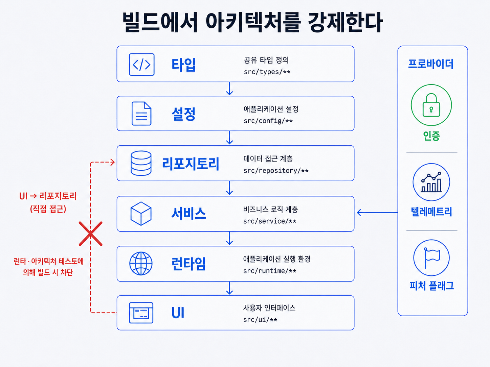

## 이 장에서 배우는 것

이 장을 끝내면 **"문서로 적어둔 규칙"과 "빌드가 막는 규칙"의 차이**를 알고, 어겨선 안 될 것을 린터와 구조적 테스트로 강제하는 법을 알게 됩니다. 엄격한 계층 아키텍처와 규약을 샘플 프로젝트 `todo-api`에 적용해, 원칙 4의 "읽을 수 있다"를 **"어길 수 없다"** 로 끌어올려 보겠습니다. 이 책을 집필하며 작성한 `verify.py`가 바로 이 원칙의 실물입니다.

## 핵심 개념

**원칙 5 — 아키텍처와 취향을 기계적으로 강제하라(Enforce architecture and taste mechanically).** 한 줄로: **어겨선 안 될 규칙을 문서가 아니라 린터와 구조적 테스트로 빌드 단계에서 막는다.** OpenAI 팀이 이 원칙에 다다른 이유는 단순합니다.

> "문서화만으로는 에이전트가 생성한 코드베이스를 완전히 일관되게 유지할 수 없습니다."
> — OpenAI, _Harness Engineering_ (§ 아키텍처 및 취향 강제 적용)

원칙 3, 4로 지식을 리포지터리에 두고 읽을 수 있게 만들어도, 항상 지켜지는 것은 아닙니다. 장시간 자율 실행되는 에이전트는 문서의 지침을 조용히 어기게 됩니다. OpenAI 팀의 해법은 구현을 세세하게 관리하는 게 아니라 **규칙을 강제**하는 것이었습니다. 핵심 구분은 이렇습니다. 무엇을 지킬지는 고정하되 **어떻게** 할지는 풀어둡니다. 원문은 "경계에서 데이터 형태로 파싱하라"는 규칙을 강제하고, 규칙을 강제하도록 구현하기 위한 라이브러리는 지정하지 않았습니다.

비유하면 **난간과 잔소리**의 차이입니다. "난간 밖으로 나가지 마세요"라는 **표지판**(문서)은 무시할 수 있지만, **난간**(린터·구조적 테스트)은 물리적으로 못 나가게 합니다. 사람의 개입 없이 6시간씩 일하는 에이전트에게는 잔소리가 아니라 난간이 필요합니다.

기계적인 강제를 하기 위한 두 개의 축이 있습니다.

- **계층 아키텍처.** 각 비즈니스 도메인을 고정된 계층으로 나누고, 종속성 방향과 허용된 에지만 통과시킵니다. 원문의 모델은 `Types → Config → Repo → Service → Runtime → UI` 한 방향이고, 교차관심사(인증, 텔레메트리, 기능 플래그 등)는 `Providers`라는 하나의 명시적 인터페이스로만 들어옵니다. 그 외는 전부 기계적으로 금지시킵니다.
- **선호나 취향.** 선호나 취향을 코드로 금지시킵니다. 구조화된 로깅, 스키마와 타입 명명 규칙, 파일 크기 제한 등이 그것입니다. 린트는 맞춤형으로 만들어, 위반 시 오류 메시지에 수정 지침을 담아 에이전트 컨텍스트에 주입합니다. 막기만 하는 게 아니라 고치는 법까지 알려줍니다.

## 왜 중요한가

이 원칙을 어기면, 즉 규칙을 문서로만 두면 코드베이스는 조용히 문제를 일으킵니다. 데모 수준의 제품에서는 사람이 리뷰로 잡아주니 멀쩡해 보이지만, 프로덕션 레벨의 제품을 개발할 땐 사람이 리뷰해야 할 양이 늘어 주의력을 넘어서는 순간 무너지기 시작합니다.

- **권고는 자율 실행에서 깨진다.** 에이전트는 프로젝트 저장소의 기존 패턴을 복제한다. 한 곳에 계층을 어긴 코드가 들어가면, 이후 요청 시 에이전트가 그걸 보고 따라 합니다. 문서의 권고는 이러한 복제를 막지 못합니다.
- **리뷰가 병목이 된다.** 강제가 없으면 모든 위반을 사람이 리뷰에서 잡아야 합니다. 이건 원칙 2에서 살펴본 병목 현상입니다. 사람의 주의력이 처리량의 천장이 됩니다.
- **취향이 휘발된다.** 리뷰 시 "이렇게 하지 말자"고 합의해도, 기계적으로 검증하지 않으면 이후 요청에 반영되지 않습니다. OpenAI 팀은 **인간의 취향이 남아 있는 리뷰 코멘트, 리팩터링 PR, 지라 이슈를 프로젝트 저장소에 문서로 포함시킵니다**. 만약 문서로 부족하다면 규칙을 코드로 처리하도록 했습니다.

원칙 5에서 기계적인 제약은 속도를 늦추는 게 아니라 오히려 속도를 내게 한다는 인사이트를 발견할 수 있습니다. 원문은 코딩 에이전트에게 제약이 **초기 전제 조건**이라고 했습니다. 엄격한 경계가 있어야 성능 저하나 드리프트 없이 속도가 납니다. 사람으로 구성된 팀이라면 수백 명 규모에서야 도입할 아키텍처를, 에이전트에게는 처음부터 구축해줘야 합니다.

## 하네스에 적용하기

원칙 4에서 다양한 의사 결정과 규칙을 **문서**로 뒀습니다. 원칙 5는 그 문서를 **난간**으로 바꿉니다.

| 구분 | 아티팩트 | 동작 |
|---|---|---|
| 원칙 4 (읽힘) | `docs/design-docs/soft-delete.md` | "물리 삭제 금지"를 문서로 기록 |
| 원칙 5 (강제) | `tests/structural/no-hard-delete.test` | `src` 전역에서 `DELETE FROM` / `.destroy()` 패턴을 스캔하고, 발견되면 빌드 실패. 에러 메시지 "물리 삭제 금지(soft-delete.md). `deleted_at`을 세팅하라."로 막기 + 고치는 법을 에이전트 컨텍스트에 주입 |

계층 강제도 같은 방식입니다. `todo-api`에 "UI 계층은 Repo를 직접 부르지 않는다(Service를 거친다)"는 불변식을 구조적 테스트로 박으면, 에이전트가 지름길을 만들어도 빌드가 실패하며 막아줍니다. **무엇을** 지킬지(계층 방향)는 고정하되, Service를 어떻게 구현할지는 에이전트에게 맡깁니다. 중앙에서 경계를 강제하고, 로컬에서는 자율을 보장합니다.

결과물이 사람의 문체 취향과 100% 일치하지 않아도 괜찮습니다. 원문의 기준은 **정확하고, 유지보수 가능하고, 다음 에이전트가 읽기 쉬운가**입니다. 그 기준만 충족하면, 변수명이 내 취향과 다른 건 문제가 되지 않습니다.

> **자기참조 — 이 책에서도 어겨선 안 될 규칙을 `verify.py`라는 난간으로 강제했습니다.** "factor가 아니라 원칙으로 쓴다", "출처는 원문과 일치", "reviewed는 4중 게이트 통과" 같은 규칙은 `docs/conventions.md`에 적혀 있지만(원칙 3, 4), 진짜 강제는 `scripts/verify.py`의 denylist, 스키마, 게이트 검사가 합니다(원칙 5). 규약을 어긴 원고는 문서가 막는 게 아니라 빌드가 막습니다 — `verify.py`가 FAIL을 뱉습니다. 그리고 그 FAIL 메시지는 "어디를 어떻게 고치라"를 담아, 원문의 맞춤 린트처럼 수정 지침을 줍니다.

**스코어카드 — 이 원칙을 적용하면:**

| 항목        | 적용 전                | 적용 후                     |
| ----------- | ---------------------- | --------------------------- |
| 규칙의 지위 | 문서의 권고(무시 가능) | 빌드의 불변식(어길 수 없음) |
| 위반 차단   | 사람 리뷰(병목)        | 린터·구조적 테스트(자동)    |
| 위반 시     | "하지 마세요"          | 차단 + 수정 지침 주입       |

원칙 5를 적용하면 하네스 성숙도가 크게 올라갑니다. 이제 어겨선 안 될 규칙을 기계가 지켜주므로, 에이전트가 자율적으로 장시간 실행해도 구조가 무너지지 않습니다. 여기서 L4와 L5가 갈립니다. 다만 강제만으로는 부족한 영역이 남아 있습니다. 얼마나 빨리, 무엇을 막고 무엇을 흘려보낼지가 그것입니다. 그 운영 정책을 원칙 6에서 다루겠습니다.

## 안티패턴과 함정

- **문서로만 규칙 두기.** "컨벤션 문서에 적었으니 됐다"고 여기는 태도입니다. 적힌 규칙은 권고일 뿐, 자율 실행에서 복제와 드리프트를 막지 못합니다. 어겨선 안 되는 것은 린터와 구조적 테스트로 **빌드가** 막아야 합니다.
- **구현까지 강제하기.** 반대 방향의 과잉입니다. "반드시 Zod로", "이 함수는 정확히 이렇게"까지 못 박는 것입니다. 원문은 **무엇을**만 고정하고 어떻게는 풀어뒀습니다. 과한 강제는 에이전트의 유연함을 죽입니다.
- **막기만 하고 안 알려주기.** 린트가 "위반"만 뱉고 수정법을 알려주지 않으면, 에이전트는 헤맵니다. 맞춤 린트의 에러 메시지에 **고치는 법**을 담아 컨텍스트에 주입해야 합니다.
- **취향을 리뷰에만 남기기.** "리뷰에서 말하면 되지"가 반복되는 상황입니다. 같은 지적을 두 번 했다면, 그건 코드(린트·테스트)로 승격하라는 신호입니다. 그렇지 않으면 다음 실행에서 또 사라집니다.

## 핵심 정리 / 체크리스트

- [ ] 원칙 5 = **아키텍처와 취향을 기계적으로 강제하라.** 문서는 권고, 린터·구조적 테스트는 난간이다.
- [ ] **무엇을** 지킬지는 고정하고 **어떻게**는 풀어라(중앙에서 경계, 로컬에서 자율).
- [ ] 계층 아키텍처(한 방향 종속성 + 명시적 Providers)를 **구조적 테스트로** 박는다.
- [ ] 맞춤 린트의 에러 메시지에 **수정 지침**을 담아 에이전트 컨텍스트에 주입한다.
- [ ] 제약은 속도를 늦추지 않고 **낸다** — 코딩 에이전트에겐 초기 전제 조건이다. 리뷰에서 두 번 지적한 취향은 코드로 승격하라.

## 공식 출처

- https://openai.com/index/harness-engineering/
