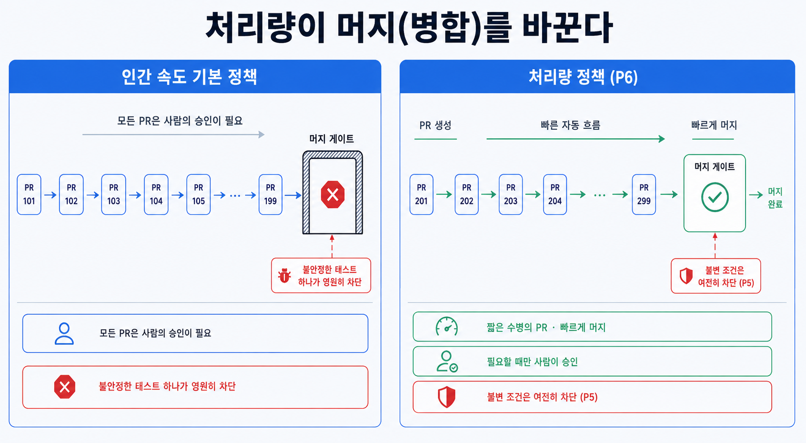

## 이 장에서 배우는 것

이 장을 끝내면 **에이전트 처리량이 사람의 리뷰 범위를 넘어설 때, 어떤 병합 정책이 발목을 잡는지** 알고, 차단 게이트, PR 수명, 테스트 불안정을 다시 설계하는 법을 알게 됩니다. 가상의 샘플 프로젝트 `todo-api`의 병합 정책을 사람의 리뷰 기준에서 에이전트 처리량 기준으로 옮겨 보겠습니다. 원칙 5가 "무엇을 막을까"였다면, 이 원칙은 **"막는 것을 얼마나 타이트하게 운영할까"** 라는 운영 정책에 관한 내용입니다.

## 핵심 개념

**원칙 6 — 처리량에 맞춰 병합 철학을 바꿔라(Let throughput reshape merge philosophy).** 한 줄로: **에이전트 처리량이 사람의 리뷰 범위를 압도하면, 사람의 리뷰 속도를 전제로 만든 병합 규칙을 에이전트의 처리량 기준으로 다시 세운다.** OpenAI 팀이 관찰한 변화가 이 원칙의 출발점입니다.

> "Codex의 처리량이 증가함에 따라 기존의 많은 엔지니어링 프로세스가 오히려 역효과를 내기 시작했습니다."
> — OpenAI, _Harness Engineering_ (§ 병합 철학을 변화시키는 처리량)

핵심은 비용 구조가 뒤집히는 데 있습니다. 사람이 직접 코드를 작성하던 시대에는 코드 수정 비용이 비쌌고, 리뷰 대기 시간이 저렴했습니다. 그래서 "코드가 병합되기 전에 모든 걸 막자"가 합리적이었습니다. 에이전트 처리량이 사람의 리뷰 범위를 훨씬 초과하는 시스템에서는 정반대입니다. 수정 비용은 저렴하고, 리뷰 대기 시간은 비쌉니다. 에이전트가 분 단위로 PR을 쏟아내는데 병합되기 위해 사람의 검토를 기다리면, 병목이 되며 비용을 증가시킵니다.

비유하면 **계산대 정책의 변화**입니다. 손님이 한 시간에 10명도 채 오지 않는 가게는 한 명 한 명 꼼꼼히 응대해 고객의 만족도를 높일 수 있습니다. 하지만 손님이 분당 수십 명 밀려드는 대형 매장에서 같은 정책을 쓰면 고객 응대에 드는 비용이 늘어날뿐더러 줄이 길어지며 고객의 만족도가 낮아지게 됩니다. 처리량이 바뀌면 정책이 바뀌어야 합니다. 더 느슨해서가 아니라, 병목이 옮겨갔기 때문입니다.

그래서 OpenAI 팀의 프로젝트 저장소는 **병합 시 최소한의 차단 정책**으로 운영됩니다.

- **PR은 수명이 짧다.** 오래 살아남아 충돌을 쌓기 전에 빠르게 병합한다.
- **테스트 불안정은 후속 실행으로 푼다.** 테스트에서 발견된 불안정성으로 인해 병합을 막기보다, 다음 실행을 통해 해결합니다.

단, 원문은 분명히 단서를 답니다. **이건 에이전트의 처리량이 적은 환경에는 맞지 않습니다.** 처리량이 적은 환경에서는 리뷰를 중요하게 여기는 게 옳습니다.

## 왜 중요한가

이 원칙을 오해하는 두 방향이 모두 위험합니다. 하나는 사람이 코드를 작성하는 시대의 규칙을 그대로 두는 것, 다른 하나는 "느슨하게"로 잘못 읽는 것입니다.

- **사람이 리뷰하던 규칙을 그대로 두면 처리량이 줄어듭니다.** 모든 PR에 사람 승인, 모든 불안정한 테스트에 무기한 차단을 걸면, 에이전트가 아무리 빨라도 게이트 앞에 줄을 서게 됩니다. 에이전트로 늘어난 처리량이 사람의 리뷰로 인해 증발하게 됩니다. 이건 원칙 1, 2에서 본 "사람이 병목" 문제가 병합 단계에서 재발한 것입니다.
- **"느슨하게"로 읽으면 다른 게 무너진다.** 이 원칙은 **검증을 버리라**가 아닙니다. 어겨선 안 될 규칙(원칙 5)은 여전히 빌드가 막습니다. 바뀌는 건 **사람의 리뷰를 전제로 한 차단**(전수 수동 리뷰, 플래키 무기한 차단)이지, 기계적 강제가 아닙니다. 이 둘을 혼동하면 제품에 문제가 발생합니다.

그러려면 **무엇이 비싼가**를 다시 물어야 합니다. 사람이 자는 동안 6시간씩 일하는 에이전트에게, 수정은 한 번 더 돌리면 되는 싼 일입니다. 반면 대기는 그 6시간을 통째로 멈추는 비싼 일입니다. 비용이 뒤집혔으면 운영 정책도 뒤집혀야 합니다.

## 하네스에 적용하기

가상의 프로젝트 `todo-api`의 병합 정책을 비용 구조에 맞춰 다시 짜 봅시다. 사람의 리뷰 속도와 에이전트의 처리량을 비교하면 아래와 같습니다.

| 항목            | 사람 속도 기본값          | 처리량 정책 — 원칙 6        |
| --------------- | ------------------------- | --------------------------- |
| PR 수명         | 길게, 충분히 리뷰         | 짧게, 빠르게 병합           |
| 사람 승인       | 모든 PR 필수              | 판단이 필요할 때만 (원칙 1) |
| 불안정한 테스트 | 테스트 통과할 때까지 차단 | 후속 실행으로 해결          |
| 규칙 (원칙 5)   | 빌드가 막음               | 빌드가 막음 (그대로!)       |

핵심은 **차단을 어디에 둘 것인가**입니다. 잘 구축된 하네스는 어겨선 안 될 구조 규칙은 여전히 기계적으로 차단합니다. 그건 처리량과 무관하게 정확하게 동작합니다. 반면 사람의 리뷰 속도를 전제로 한 차단(모든 PR 수동 승인, 불안정한 테스트의 무기한 차단)은 에이전트의 처리량 앞에서 병목이 되므로 풀어줍니다. 사람은 **판단이 필요한 경우에만** 개입합니다(원칙 1).

> **자기참조 — 이 책의 게이트는 에이전트 처리량이 낮아 일부러 촘촘하게 설계했습니다.** 이 책의 산출물은 원고 24개이지 분당 수십 개의 PR이 아닙니다. 처리량이 낮으므로, 원문의 단서대로 반대쪽 절충이 맞습니다. 발행 전 4중 게이트(verify, 검수, codex, humanize)를 전부 통과해야 reviewed로 올립니다. 처리량이 폭증하는 코드베이스라면 이 게이트 일부는 후속 실행으로 미뤘겠지만, 한 권의 책은 틀린 사실 하나의 비용이 크고 재작성 빈도가 낮아 타이트하게 검증하는 게 옳습니다. **정책은 처리량을 따른다.** 이게 이 원칙의 핵심입니다.

**스코어카드 — 이 원칙을 적용하면:**

| 항목                 | 적용 전(사람 기본값) | 적용 후(처리량 정책)      |
| -------------------- | -------------------- | ------------------------- |
| 병합 대기            | 사람 리뷰 줄서기     | 짧은 PR, 필요 시에만 승인 |
| 불안정한 테스트 대응 | 무기한 차단          | 후속 실행으로 해결        |
| 규칙 (원칙 5)        | 빌드가 차단          | 빌드가 차단 (불변)        |

원칙 6을 적용하면 하네스 성숙도가 운영 측면에서 한 단계 올라갑니다. 이제 원칙 5의 기계적 차단은 유지하면서도, 사람의 리뷰 속도가 만든 병목을 걷어내 에이전트의 처리량이 생산성으로 연결됩니다. 다만 에이전트의 처리량이 늘어나면, 에이전트가 기존 패턴을 복제해 생성하기 때문에 엔트로피가 쌓이는데, 그 청소는 원칙 8에서 자세히 다루도록 하겠습니다(그 사이에 자율 루프 자체를 구축하는 원칙 7이 있습니다).

## 안티패턴과 함정

- **사람이 일하던 프로세스를 무비판적으로 이식하기.** "코드 리뷰는 좋은 관행이니까"라며 모든 에이전트 PR을 꼼꼼하게 리뷰한 후 수동으로 승인하면 사람의 리뷰 속도가 병목이 됩니다. 차단은 정확성에 필요한 곳에만 둬야 합니다.
- **"느슨하게"로 오독하기.** 이 원칙을 검증 포기로 이해하면 안 됩니다. 원칙 5가 문제를 잡아내도록 하네스를 구축해야 합니다. 풀어주는 건 사람의 리뷰 속도가 병목이 되어 생산성을 낮추는 지점을 줄이는 데 있습니다.
- **처리량과 무관하게 적용하기.** 처리량이 낮은데 원문의 "최소 차단, 불안정한 테스트 후속 처리"를 흉내 내는 것도 주의해야 합니다. OpenAI 팀도 처리량이 적은 환경엔 맞지 않는다고 못 박았습니다. 정책은 프로젝트별 에이전트 처리량과 사람의 리뷰 속도를 비교해서 정해야 합니다.
- **불안정한 기능 영원히 방치하기.** "테스트에서 발견된 불안정한 기능을 후속 실행으로 푼다"를 "안 고친다"로 오해하는 것도 피해야 합니다. 미루는 것과 버리는 것은 다릅니다. 반복되는 불안정한 테스트는 결국 원칙 5와 앞으로 살펴볼 원칙 8을 통해 다뤄야 합니다.

## 핵심 정리 / 체크리스트

- [ ] 원칙 6 = **처리량에 맞춰 병합 철학을 바꿔라.** 처리량이 사람의 리뷰 속도를 넘으면 비용이 뒤집힌다(수정은 싸고 대기는 비쌈).
- [ ] **최소 차단 게이트**: PR 수명은 짧게, 불안정한 테스트는 후속 실행으로 대응. 단 어겨선 안 될 규칙(원칙 5)은 그대로 차단.
- [ ] 느슨하게가 아니라 **차단의 위치를 옮기는** 것. 사람의 리뷰 속도를 전제로 한 차단을 걷고, 기계적인 차단은 남긴다.
- [ ] 정책은 **여러분의 처리량**을 따른다. 처리량이 낮으면 반대쪽 절충안(타이트한 리뷰)이 옳다.
- [ ] 미루는 것과 버리는 것은 다르다. 반복되는 불안정한 테스트는 원칙 5, 원칙 8로 결국 해결한다.

## 공식 출처

- https://openai.com/index/harness-engineering/
