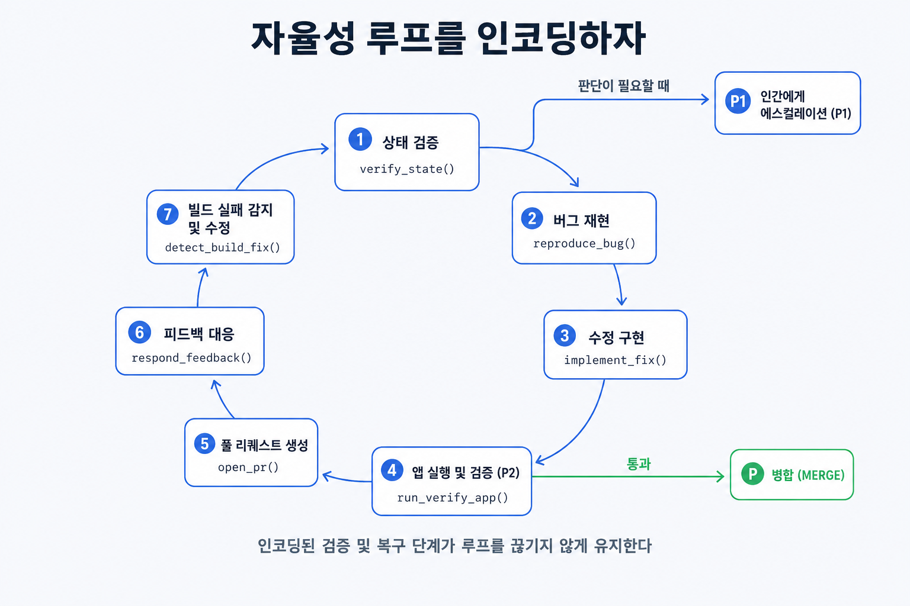

## 이 장에서 배우는 것

이 장을 끝내면 에이전트가 한 번의 프롬프트로 기능을 처음부터 끝까지 끌고 가게 하려면, 어떤 루프를 시스템에 박아야 하는지 압니다. 테스트·검증·리뷰·피드백 처리·복구를 환경에 인코딩해, 샘플 프로젝트 `todo-api`가 "에이전트가 알아서 한 기능을 완성하는" 임계점을 넘는 과정을 봅니다. 자율은 모델을 더 믿어서가 아니라 *루프를 인코딩해서* 얻는다는 게 이 장의 핵심입니다.

## 핵심 개념

**원칙 7 — 자율 루프를 시스템에 인코딩하라(Encode the autonomy loop).** 한 줄로: *테스트·검증·리뷰·피드백 처리·복구 같은 개발 루프를 환경에 박아, 에이전트가 한 작업을 끝까지 닫을 수 있게 한다.* 정본은 이 인코딩이 임계점을 넘겼다고 말합니다.

> "더 많은 개발 루프가 시스템에 직접 인코딩되면서, 리포지터리는 Codex가 새로운 기능을 처음부터 끝까지 주도할 수 있는 중요한 임계점을 넘어섰습니다."
> — OpenAI, *Harness Engineering* (§ 자율성 수준의 증가)

정본에 따르면, 이제 에이전트는 *한 번의 프롬프트로* 다음을 이어서 합니다 — 코드베이스 현재 상태 검증, 보고된 버그 재현, 실패를 보여주는 영상 녹화, 수정 구현, 앱을 실행해 수정 검증, 해결을 보여주는 두 번째 영상, PR 열기, 에이전트·사람 피드백에 응답, 빌드 실패 감지·수정, *판단이 필요할 때만* 사람에게 에스컬레이션, 변경 병합.

여기서 결정적인 통찰. **자율은 모델 신뢰가 아니라 루프 인코딩의 결과입니다.** "에이전트가 똑똑하니 알아서 하겠지"가 아니라, *검증할 수 있는 눈(원칙 2)·읽을 수 있는 코드(원칙 4)·어길 수 없는 불변식(원칙 5)·흐르는 병합(원칙 6)* 이 갖춰졌기에 비로소 끝까지 도는 것입니다. 앞의 원칙들이 부품이라면, 이 원칙은 그 부품을 *닫힌 루프*로 잇는 일입니다.

비유하면 공장 자동화 라인입니다. 로봇 팔 하나가 똑똑해서 자동화가 되는 게 아닙니다. 투입·가공·검사·불량 재작업·포장이 *컨베이어로 이어져* 비로소 무인 라인이 됩니다. 한 단계라도 사람이 물건을 옮겨줘야 하면 라인은 멈춥니다. 자율 루프도 같아서, 검증이든 복구든 *한 군데라도 끊기면* 거기서 사람을 기다립니다.



## 왜 중요한가

이 원칙을 어기는 길은 루프를 인코딩하지 않고 자율을 기대하는 것입니다. "에이전트한테 기능 통째로 맡겨봐"라고 던지지만, 검증·복구가 환경에 없으면 에이전트는 매 단계 사람을 부릅니다.

- **루프가 끊긴 곳마다 사람이 소환된다.** 테스트를 못 돌리면(눈 없음) 검증에서, 빌드 실패를 못 고치면 복구에서, 피드백을 못 받으면 리뷰에서 끊깁니다. 끊긴 단계 수만큼 사람 개입이 필요합니다. "반자율"은 사실 매 단계 대기입니다.
- 모델만 믿으면 조용히 틀린다. 루프 없이 "알아서 하라"고 하면, 에이전트는 검증되지 않은 추측을 끝까지 밀어붙입니다. 자율의 안전은 *똑똑함*이 아니라 *닫힌 검증 루프*에서 옵니다.
- 일반화 가정이 위험하다. 정본은 분명히 경고합니다. 이 자율적 동작은 *그 리포지터리의 특정 구조와 툴링에 크게 의존*하며, 유사한 투자 없이 일반화된다고 가정해선 안 됩니다. 다른 코드베이스에 그대로 프롬프트만 가져가면 루프가 끊깁니다.

데모와 프로덕션의 격차가 여기서 가장 극적입니다. 데모의 "와, 에이전트가 혼자 기능을 만들었어"는 누군가 이미 루프를 인코딩해 둔 환경에서만 재현됩니다. 그 투자 없이 흉내 내면, 같은 프롬프트가 매 단계 멈춥니다.

## 하네스에 적용하기

`todo-api`에 "마감일 추가" 기능을 *한 프롬프트로* 맡기려면, 앞 원칙들이 깔아둔 부품을 루프로 잇습니다.

```text
프롬프트: "할 일에 마감일(due_date)을 추가하라."

에이전트 자율 루프(인코딩된 단계):
  1. 상태 검증     코드베이스·스키마를 읽는다              (원칙 4)
  2. 계획          exec-plans/active/due-date.md 작성       (원칙 1·3)
  3. 구현          src 수정
  4. 검증          boot.sh + 통합 테스트 실행               (원칙 2)
  5. 강제 통과     구조적 테스트·린터 빨간불 해소           (원칙 5)
  6. PR            짧은 PR 열고 에이전트 리뷰               (원칙 6)
  7. 복구          빌드 실패 감지 → 자가 수정 → 4로
  8. 에스컬레이션  판단 필요할 때만 사람                    (원칙 1)
  9. 병합
```

핵심은 4·5·7번(검증·강제·복구)이 환경에 *이미* 있어야 이 루프가 사람 없이 돈다는 점입니다. 그게 없으면 에이전트는 3번에서 멈춰 "이거 맞나요?"를 묻습니다. 원칙 1~6은 이 루프의 *부품*을 하나씩 깔아온 것이고, 원칙 7은 그 부품들을 닫힌 사이클로 잇는 작업입니다. 단, *당신의* 코드베이스에 그 부품이 깔려 있어야 합니다. 정본 프롬프트만 복사한다고 자율이 따라오지 않습니다.

> **자기참조 — 이 책의 집필도 닫힌 루프입니다.** "원칙 7 장을 써줘" 한 번에, 집필(실행)에 이어 기계 검증 → 독립 모델(codex) 교차검증 → 문체 피드백 반영 → 상태 갱신이 닫힌 루프로 이어집니다. 막히면 *판단이 필요할 때만* 저자에게 에스컬레이션합니다(예: 원칙 개수 같은 설계 결정). 이 루프의 검증·리뷰 단계가 인코딩돼 있어 저자가 매 문장을 지켜볼 필요가 없습니다. 다만 이건 *이 레포의* 특정 스크립트·게이트에 의존하므로(그 전체 해부는 4부 케이스 스터디에서), 다른 책에 프롬프트만 옮긴다고 재현되지 않습니다. 정본의 경고 그대로입니다.

스코어카드 — 이 원칙을 적용하면:

| 항목 | 적용 전 | 적용 후 |
|---|---|---|
| 한 기능에 드는 사람 개입 | 매 단계(검증·복구마다) | 판단 필요 시에만 |
| 자율의 근거 | "모델이 똑똑하니까" | 인코딩된 검증·복구 루프 |
| 끊긴 단계 | 여럿(사람 대기) | 없음(루프가 닫힘) |

성숙도가 L4에서 L5로 향합니다. 이제 에이전트가 한 기능을 *처음부터 끝까지* 끌고 가니까요. 하지만 자율이 커질수록 새 문제가 생깁니다. 에이전트가 기존 패턴(불균일하거나 최적이 아닌 것까지)을 복제하며 엔트로피가 쌓입니다. 그 청소가 마지막 원칙 8입니다.

## 안티패턴과 함정

- **루프 없이 자율 기대하기.** 검증·복구를 인코딩하지 않고 "통째로 맡기는" 것. 에이전트는 끊긴 단계마다 사람을 부르고, 결국 "반자율"이라는 이름의 상시 대기가 됩니다.
- 모델 신뢰로 검증 대체. "요즘 모델은 똑똑하니 검증 루프는 과해"라는 것. 자율의 안전은 똑똑함이 아니라 *닫힌 검증*에서 옵니다. 루프 없는 자율은 검증 안 된 추측을 끝까지 밉니다.
- 일반화 가정. 정본의 자율 프롬프트를 *투자 없이* 다른 코드베이스에 이식하는 것. 정본이 명시적으로 경고했습니다. 그 동작은 특정 구조·툴링에 의존합니다. 루프 부품부터 깔아야 합니다.
- 에스컬레이션을 0으로. "완전 자율"에 취해 사람 에스컬레이션을 없애는 것. 정본도 *판단이 필요할 때는* 사람에게 올립니다(원칙 1). 자율은 사람을 빼는 게 아니라, 사람을 *판단에만* 부르는 것입니다.

## 핵심 정리 / 체크리스트

- [ ] 원칙 7 = **자율 루프를 시스템에 인코딩하라.** 테스트·검증·리뷰·피드백·복구를 환경에 박아 에이전트가 한 작업을 끝까지 닫게 한다.
- [ ] 자율은 **모델 신뢰가 아니라 루프 인코딩**의 결과다. 끊긴 단계마다 사람이 소환된다.
- [ ] 원칙 1~6이 부품, 원칙 7은 그 부품을 **닫힌 사이클**로 잇는 일이다(특히 검증·강제·복구).
- [ ] 이 자율은 *당신의* 구조·툴링에 의존한다. 정본 프롬프트만 복사한다고 일반화되지 않는다.
- [ ] 에스컬레이션을 0으로 만들지 마라. 자율은 사람을 빼는 게 아니라 **판단에만** 부르는 것이다.

## 공식 출처

- https://openai.com/index/harness-engineering/
