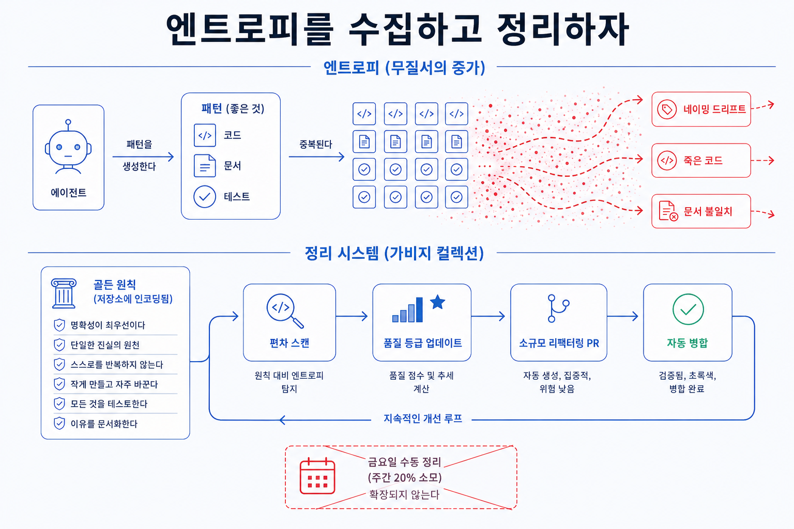

## 이 장에서 배우는 것

이 장을 끝내면 **강제(원칙 5)로도 막지 못하는 "엔트로피"가 왜 쌓이는지, 그리고 그걸 어떻게 매일 조금씩 청소하는지** 알게 됩니다. 황금 원칙(golden principles)과 정기 정리 프로세스를 샘플 프로젝트 `todo-api`에 적용해, 에이전트가 자율적으로 일할수록 쌓이는 드리프트를 자동으로 걷어내 보겠습니다. 8원칙의 마지막이자, 자율(원칙 7)이 만든 부작용을 닫는 안전장치입니다.

## 핵심 개념

**원칙 8 — 엔트로피를 가비지 컬렉션하라(Garbage-collect entropy).** 한 줄로: **에이전트가 자율적으로 복제하며 쌓는 드리프트를, 황금 원칙과 정기 정리로 매일 조금씩 걷어낸다.** 자율에는 대가가 따릅니다.

> "Codex는 리포지터리에 이미 존재하는 패턴, 심지어 불균일하거나 최적 상태가 아닌 패턴도 복제합니다. 따라서 시간이 지나면 필연적으로 드리프트가 발생합니다."
> — OpenAI, _Harness Engineering_ (§ 엔트로피 및 가비지 컬렉션)

원칙 5의 강제는 어겨선 안 될 규칙을 막습니다. 하지만 강제로 명문화하지 않은, 미묘하게 불균일하거나 최적이 아닌 패턴은 빌드를 통과합니다. 에이전트는 그걸 기존 패턴이니까 복제하고, 복제가 복제를 부릅니다. 그렇게 엔트로피가 쌓입니다. 강제가 예방이라면, 이 원칙은 예방을 빠져나간 드리프트를 청소하는 일입니다.

OpenAI 팀도 처음엔 수동으로 청소했습니다. 매주 금요일(한 주의 20%)마다 "AI 슬로프"를 정리했습니다. 예상대로 그 방식은 확장되지 않았습니다. 그래서 두 가지로 바꿉니다.

- **황금 원칙(Golden Principles).** 코드베이스의 가독성과 일관성을 유지하는 규칙을 프로젝트 저장소에 직접 인코딩합니다. 원문의 예를 보면 (1) 매번 직접 만든 헬퍼보다 공유 유틸리티 패키지를 선호해 규칙을 중앙에서 관리하고, (2) "YOLO 식"으로 데이터 형태를 추측하지 말고 경계에서 검증하거나 타입이 있는 SDK에 의존하게 합니다.
- **정기 정리(GC) 프로세스.** 편차를 정기적으로 검사하고, 품질 등급을 업데이트하며, 대상 리팩터링 PR을 생성하는 백그라운드 작업을 돌립니다. 대부분 1분 안에 검토되고 자동 병합됩니다.

비유는 원문이 직접 제시했습니다. 바로 **가비지 컬렉션**입니다. 기술 부채는 고금리 대출과 같아서, 이자가 쌓여 한꺼번에 고통스럽게 갚기보다 조금씩 꾸준히 갚는 편이 훨씬 쌉니다. 사람의 취향이 한 번 포착되면 코드의 모든 라인에 지속적으로 반영되고, 나쁜 패턴이 며칠, 몇 주씩 퍼지기 전에 매일 잡힙니다.

## 왜 중요한가

이 원칙을 어기는 두 가지 길이 있습니다. 청소를 아예 안 하거나, 사람이 몰아서 하거나. 둘 다 자율 시스템에서 무너집니다.

- **방치하면 드리프트가 복리로 분다.** 에이전트는 기존 패턴을 복제하므로, 한 번 들어온 나쁜 패턴이 다음 실행마다 더 퍼진다. 막지 않으면 며칠 만에 코드베이스 전체가 그 패턴으로 물든다. 기술 부채의 이자가 복리로 붙는 셈이다.
- **사람이 몰아서 하면 확장이 안 된다.** OpenAI 팀이 겪은 그대로다. 금요일마다 사람이 "AI 슬로프"를 치우는 방식은, 처리량이 오르면 한 주의 20%로도 모자란다. 사람의 청소는 에이전트의 생산 속도를 따라잡지 못한다.
- **자율이 클수록 엔트로피도 크다.** 원칙 7로 자율이 커질수록 에이전트는 더 많이, 더 빨리 패턴을 복제한다. 자율과 엔트로피가 함께 자라는 셈이다. 자율을 키웠다면 청소도 자동화해야 균형이 맞는다.

핵심은 청소의 빈도입니다. 청소를 큰 이벤트(분기 리팩터링)로 두면 부채가 그사이 복리로 불어 갚기 고통스럽습니다. 매일 조금씩 걷어내면, 가비지 컬렉터가 그러듯, 부채가 위험 수위로 쌓이지 않습니다. 비싼 건 청소가 아니라 미룬 청소입니다.

## 하네스에 적용하기

`todo-api`가 원칙 7로 자율적으로 굴러가면, 에이전트가 만든 코드에 드리프트가 끼게 됩니다. 어떤 라우트는 구식 에러 포맷을, 어떤 모듈은 일관성 없는 로깅을 씁니다(강제로 막지 않은 것들). 원칙 8은 이걸 자동으로 청소합니다.

먼저 `docs/GOLDEN_PRINCIPLES.md`를 프로젝트 저장소에 인코딩합니다.

- 매번 새 헬퍼를 만드는 대신 `shared/`의 공유 유틸리티를 쓴다
- 경계에서 데이터 형태를 검증한다(추측 금지)

그리고 백그라운드 GC 작업이 정기적으로 다음 단계를 돕니다.

| 단계 | 동작 |
|---|---|
| 1. 편차 스캔 | 황금 원칙 위반과 불균일 패턴을 찾는다 |
| 2. 품질 등급 | `docs/QUALITY_SCORE.md` 갱신(도메인별 격차 추적) |
| 3. 리팩터 PR | 대상만 고치는 작은 PR을 연다 |
| 4. 자동 병합 | 대부분 1분 내 검토 → 병합 |

핵심은 청소가 **작고 잦은 PR**이라는 점입니다. 한 번에 코드베이스를 갈아엎는 대청소가 아니라, 가비지 컬렉터처럼 조금씩 상시 돕니다. 원칙 5가 경계(어기면 빌드 실패)라면, 원칙 8은 그 경계 안에서 생기는 때를 닦는 일입니다. 둘은 짝입니다. 강제로 막고, GC로 쓸어냅니다.

> **자기참조 — 이 책에서도 드리프트를 청소하는 장치를 뒀습니다.** 원고가 늘면 규약과 어긋나는 드리프트(낡은 표현, 끊긴 링크, 스테일 사실)가 생깁니다. 이 책은 사실을 `docs/verified-facts.md` 한곳에 모아 두고, 한 사실이 바뀌면 거기를 먼저 고친 뒤 본문을 맞춥니다. 드리프트가 한 곳에 모이게 하려는 것입니다. 황금 원칙에 해당하는 규약(`conventions.md`)과 결정 로그(`adr/`)가 "왜 이렇게 하나"를 붙들어, 다음 집필이 나쁜 패턴을 복제하지 않게 합니다. (이 청소 파이프라인의 전체 해부는 4부 케이스 스터디에서 다룹니다.)

**스코어카드 — 이 원칙을 적용하면:**

| 항목 | 적용 전 | 적용 후 |
|---|---|---|
| 드리프트 처리 | 방치 또는 사람이 몰아서 | 백그라운드 GC가 상시 |
| 청소 단위 | 큰 대청소(분기) | 작고 잦은 리팩터 PR |
| 취향의 수명 | 리뷰 한 번 뒤 휘발 | 황금 원칙으로 코드에 지속 반영 |

이로써 8원칙이 완성됩니다. 빈 레포(L1)에서 시작한 `todo-api`는 이제 조종(1), 눈(2), 기록 시스템(3), 가독성(4), 강제(5), 병합 정책(6), 자율 루프(7), GC(8)를 갖춰, 에이전트가 장시간 자율 실행으로도 안정적으로 키워 나가는 L5 하네스에 가까워졌습니다. 3부에서는 이 원칙들을 조합한 패턴을 다루고, 4부에서 이 책 자신의 하네스를 8원칙으로 채점합니다.

## 안티패턴과 함정

- **청소를 미루기.** "리팩터링은 나중에 몰아서"라고 여기는 것. 에이전트 시스템에서 드리프트는 복리로 붑니다. 미룬 청소가 비싼 것이지, 청소 자체가 비싼 게 아닙니다.
- **사람이 직접 다 치우기.** OpenAI 팀이 버린 방식입니다. 금요일마다 사람이 슬로프를 치우는 방식 말입니다. 처리량을 따라가지 못합니다. 청소도 에이전트 백그라운드 작업으로 자동화해야 합니다.
- **황금 원칙 없이 GC만 돌리기.** 무엇이 좋은 패턴인지 인코딩하지 않고 청소만 돌리면, 기준이 없어 헛돌게 됩니다. 공유 유틸리티 선호, 경계 검증 같은 황금 원칙을 먼저 프로젝트 저장소에 인코딩해야 합니다.
- **강제와 혼동하기.** 원칙 5(강제)와 8(GC)을 같은 것으로 보는 것. 강제는 어겨선 안 될 규칙을 빌드가 막고, GC는 강제를 빠져나간 드리프트를 상시 청소합니다. 예방과 청소는 둘 다 필요합니다.

## 핵심 정리 / 체크리스트

- [ ] 원칙 8 = **엔트로피를 가비지 컬렉션하라.** 에이전트가 복제하며 쌓는 드리프트를 매일 조금씩 걷어낸다.
- [ ] 자율(원칙 7)이 클수록 엔트로피도 커진다. 자율을 키웠으면 청소도 **자동화**해야 균형이 맞다.
- [ ] **황금 원칙**(좋은 패턴)을 프로젝트 저장소에 인코딩 + **백그라운드 GC**(편차 스캔, 품질 등급, 작은 리팩터 PR)를 돌린다.
- [ ] 기술 부채는 고금리 대출이다. **작고 잦은** 청소가 큰 대청소보다 싸다. 비싼 건 미룬 청소다.
- [ ] 원칙 5(강제=예방)와 원칙 8(GC=청소)은 짝이다. 막고, 쓸어낸다.

## 공식 출처

- https://openai.com/index/harness-engineering/
