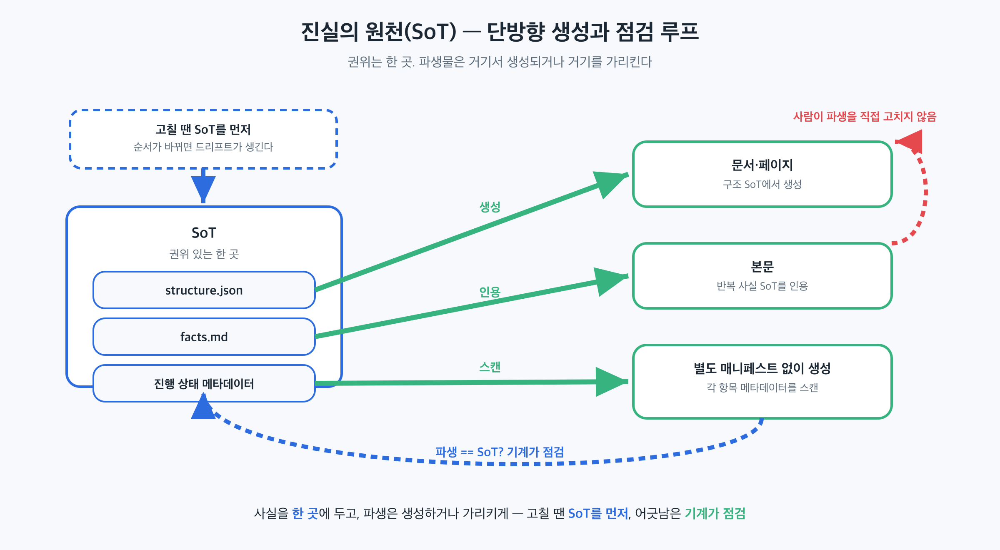

## 이 장에서 배우는 것

이 장을 끝내면 한 사실이 리포지터리 안에서 "딱 한 곳"에만 살게 설계하는 법을 압니다. 원칙 3(기록 시스템)과 원칙 4(가독성)를 합쳐 하나의 패턴, 곧 *진실의 원천(Source of Truth, SoT)* 으로 묶고, 사실이 중복돼 드리프트하는 흔한 함정을 막습니다. 2부가 원칙 하나하나였다면, 3부는 그 원칙들을 *조합한 패턴*입니다. 첫 패턴이 SoT입니다.

## 핵심 개념

**진실의 원천(SoT)** 은 한 줄로: *어떤 사실이든 권위 있는 위치는 딱 한 곳이고, 나머지는 그 한 곳을 복제하지 않고 가리킨다.* 이건 원칙 3·4의 자연스러운 결론입니다. 원칙 3이 "지식을 리포지터리에 기록 시스템으로 두라"였고 원칙 4가 "코드베이스를 에이전트 가독성에 최적화하라"였다면, 둘을 합치면 *"각 사실은 한 곳에서만 읽히고, 거기만 고치면 된다"* 가 됩니다.

핵심은 중복 제거입니다. 같은 사실이 두 곳에 적히는 순간, 둘은 반드시 어긋납니다(한쪽만 갱신되니까). 에이전트는 어느 쪽이 참인지 모른 채 둘 다 읽고, 어긋난 쪽을 근거로 코드를 짭니다. SoT는 이 분기를 원천 차단합니다. 사실이 한 곳에만 있으면 어긋날 둘이 없습니다.

비유하면 시계를 하나만 두는 집입니다. 방마다 시계를 걸면, 시간이 조금씩 어긋나 "지금 몇 시야?"에 답이 여러 개가 됩니다. 대신 기준 시계 하나를 두고 나머지는 *그것을 보게* 하면, 시간은 언제나 하나입니다. SoT 설계는 집 안의 시계를 하나로 줄이는 일입니다.

좋은 SoT는 세 가지 속성을 가집니다.

- **유일성** — 한 사실은 한 곳에만. 복제 금지, 파생만 허용.
- **가리킴** — 다른 곳은 사실을 *담지* 않고 SoT를 *가리킨다*(원칙 3의 맵).
- **점검 가능** — SoT와 본문(파생물)의 일치를 *기계가* 검사할 수 있다(원칙 4·5와 맞물림).

## 왜 중요한가

이 패턴을 어기면(같은 사실을 여러 곳에 두면) 드리프트가 조용히 자랍니다. 데모에서는 두 곳이 우연히 일치하니 안 보이지만, 한쪽만 고치는 순간 갈라집니다.

- 에이전트가 스테일 복사본을 읽는다. 사실이 A·B 두 곳에 있고 A만 갱신되면, B를 읽은 에이전트는 틀린 전제로 작업합니다. 어느 쪽이 최신인지 코드는 모릅니다.
- 고칠 곳을 못 찾는다. 사실이 흩어져 있으면, 하나를 바꿀 때 *몇 곳을 같이* 고쳐야 하는지 알 수 없습니다. 빠뜨린 한 곳이 드리프트의 씨앗입니다.
- 점검이 불가능해진다. 권위 있는 한 곳이 없으면, "이 값이 맞나"를 기계가 무엇과 대조할지 정할 수 없습니다. SoT가 있어야 "본문 == SoT?"라는 검사가 성립합니다.

규모에서 이게 치명적인 이유는 원칙 4와 같습니다. 사람은 "아, 그건 저쪽이 최신이야"를 기억으로 메우지만, 에이전트는 그 암묵지가 없습니다. 권위가 코드에 적혀 있지 않으면, 에이전트에겐 권위가 없습니다.

## 하네스에 적용하기

SoT 설계는 *"각 사실 유형의 권위 있는 위치를 한 곳으로 정하고, 나머지를 파생으로 만드는"* 작업입니다. 사실 유형별로 SoT를 지정합니다.

```text
사실 유형            SoT (권위 있는 한 곳)        파생물 (가리키거나 생성)
─────────────────────────────────────────────────────────────────
구조(목차·계층)       structure.json (예)          문서·페이지는 여기서 생성
반복 사실(값·명칭)     facts.md (예)                본문은 여기를 인용
진행 상태            각 항목의 메타데이터          별도 매니페스트 없음(스캔해 생성)
```



핵심 규칙 셋입니다. (1) 한 사실은 한 SoT에만 둔다. (2) 사실이 바뀌면 *SoT를 먼저* 고치고 파생을 맞춘다. (3) "파생 == SoT"를 기계가 검사하게 한다. 특히 (3)이 SoT를 *살아있게* 합니다. 검사가 없으면 SoT도 결국 또 하나의 스테일 문서가 됩니다.

> **자기참조 — 이 책이 SoT 패턴 위에 있습니다.** 이 책의 구조(부·장·링크)는 `docs/toc.json` 한 곳이 권위이고, 원고 골격은 거기서 *생성*됩니다(복제가 아니라 파생). 반복 사실(원칙 명칭·출처·수치)은 `docs/verified-facts.md` 한 곳에 살고, 본문은 그걸 인용합니다. 진행 상태는 별도 매니페스트 없이 각 원고의 메타데이터를 *스캔해 생성*합니다. 상태가 두 곳에 적혀 어긋날 일이 없도록 말입니다. 그리고 "본문이 SoT와 일치하는가"를 검증 스크립트가 기계로 점검합니다. (이 파이프라인의 전체 해부는 4부 케이스 스터디에서.)

이 패턴은 책에만 해당하지 않습니다. 코드베이스라면 DB 스키마의 SoT는 마이그레이션 파일 하나, API 계약의 SoT는 스키마 정의 하나, 설정의 SoT는 한 설정 소스입니다. 나머지(문서·타입·목업)는 거기서 *생성*하거나 *가리킵니다*. 무엇이든, 사실 하나에 권위 있는 위치는 하나입니다.

## 안티패턴과 함정

- **사실 복제.** 같은 값을 README·코드 주석·위키에 각각 적는 것. 셋은 반드시 어긋납니다. 한 곳에 두고 나머지는 가리키세요.
- **두 개의 SoT.** "구조는 여기, 그런데 가끔 저기도"처럼 권위가 둘인 것. 권위가 둘이면 권위가 없습니다. 한 사실 유형엔 정확히 하나의 SoT.
- **점검 없는 SoT.** SoT를 정해두고 "파생 == SoT" 검사를 안 거는 것. 검사가 없으면 파생이 조용히 어긋나고, SoT는 명목만 남습니다(원칙 5의 강제와 맞물려야 합니다).
- **사람 머릿속 SoT.** "그건 내가 제일 잘 알아"가 권위인 것. 에이전트는 그 머릿속을 못 읽습니다(원칙 4). 권위는 *리포지터리에* 있어야 합니다.

## 핵심 정리 / 체크리스트

- [ ] SoT 패턴 = **한 사실은 한 곳에만**(유일성) + 나머지는 **가리킨다**(파생) + **기계가 일치를 점검**(점검 가능).
- [ ] SoT는 원칙 3(기록 시스템)과 원칙 4(가독성)의 결합이다.
- [ ] 사실이 바뀌면 **SoT를 먼저** 고치고 파생을 맞춘다.
- [ ] "파생 == SoT" 검사가 없으면 SoT도 결국 스테일 문서가 된다(원칙 5와 맞물림).
- [ ] 권위는 사람 머릿속이 아니라 **리포지터리**에 둔다. 사실 유형 하나에 SoT 하나.

## 공식 출처

- https://openai.com/index/harness-engineering/
