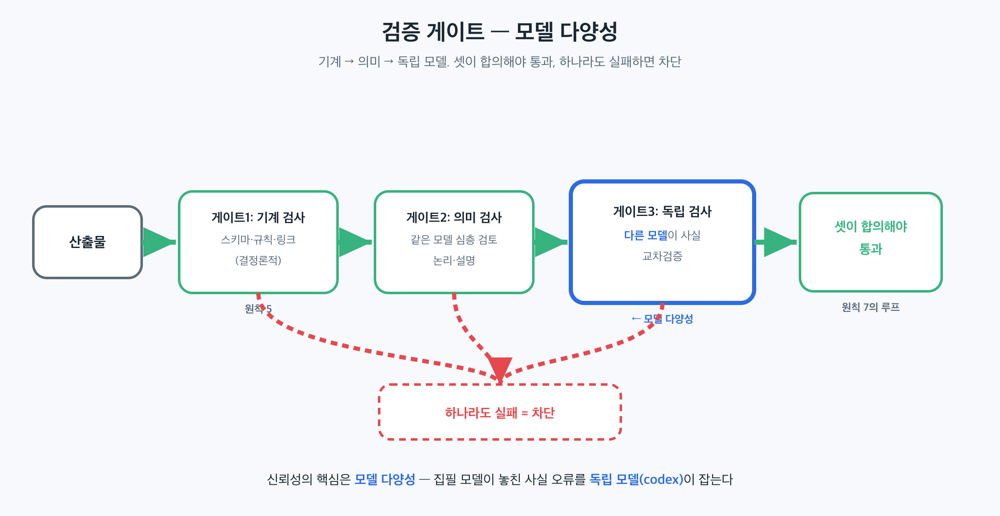

## 이 장에서 배우는 것

이 장을 끝내면 **에이전트의 산출물을 어떤 게이트로 검증해야 신뢰할 수 있는지, 그리고 왜 그 검증자가 "다른 모델"이어야 하는지** 압니다. 원칙 5(기계적 강제)와 원칙 7(자율 루프의 검증)을 합쳐, 모델이 자기 사각지대를 스스로 보지 못한다는 문제를 *모델 다양성*으로 푸는 패턴을 배웁니다. SoT(ch12)가 "무엇이 참인가"였다면, 이 장은 *"그 참을 어떻게 보장하는가"* 입니다.

## 핵심 개념

이 패턴의 한 줄: *신뢰성은 마법이 아니라 독립된 검증 게이트의 합이며, 가장 강한 게이트는 산출자와 다른 모델이다.* 원칙 5는 어겨선 안 될 규칙을 *기계*가 막게 했고, 원칙 7은 검증을 자율 루프 안에 넣었습니다. 여기에 한 가지가 더해집니다. 바로 **검증자의 독립성**입니다.

핵심 문제는 **사각지대의 공유**입니다. 한 모델이 코드를 쓰고 *같은 모델*이 검토하면, 둘은 같은 가정·같은 약점을 공유합니다. 첫 번째가 놓친 것을 두 번째도 놓칩니다("JSON으로 답해줘"라고 부탁하면 같은 모델은 같은 방식으로 어깁니다). 자기 검토는 *맞춤법*은 잡아도 *사고의 사각지대*는 못 잡습니다.

비유하면 **저자가 자기 글을 교정보는 것**입니다. 아무리 꼼꼼해도 자기 오타에는 눈이 멉니다. 머릿속에 "맞다고 아는" 문장이 종이에도 맞게 보이니까요. 다른 사람(다른 눈)이 봐야 그 사각지대가 드러납니다. *모델 다양성*은 검증에 "다른 눈"을 붙이는 일입니다. 이상적으로는 다른 벤더·다른 학습 데이터의 모델을 붙입니다.

그래서 신뢰성 게이트는 두 축으로 설계합니다.

- **다중 게이트(원칙 5·7).** 한 번의 검사가 아니라, 서로 다른 차원을 보는 게이트 여럿을 직렬로 통과시킨다. 기계적 검사(스키마·규칙) + 의미 검사(사실·논리) + 문체 검사처럼.
- **모델 다양성.** 적어도 한 게이트는 *산출한 모델과 다른 모델*이 본다. 같은 모델의 재검토는 독립이 아니다 — 사각지대가 겹친다.

## 왜 중요한가

이 패턴을 어기는 흔한 길은 **"한 모델에게 한 번 더 물어보면 검증"이라고 믿는 것**입니다. 데모에서는 그럴듯한 "검토 통과"가 돌아오지만, 같은 사각지대가 그대로 통과됩니다.

- **자기 검토는 같은 실수를 통과시킨다.** 모델이 원칙 번호를 헷갈렸다면, 같은 모델은 검토에서도 같은 번호를 "맞다"고 합니다. 틀린 확신은 재검토로 강화될 뿐입니다.
- **단일 게이트는 한 차원만 본다.** 스키마 검사만 있으면 *형식*은 맞지만 *사실*이 틀린 산출물이 통과합니다. 사실 검사만 있으면 형식이 깨집니다. 신뢰성은 여러 차원의 게이트가 *합의*할 때 옵니다.
- **검증이 자율 루프 밖에 있으면 안 돈다.** 사람이 가끔 손으로 검토하는 방식은 원칙 7의 자율 루프를 끊습니다. 게이트는 *루프 안에* 인코딩돼, 통과 못 하면 다음으로 못 가게 해야 합니다(원칙 5의 강제).

규모에서 이게 중요한 이유는, 에이전트가 *틀린 것을 빠르게 대량으로* 만들 수 있기 때문입니다. 빠른 생산에 독립 검증이 안 붙으면, 틀린 산출물이 빠르게 퍼집니다. 신뢰성은 생산 속도가 아니라 *검증의 독립성과 다중성*에서 옵니다.

## 하네스에 적용하기

신뢰성 게이트는 *"서로 다른 차원을, 가능하면 다른 모델로, 직렬로 통과시키는"* 구조입니다. 산출물이 무엇이든(코드·문서·설정) 같은 틀이 적용됩니다.

```text
산출물 ─▶ [게이트1: 기계 검사]   스키마·규칙·링크 (결정론적)        원칙 5
        ─▶ [게이트2: 의미 검사]   같은 모델 심층 검토 (논리·설명)
        ─▶ [게이트3: 독립 검사]   *다른 모델*이 사실 교차검증        ← 모델 다양성
        ─▶ 셋이 합의해야 통과 (하나라도 실패 = 차단)               원칙 7의 루프
```



게이트3이 이 패턴의 심장입니다. 산출한 모델과 *다른* 모델이 같은 산출물을 보면, 첫 모델의 사각지대가 드러납니다. 단, 독립성은 공짜가 아니라 *설정의 결과*입니다. 검증 모델이 산출 모델과 같은 벤더·같은 가중치면 다양성이 없습니다. "다른 모델 CLI를 띄웠다"가 아니라 "정말 다른 모델인가"를 확인해야 합니다.

> **자기참조 — 이 책이 이 게이트로 만들어집니다.** 이 책의 사실은 집필 모델(Claude) 하나가 아니라, *독립 모델*(codex)이 한 번 더 교차검증해야 reviewed가 됩니다. 집필과 검증이 다른 모델이라, 한 모델의 사각지대(원칙 순서 혼동·출처 오귀속·정본이 명시 안 한 카운트 단정)를 다른 모델이 잡습니다. 두 모델 + 기계 검증이 *합의*해야 비로소 통과합니다. (이 게이트 파이프라인의 전체 구성·도구는 4부 케이스 스터디에서 해부합니다.)

이 패턴은 책 밖에서도 같습니다. 코드 리뷰를 *다른* 팀원이 보듯, 에이전트 산출물은 *다른* 모델이 봐야 독립입니다. 자기 PR을 자기가 승인하는 게 리뷰가 아니듯, 같은 모델의 자기 검토는 교차검증이 아닙니다.

## 안티패턴과 함정

- **자기 검토를 검증으로 착각.** "같은 모델에게 한 번 더" 물어 통과시키는 것. 같은 모델은 같은 사각지대를 공유합니다. 적어도 한 게이트는 *다른 모델*이어야 합니다.
- **이름만 다른 모델.** 검증에 띄운 게 산출 모델과 같은 벤더·같은 가중치인 것. 다양성은 *설정으로* 보장됩니다 — "정말 다른 모델인가"를 확인하세요.
- **단일 차원 게이트.** 스키마만, 혹은 사실만 보는 것. 신뢰성은 기계·의미·문체 등 *여러 차원이 합의*할 때 옵니다. 한 게이트는 한 사각지대를 남깁니다.
- **게이트를 루프 밖에 두기.** "나중에 사람이 검토하지"로 검증을 자율 루프에서 떼어내는 것. 게이트는 루프 안에 인코딩돼, 통과 못 하면 못 넘어가게(원칙 5·7) 해야 합니다.

## 핵심 정리 / 체크리스트

- [ ] 신뢰성 = **독립된 검증 게이트의 합**. 마법이 아니라 설계다(원칙 5·7의 결합).
- [ ] 같은 모델의 자기 검토는 **사각지대를 공유**한다 → 적어도 한 게이트는 *다른 모델*.
- [ ] 모델 다양성은 *설정의 결과*다 — "정말 다른 벤더·가중치인가"를 확인한다.
- [ ] 게이트는 **여러 차원**(기계·의미·문체)을 보고, *합의*해야 통과한다.
- [ ] 게이트를 자율 루프 *안에* 인코딩한다 — 통과 못 하면 못 넘어간다.

## 공식 출처

- 이 장은 2부의 원칙 5·7을 종합한 패턴이다. 근거는 해당 원칙 장과 `docs/verified-facts.md`(8원칙 정의)에 둔다.
