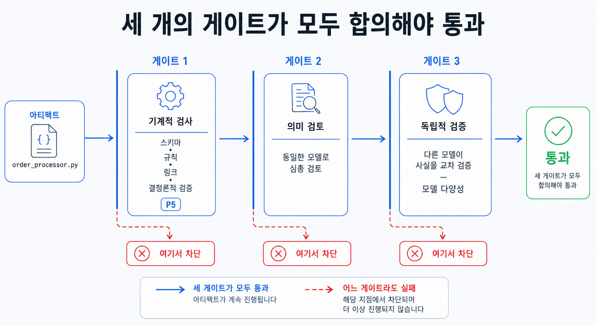

## 이 장에서 배우는 것

이 장을 끝내면 **에이전트의 산출물을 어떻게 검증해야 신뢰할 수 있는지, 그리고 왜 검증에 "다른 모델"을 사용해야 하는지** 알게 됩니다. 기계적으로 규칙을 강제하는 원칙 5와 자율적으로 실행되는 닫힌 루프를 다룬 원칙 7을 합쳐, 모델이 사각지대를 스스로 보지 못한다는 문제를 **모델 다양성**으로 푸는 패턴을 배웁니다. SoT(12장)가 "무엇이 진실인가?"를 이야기했다면 이 장은 **"그 진실을 어떻게 보장하는가"**에 대해 살펴보겠습니다.

## 핵심 개념

이 패턴을 한 줄로 정의하면 **신뢰성은 마법이 아니라 검증 게이트가 만들어 내는 결과입니다. 그리고 그중 가장 강한 게이트는, 생성에 쓴 모델과는 다른 모델로 검증하는 게이트입니다.** 원칙 5는 어겨선 안 될 규칙을 기계적으로 막게 했고, 원칙 7은 검증 게이트를 자율적으로 실행되는 루프 안에 넣었습니다. 여기에 한 가지가 더해집니다. 바로 **검증 게이트의 독립성**입니다.

검증 게이트의 독립성이 필요한 이유는 **모델의 사각지대**에서 비롯됩니다. 코드를 생성하고, 검토할 때 동일한 모델을 사용하면 비록 다른 역할을 수행하더라도 같은 약점을 지닙니다. 모델이 생성 과정에서 놓친 것을 검증 과정에서도 놓치게 됩니다. 모델이 아무리 똑똑해져도 이런 편향은 사라지지 않기 때문에, **사고의 사각지대** 문제는 쉽게 풀리지 않습니다.

비유하면 **글쓴이가 자기 글을 교정하는 것**과 같이 어려운 일입니다. 아무리 꼼꼼해도 지식의 오류나 편향에 의해 자신이 작성한 글을 객관적으로 보기 어렵습니다. 머릿속에 이미 맞다고 생각하는 문장을 종이에 작성했기 때문에 오류를 잡아내는 건 매우 어렵습니다. 다른 사람, 곧 다른 눈이 봐야 그 사각지대가 드러납니다. **모델 다양성**은 검증에 "다른 눈"을 붙이는 일입니다. 같은 벤더의 모델은 같은 학습 데이터를 사용한 경우가 많기 때문에, 다른 벤더의 모델로 교차 검증하는 게 이상적입니다.

그래서 신뢰도 높은 게이트를 만들기 위해 두 축으로 설계합니다.

- **다중 게이트(원칙 5와 원칙 7).** 한 번의 검사가 아니라, 서로 다른 차원을 보는 게이트 여럿을 직렬로 통과시킵니다. 스키마와 규칙을 기계적으로 검사하는 게이트, 그다음 사실과 논리를 검사하는 게이트, 마지막으로 문체를 검사하는 게이트처럼 여러 관점의 게이트를 차례로 배치합니다.
- **모델 다양성.** 적어도 한 게이트는 다른 모델을 사용합니다. 같은 모델을 사용한 검증 게이트는 사각지대를 만듭니다.

## 왜 중요한가

이 패턴을 어기는 흔한 길은 **한 모델에게 한 번 더 검증시킨 뒤 검증이 충분하다 믿는 것**입니다. 데모 규모의 프로젝트에서는 그럴듯한 검증 게이트가 만들어질 수 있지만, 프로덕션 레벨의 제품을 만들 때는 사각지대에 의해 문제가 발생할 수 있습니다.

- **자기 검토는 같은 실수를 통과시킨다.** 모델이 잘못된 응답을 생성했다면, 같은 모델로 검토해도 그 오류를 잡아내지 못할 수 있습니다. 오히려 검출에 실패하면, "검토를 통과했다"는 사실이 잘못된 확신만 더 키울 수 있습니다.
- **하나의 검증 게이트는 한 타입의 검증만 진행한다.** 스키마만 검사하면 스키마는 맞지만 틀린 사실이 산출물에 포함될 수 있습니다. 사실 검사만 있으면 스키마가 깨집니다. 산출물에 대한 신뢰는 여러 차원의 게이트 **합의**를 통해 구축됩니다.
- **검증이 자율 루프 밖에 있으면 안 돈다.** 사람이 가끔 손으로 검토하는 방식은 원칙 7의 자율 루프를 끊습니다. 검증 게이트는 **루프 안에** 위치시켜, 검증 게이트를 통과하지 못하면 자율 루프의 다음 단계로 못 가게 해야 합니다(원칙 5의 강제).

프로덕션 규모의 제품을 개발할 때 이 패턴이 중요한 이유는, 에이전트가 틀린 것을 대량으로 생산할 수 있기 때문입니다. 에이전트가 빠르게 쏟아내는 산출물에 검증 게이트가 걸려 있지 않으면, 틀린 결과물이 그만큼 빠르게 퍼집니다. 산출물의 신뢰성은 생산 속도가 아니라 **검증의 독립성과 다중성**에서 비롯됩니다.

## 하네스에 적용하기

신뢰할 수 있는 검증 게이트는 **"서로 다른 차원의 게이트를 가능하면 여러 모델을 이용해 직렬로 통과시키는"** 구조로 구축됩니다. 산출물이 무엇이든(코드, 문서, 설정) 같은 틀이 적용됩니다.

| 게이트                   | 검사 내용                       | 비고        |
| ------------------------ | ------------------------------- | ----------- |
| 게이트 1 — 기계적인 검사 | 스키마, 규칙, 링크              | 원칙 5      |
| 게이트 2 — 의미적 검사   | 같은 모델을 이용해 심층 검토    |             |
| 게이트 3 — 교차 검사     | **다른 모델**을 이용해 교차검증 | 모델 다양성 |

세 게이트를 모두 통과해야 하고, 하나라도 실패하면 거기서 차단됩니다(원칙 7의 자율 루프).

3개의 검증 게이트 중 이 패턴의 핵심은 게이트 3입니다. 생성에 사용한 모델과 **다른** 모델이 같은 산출물을 검증하게 하면, 첫 모델의 사각지대가 드러납니다. 검증 모델이 산출 모델과 같은 벤더의 같은 학습 데이터를 사용한 모델이라면 검증의 다양성을 얻을 수 없습니다. "다른 모델 CLI를 띄웠다"가 아니라 "정말 다른 모델인가"를 확인해야 합니다.

> **자기참조 — 이 책도 이 게이트로 만들어졌습니다.** 이 책은 집필 모델(Claude)이 작성한 컨텐츠를 독립 모델(Codex)이 한 번 더 교차검증해야 reviewed 상태로 전이되도록 하네스를 구성했습니다. 집필과 검증이 다른 모델이라, 한 모델의 사각지대(원칙 순서 혼동, 출처 오귀속, 원문이 명시하지 않은 카운트 단정)를 다른 모델이 잡아냅니다. 두 모델을 사용해 교차 검증하고, 기계적인 검증을 통과해야 비로소 통과됩니다. 이 게이트 파이프라인의 전체 구성과 도구는 4부 케이스 스터디에서 자세히 살펴보겠습니다.

이 패턴은 책을 집필하는 일 이외의 케이스에서도 유용합니다. 코드 리뷰를 코드를 작성하지 않은 동료가 보듯, 에이전트의 산출물은 **다른 모델**이 봐야 독립성을 얻을 수 있습니다. 자기 PR을 자기가 승인하는 게 리뷰가 아니듯, 같은 모델이 자기 산출물을 검토하는 건 교차검증이 아닙니다.

## 안티패턴과 함정

- **같은 모델로 산출물을 만들고, 검토하는 걸 교차 검증으로 착각하기.** "같은 모델에게 한 번 더" 물어 통과시키는 것. 같은 모델은 같은 사각지대를 공유합니다. 적어도 하나의 검증 게이트는 **다른 모델**을 사용해야 합니다.
- **이름만 다른 모델 쓰기.** 검증에 사용한 모델이 산출 모델과 같은 벤더, 같은 가중치인 것. "정말 다른 모델인가"를 확인해야 합니다.
- **단일 차원 게이트.** 스키마만, 혹은 사실만 검증하기. 신뢰성은 기계적인 검증, 의미론적인 검증, 문체 검증 등 여러 차원의 검증을 통해 달성됩니다. 하나의 게이트는 사각지대를 남깁니다.
- **게이트를 자율 루프 밖에 두기.** "나중에 사람이 검토하지"라는 생각으로 검증을 자율 루프 밖에 두기. 검증 게이트를 루프 안에 두어 통과하지 못하면 다음 단계로 넘어가지 못하도록 원칙 5와 원칙 7을 준수해야 합니다.

## 핵심 정리 / 체크리스트

- [ ] 신뢰성 = **여러 차원의 검증 게이트의 합**. 마법이 아니라 설계다(원칙 5와 7의 결합).
- [ ] 같은 모델의 자기 검토는 **사각지대를 공유**한다. 적어도 한 게이트는 다른 모델 사용.
- [ ] 모델 다양성은 "정말 다른 벤더와 다른 가중치를 사용하는 모델인가?"라는 질문을 통해 획득할 수 있다.
- [ ] 검증 게이트는 **여러 차원**(기계적인 검증, 의미론적 검증, 문체 검증)을 거쳐 통과하도록 구성한다.
- [ ] 검증 게이트를 자율 루프 안에 위치시킨다. 통과하지 못하면 다음 단계로 못 넘어간다.

## 공식 출처

- 이 장은 2부의 원칙 5와 7을 종합한 패턴입니다. 근거는 해당 원칙 장과 `docs/verified-facts.md`(8원칙 정의)에서 확인할 수 있습니다.
