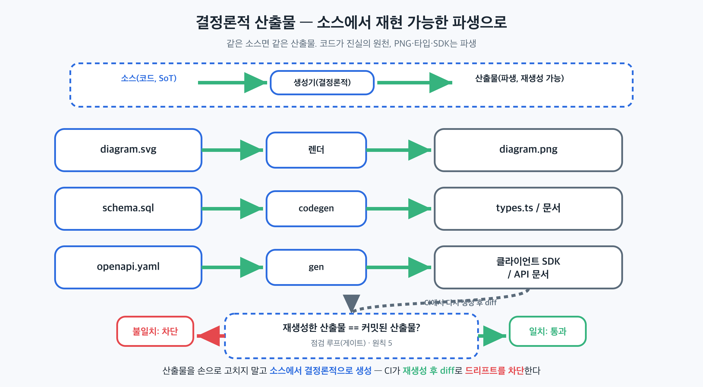

## 이 장에서 배우는 것

이 장을 끝내면 **에이전트와 사람이 소비하는 산출물(다이어그램·문서·타입·설정)을 "손으로 만든 불투명한 결과물"이 아니라 "소스에서 재현 가능하게 생성된 파생물"로 설계하는 법**을 압니다. 핵심 한 줄은 *코드가 진실이고, 산출물은 언제든 다시 만들 수 있는 뷰다.* ch12의 SoT가 "어떤 사실이 권위 있는가"였다면, 이 장은 그 패턴을 산출물에 적용합니다. 소스가 SoT이고, 산출물은 거기서 결정론적으로 파생됩니다.

## 핵심 개념

이 패턴의 한 줄은 이렇습니다. 산출물은 소스(코드)로부터 재현 가능하게 생성돼야 한다. 같은 입력은 언제나 같은 출력을 낸다. 여기서 "결정론적"이란 생성 과정이 재실행해도 같은 결과를 낸다는 뜻입니다. 그래서 소스가 진실(SoT)이고, 산출물은 그 소스의 파생 뷰입니다. 손으로 빚은 최종 결과물이 아니라, 버리고 다시 만들 수 있는 빌드 결과입니다.

핵심 문제는 **불투명한 산출물**입니다. 어떤 산출물이 소스 없이 한 번 만들어진 블롭(AI가 생성한 래스터 이미지, 손으로 적어 넣은 값, 손편집한 생성 파일)이면, 셋이 동시에 깨집니다. 무엇이 바뀌었는지 diff할 수 없고, 같은 결과를 다시 만들 수 없으며, 에이전트가 그걸 읽거나 고칠 수 없습니다. 결정론적 산출물은 이 셋을 한꺼번에 해결합니다. 소스가 텍스트(코드)라 diff·리뷰가 되고, 생성이 재현 가능하니 누구나 같은 결과를 얻고, 소스를 고치면 산출물이 따라옵니다.

비유하면 **컴파일된 바이너리와 소스 코드**입니다. 아무도 바이너리를 헥스 에디터로 직접 고치지 않습니다. 소스를 고치고 다시 컴파일합니다. 바이너리는 소스의 파생물일 뿐, 진실이 아니니까요. 결정론적 산출물도 똑같습니다. PNG·생성된 타입·렌더된 문서를 손으로 만지는 게 아니라, 소스를 고치고 다시 생성합니다.

좋은 결정론적 산출물은 세 가지 속성을 가집니다.

- **재현성**: 같은 소스는 언제나 같은 산출물을 낸다(재실행해도 동일).
- **파생**: 산출물은 SoT가 아니라 소스의 뷰다. 손으로 고치지 않는다.
- **점검 가능**: "산출물 == 생성(소스)"를 기계가 확인할 수 있다(원칙 5와 맞물림).

## 왜 중요한가

이 패턴을 어기는 흔한 길은 **편한 산출물을 진실로 삼는 것**입니다. 다이어그램은 이미지 생성기로 뽑고, 값은 문서에 손으로 적고, 생성된 파일은 급할 때 직접 고칩니다. 데모에서는 빨라 보이지만, 그 산출물은 소스와 조용히 어긋나기 시작합니다.

- **diff·리뷰가 불가능해진다.** AI가 생성한 래스터 이미지는 한 글자를 고치려도 전체를 다시 뽑아야 하고, "무엇이 바뀌었나"를 텍스트로 비교할 수 없습니다. 리뷰어는 픽셀을 눈으로 대조하는 수밖에 없습니다. 소스가 코드(SVG·스키마)면 변경이 텍스트 diff로 드러납니다.
- **재현이 깨진다.** 비결정적 생성(타임스탬프·랜덤·정렬 안 된 출력)은 같은 입력에 다른 출력을 냅니다. 그러면 "이 산출물이 맞게 생성됐나"를 대조할 기준 자체가 없습니다. 결정론이 있어야 "다시 생성해서 같은지" 확인할 수 있습니다.
- **손수정이 드리프트를 만든다.** 생성된 파일을 직접 고치면, 다음 생성이 그 수정을 덮어쓰고, 덮어쓰기 전까지는 소스와 어긋난 채로 남습니다. 에이전트는 어느 쪽이 진실인지 모릅니다.
- **불투명 블롭이 사람 병목을 만든다.** 산출물이 코드가 아니라 손으로만 만들 수 있는 블롭이면, 에이전트가 그걸 수정하지 못해 매번 사람을 호출합니다(원칙 1·4 위반). 코드로 된 산출물은 에이전트가 직접 고치고 재생성합니다.

규모에서 이게 중요한 이유는 ch13과 같습니다. 에이전트가 산출물을 대량으로 만들 때, 사람은 "대충 맞네"로 넘어가지만 에이전트 규모에선 그게 통하지 않습니다. 유일하게 통하는 검증은 기계 점검이고, 기계 점검은 결정론을 전제로 합니다. 같은 입력에 같은 출력이 나와야 "재생성한 것과 일치하는가"를 묻습니다. 결정론은 검증의 사치가 아니라 전제 조건입니다.

## 하네스에 적용하기

결정론적 산출물 설계는 "산출물마다 소스를 정하고, 생성을 재현 가능하게 만들고, 일치를 기계가 강제하는" 작업입니다. 산출물이 무엇이든 같은 틀이 적용됩니다.

```text
소스(코드, SoT) ──생성기(결정론적)──▶ 산출물(파생, 재생성 가능)
────────────────────────────────────────────────────────────
diagram.svg     ── 렌더 ──▶          diagram.png
schema.sql      ── codegen ──▶       types.ts / 문서
openapi.yaml    ── gen ──▶           클라이언트 SDK / API 문서

점검: 재생성한 산출물 == 커밋된 산출물?   (CI에서 다시 생성 후 diff)   ← 원칙 5
```



핵심 규칙 셋입니다. (1) 소스를 커밋하고, 산출물은 소스에서 생성한다. (2) 산출물을 손으로 고치지 않는다. 소스를 고치고 재생성한다. (3) CI가 "재생성 후 diff"로 산출물이 소스와 일치함을 강제한다. 특히 (3)이 이 패턴을 살아있게 합니다. 강제가 없으면 누군가 산출물을 손으로 고치고, 소스와의 연결이 끊깁니다.

가장 흔하고 직관적인 사례가 **개념 다이어그램**입니다. 흐름도를 AI 이미지 생성기로 뽑으면, 의미 있는 텍스트 diff도 안정적 재현도 어려운 블롭이 됩니다(모델·시드·버전·프롬프트가 고정되지 않으니까요). 대신 다이어그램을 코드로 작성하면(SVG나 텍스트 다이어그램 언어) 소스가 텍스트라 diff·리뷰가 되고, 결정론적 렌더러가 그 코드를 이미지로 변환합니다. 화살표 하나를 옮기는 변경이 코드 한 줄의 diff로 드러나고, 렌더러 버전·폰트·환경을 고정하면 누구든 같은 소스로 같은 이미지를 재생성합니다.

> **자기참조 — 이 책의 산출물이 이 패턴 위에 있습니다.** 이 책의 모든 개념 다이어그램은 AI가 생성한 그림이 아니라 SVG 코드로 작성되고, 결정론적 렌더러가 PNG로 변환합니다. 그래서 다이어그램의 변경은 SVG 텍스트의 diff로 리뷰되고, 렌더 환경(렌더러·폰트·설정)을 고정하면 누구나 같은 소스에서 같은 PNG를 재생성합니다. 마찬가지로 책의 구조(목차·장 골격)는 한 구조 파일에서 생성되고(ch12의 SoT), 진행 상태는 각 원고의 메타데이터를 스캔해 산출합니다. 별도 매니페스트라는 손편집 블롭을 두지 않습니다. (이 생성 파이프라인의 도구 전체는 4부 케이스 스터디에서 해부합니다.)

이 패턴은 책 밖에서도 같습니다. DB 타입은 스키마에서 생성하고, API 클라이언트는 OpenAPI 정의에서 생성하고, 레퍼런스 문서는 코드 주석·스키마에서 생성합니다. 손으로 동기화하지 말고 생성하세요. 그리고 빌드를 결정론적으로 만들면(같은 입력 → 같은 출력) 캐시·검증·재현이 공짜로 따라옵니다. 무엇이든, 산출물은 소스의 파생이고 소스가 진실입니다.

## 안티패턴과 함정

- **AI 래스터 다이어그램.** 개념 흐름도를 이미지 생성기로 뽑는 것. 의미 있는 텍스트 diff도 안정적 재현도 어렵고, 리뷰어는 대체로 픽셀 결과를 눈으로 확인하게 됩니다. 다이어그램을 코드(SVG 등)로 작성해 결정론적으로 렌더하세요.
- **산출물 손수정.** 생성된 파일(타입·문서·렌더 결과)을 직접 편집하는 것. 다음 생성이 덮어쓰고, 그 전까지 소스와 어긋납니다. 소스를 고치고 재생성하세요.
- **비결정적 생성기.** 타임스탬프·랜덤·정렬 안 된 출력 때문에 같은 입력에 다른 결과가 나오는 것. diff가 노이즈로 가득 차 점검이 무의미해집니다. 생성을 결정론적으로 고정하세요(정렬·고정 시드·시간 제거).
- **생성물을 SoT로 착각.** 빌드 결과를 진실로 삼아 거기서 다시 손으로 파생하는 것. 소스가 진실이어야 합니다(ch12). 생성물은 언제든 버리고 다시 만들 수 있어야 합니다.

## 핵심 정리 / 체크리스트

- [ ] 결정론적 산출물 = **소스(코드)가 진실, 산출물은 재생성 가능한 파생**. 같은 입력 → 같은 출력.
- [ ] 산출물을 **손으로 고치지 않는다**. 소스를 고치고 다시 생성한다.
- [ ] 개념 다이어그램은 **AI 래스터가 아니라 코드**(SVG 등)로 작성해 결정론적으로 렌더한다.
- [ ] "재생성한 산출물 == 커밋된 산출물"을 **CI가 강제**한다(원칙 5와 맞물림).
- [ ] 이 패턴은 ch12의 SoT를 산출물에 적용한 것이다. 소스가 SoT, 산출물은 뷰.

## 공식 출처

- 이 장은 원칙 2·4·5와 ch12의 SoT 패턴을 산출물에 종합한 패턴이다. 근거는 해당 원칙 장과 `docs/verified-facts.md`(8원칙 정의)에 둔다.
