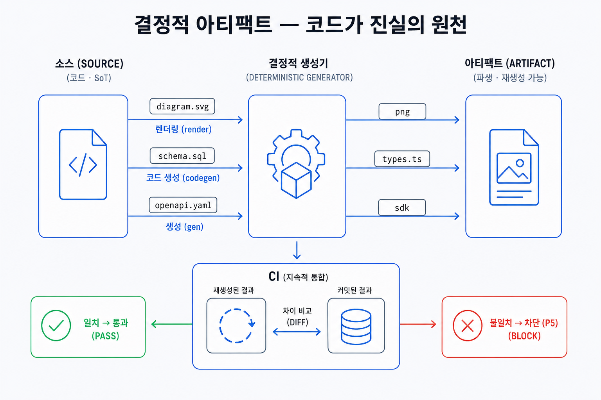

## 이 장에서 배우는 것

이 장을 끝내면 **에이전트와 사람이 다루는 다이어그램, 문서, 타입, 설정 등의 산출물을 불투명한 결과물이 아니라 재현 가능하도록 생성된 산출물로 설계하는 법**을 알게 됩니다. 핵심은 **코드가 진실이고, 산출물은 언제든 다시 만들 수 있다**라는 것입니다. 12장의 SoT가 "어떤 사실이 진실의 원천인가"였다면, 이 장은 그 패턴을 산출물에 적용합니다. 소스가 SoT이고, 산출물은 소스에서 결정론적으로 생성된 파생이 됩니다.

## 핵심 개념

이 패턴을 한 줄로 정의하면 **산출물은 소스(코드)로부터 재현 가능하게 생성돼야 하고, 같은 입력은 언제나 같은 출력을 내야 합니다.** 여기서 "결정론적"이란 생성 과정을 재실행해도 같은 결과를 낸다는 뜻입니다. 소스가 진실(SoT)이고, 산출물은 소스의 파생물이 돼야 합니다. 손으로 빚은 최종 결과물이 아니라, 버리고 다시 만들 수 있는 결과여야 합니다.

이 패턴이 필요한 이유는 **산출물의 재현 불가능성**에서 비롯됩니다. 어떤 산출물이 소스 없이 한 번 만들어진 결과물(AI가 생성한 이미지, 손으로 적어 넣은 값, 사람이 생성하거나 편집한 파일)이면, 무엇이 바뀌었는지 비교할 수 없고, 같은 결과를 다시 만들 수 없으며, 에이전트가 그걸 읽거나 고칠 수 없게 됩니다. 재현 가능한 산출물은 이 세 가지 문제를 한꺼번에 해결합니다. 소스가 텍스트라 비교하거나 리뷰할 수 있고, 생성이 재현 가능하니 누구나 같은 결과를 얻고, 소스를 고치며 산출물을 제어할 수 있습니다.

비유하면 **동일한 소스 코드를 컴파일하면 결정론적으로 생성되는 바이너리**와 같습니다. 누구도 바이너리를 직접 고치지 않습니다. 소스를 고치고 다시 컴파일합니다. 바이너리는 소스의 파생물일 뿐, 진실이 아니니까요. 결정론적 산출물도 똑같습니다. PNG 이미지, 생성된 타입, 문서를 손으로 만지는 게 아니라, 소스를 고치고 다시 생성합니다.

좋은 결정론적 산출물은 세 가지 속성을 지닙니다.

- **재현성**: 같은 소스는 언제나 같은 산출물을 생성합니다.
- **파생**: 산출물은 SoT가 아니라 소스로부터 파생돼야 합니다. 직접 고치지 않아야 합니다.
- **점검 가능**: 소스와 산출물을 기계가 확인할 수 있어야 합니다.

## 왜 중요한가

이 패턴을 어기는 흔한 상황은 **산출물을 진실의 원천으로 삼는 것**입니다. 다이어그램은 이미지 생성 도구로 직접 만들고, 값은 문서에 손으로 작성합니다. 생성된 파일은 급할 때 직접 고칩니다. 데모 수준의 제품을 개발할 땐 이게 빠르지만, 그 산출물은 소스와 어긋나기 시작해 문제를 일으키게 됩니다.

- **비교, 리뷰가 불가능해진다.** AI가 생성한 이미지는 한 글자를 고치려 해도 전체를 다시 뽑아야 하고, "무엇이 바뀌었나"를 비교할 수 없습니다. 사람이 직접 픽셀을 눈으로 비교하고, 리뷰하는 수밖에 없습니다. 소스가 코드(SVG·스키마)면 변경을 텍스트 비교로 손쉽게 찾아낼 수 있습니다.
- **재현이 불가능하다.** 비결정적으로 생성된 타임스탬프, 랜덤, 정렬 안 된 출력은 같은 입력에도 다른 출력을 반환합니다. 그러면 "이 산출물이 맞게 생성됐나"를 대조할 기준이 모호해집니다. 결정적으로 생성되어야 "다시 생성해서 같은지" 확인할 수 있습니다.
- **사람의 직접 수정이 점진적으로 문제 가능성을 늘린다.** 생성된 파일을 직접 고치면, 다음 생성이 그 수정을 덮어쓰고, 덮어쓰기 전까지는 진실의 원천인 소스와 어긋난 채로 남게 됩니다. 에이전트는 어느 쪽이 진실인지 모르게 됩니다.
- **에이전트에 의해 생성되지 않은 산출물이 사람의 개입을 필요로 해 병목을 만든다.** 산출물이 코드에 의해 생성되지 않고 사람이 직접 생성해야만 한다면, 에이전트는 수정할 수 없어 매번 사람의 개입을 필요로 합니다. 이는 원칙 1과 4를 위반한 것으로, 코드로 된 산출물은 에이전트가 직접 고치고 생성할 수 있게 해야 합니다.

특히 프로덕션 규모에서 이 패턴이 중요한 이유는 13장과 같습니다. 에이전트가 산출물을 대량으로 만들 때, 사람의 리뷰가 병목이 되어 대충 살펴보고 넘어가게 되지만 프로덕션 환경에서는 문제가 되곤 합니다. 이러한 상황에서 유효한 검증은 기계적 검증이지만, 기계적 검증은 결정론적으로 생성된 산출물에 대해서만 의미 있는 검증이 가능합니다. 같은 입력에 같은 출력이 나와야 "재생성한 것과 일치하는가"를 검사할 수 있기 때문입니다. 결정론적 산출물에 대한 검증은 사치가 아니라 에이전틱한 업무 프로세스의 필수 조건입니다.

## 하네스에 적용하기

결정론적 산출물 설계는 "산출물마다 소스를 정하고, 생성을 재현 가능하게 만들고, 기계적인 검증을 가능하게 하는" 작업입니다. 산출물이 무엇이든 같은 틀이 적용됩니다.

| 소스 (코드, SoT) | 생성기 (결정론적) | 산출물 (파생, 재생성 가능) |
| ---------------- | ----------------- | -------------------------- |
| `diagram.svg`    | 렌더              | `diagram.png`              |
| `schema.sql`     | codegen           | `types.ts` / 문서          |
| `openapi.yaml`   | gen               | 클라이언트 SDK / API 문서  |

결정론적인 산출물의 일관성 검증은 재생성한 산출물이 기존 산출물과 같은지 비교하면 됩니다. 원칙 5에 따라 CI에서 다시 생성한 뒤 diff로 확인할 수 있습니다.

이 그림은 결정론적인 산출물의 핵심 규칙을 설명합니다. 소스를 커밋하고, 산출물은 소스로부터 생성합니다. 산출물을 손으로 직접 고치지 않아야 하며, 필요하면 소스를 수정해 산출물을 재생성해야 합니다. CI 단계에서 소스에 대한 검증은 재생성한 산출물과 기존 산출물을 비교해서 강제할 수 있습니다. 특히 이 패턴을 살아있게 하는 건 CI 단계에서 결정론적인 산출물의 검증을 통해 이를 강제할 수 있다는 것입니다. 강제가 없으면 누군가 산출물을 손으로 고치게 되어, 소스와의 동기화가 깨지게 되기 때문입니다.

이 책 집필 과정에서 **다이어그램**을 결정론적인 산출물로 생성했습니다. 다이어그램을 설명하는 컨텐츠를 우선 작성하고, 이를 기반으로 SVG를 생성했습니다. 예외적으로 시각적인 완성도를 위해 스타일 프롬프트와 다이어그램을 설명하는 컨텐츠, SVG를 이용해 이미지 생성 모델로 래스터라이징했습니다. 다이어그램에 대한 설명과 SVG 없이 이미지 생성 모델만으로 생성하면, 의미 있는 텍스트 비교도 안정적 재현도 어렵게 됩니다. 대신 다이어그램을 코드로 작성하면(SVG나 텍스트 다이어그램 언어) 소스가 텍스트라 리뷰와 비교가 가능하게 되고, 시각적인 완성도를 높이는 이미지 생성 단계에서도 SVG가 명세 역할을 해 산출물의 일관성을 지킬 수 있습니다(다만 이 생성 단계 자체는 결정론적이지 않아 의도적 예외로 문서화했습니다). 다이어그램의 화살표를 옮기는 변경이 코드 한 줄의 비교로 드러나고, 폰트, 색상 등을 고정하면 누구든 같은 소스로 같은 이미지를 재생성할 수 있게 됩니다.

> **자기참조 — 이 책의 산출물도 이 패턴을 적용했습니다.** 이 책의 다이어그램은 내용을 SVG 코드로 설계하고 결정론적 렌더러로 PNG를 뽑아 비교와 리뷰, 재현이 가능했습니다. 다만 한국어 라벨의 타이포그래피 품질 때문에, **발행 본문에 싣는 이미지**는 SVG 소스를 명세로 삼아 생성된 이미지를 사용했습니다. 결정론 원칙의 **의도적으로 문서화된 예외**이며, 4부에서 하네스 성숙도를 점수화할 때 감점으로 반영했습니다. 책의 목차와 챕터는 한 구조의 파일에서 생성되고(12장의 SoT), 진행 상태는 각 원고의 메타데이터를 통해 기록했습니다. 별도로 메타데이터를 관리하지 않았으며, 이러한 생성 파이프라인과 예외를 포함한 책 집필 과정의 하네스는 4부 케이스 스터디에서 다루겠습니다.

이 패턴은 책을 만드는 일 이외의 케이스에서도 유용합니다. DB 테이블은 스키마를 통해 생성하고, OpenAPI가 제공하는 API를 호출하는 클라이언트 객체는 OpenAPI의 API 프로토콜 문서를 기반으로 생성하고, 레퍼런스 문서는 코드 주석과 스키마에서 생성됩니다. 사람이 직접 작성해서 동기화하지 말고 소스를 바탕으로 생성해야 합니다. 빌드를 통해 결정론적인 산출물이 만들어지면 캐시를 통한 최적화, 검증의 자동화, 산출물의 재현성이 공짜로 따라옵니다. 무엇이든, 산출물은 소스의 파생이고 소스가 진실입니다.

## 안티패턴과 함정

- **이미지 생성 모델을 사용해 생성한 다이어그램.** 다이어그램을 이미지 생성기로 뽑는 것. 의미 있는 텍스트 비교도, 결정론적인 산출물의 확보와 재현도 어렵습니다. 리뷰어는 이미지를 직접 검토해야 합니다. 다이어그램을 코드(SVG 등)로 작성해 결정론적으로 생성해야 합니다. 불가피하게 이미지를 사용한다면, 이 책처럼 **의도적 예외로 문서화**하고 코드 소스를 함께 보존해야 합니다.
- **산출물을 직접 수정하기.** 생성된 파일(타입, 문서, 렌더 결과)을 직접 편집하는 것. 다음 생성 시 덮어쓰게 되고, 다시 생성하기 전까지 산출물의 진실의 원천이 되는 소스와 어긋나게 됩니다. 소스를 고쳐 산출물을 재생성해야 합니다.
- **비결정적인 생성 프로세스.** 타임스탬프, 랜덤, 정렬 안 된 출력 때문에 같은 입력에 대해 다른 산출물이 나오는 것. 비교 시 노이즈로 가득 차 자동화된 검증이 무의미해집니다. 생성 시 산출물이 결정론적으로 고정되게 해야 합니다(정렬, 고정 시드, 시간 제거).
- **산출물을 SoT로 착각하기.** 빌드 결과를 단일 진실의 원천으로 삼아 거기서 다시 손으로 파생하는 것. 산출물 생성 시 입력으로 사용되는 소스가 진실이어야 합니다(12장). 산출물은 언제든 버리고 다시 만들 수 있어야 합니다.

## 핵심 정리 / 체크리스트

- [ ] 결정론적 산출물 = **소스(코드)가 진실, 산출물은 재생성 가능한 파생**. 같은 입력 → 같은 출력.
- [ ] 산출물을 **손으로 고치지 않는다**. 소스를 고치고 다시 생성한다.
- [ ] 개념 다이어그램은 **AI 래스터가 아니라 코드**(SVG 등)로 작성해 결정론적으로 렌더한다. 불가피한 래스터는 의도적 예외로 문서화한다.
- [ ] "재생성한 산출물 == 커밋된 산출물"을 **CI가 강제**한다(원칙 5와 맞물림).
- [ ] 이 패턴은 12장의 SoT를 산출물에 적용한 것이다. 소스가 SoT, 산출물은 뷰.

## 공식 출처

- 이 장은 원칙 2·4·5와 ch12의 SoT 패턴을 산출물에 종합한 패턴이다. 근거는 해당 원칙 장과 `docs/verified-facts.md`(8원칙 정의)에 둔다.
