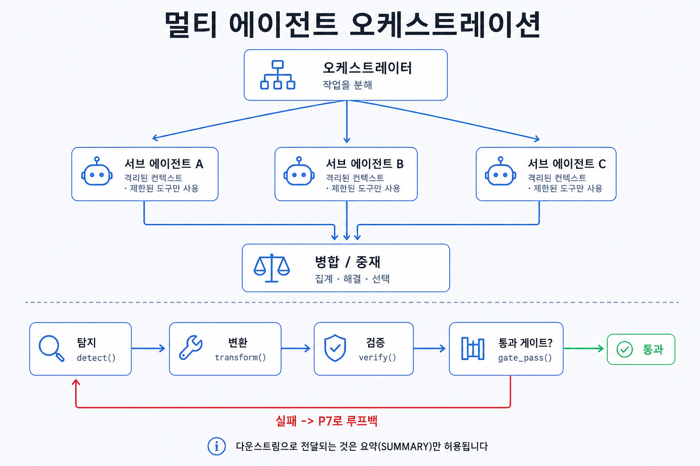

## 이 장에서 배우는 것

이 장을 끝내면 **복잡한 작업을 단일 에이전트의 컨텍스트에 다 넣는 대신, 격리된 컨텍스트를 가진 여러 서브에이전트로 쪼개고 메인 에이전트가 이를 지휘해 처리하는 법**을 알게 됩니다. 사람이 조종하고 에이전트가 실행한다는 원칙 1과 자율 루프를 시스템으로 구축하라는 원칙 7을 합쳐, 사람이 작업의 분해와 게이트를 조종하고 여러 에이전트가 병렬·직렬로 실행하는 패턴을 배웁니다. 이 패턴은 3부의 마지막이자, 4부에서 해부할 이 책 집필을 위해 구축한 하네스의 뼈대입니다.

## 핵심 개념

이 패턴을 한 줄로 정의하면 **복잡한 작업은 한 에이전트의 한 컨텍스트에 다 넣지 말고, 자신만의 컨텍스트를 가진 서브에이전트로 쪼개고, 오케스트레이터가 작업을 분해한 뒤 결과를 합치며 게이트를 지휘하는 것**입니다. 여기서 **서브에이전트**는 자기만의 컨텍스트 윈도우와 커스텀 시스템 프롬프트, 제한된 도구 권한을 가지고 위임받은 작업만 수행한 뒤 결과를 메인 대화 세션에 돌려주는 일꾼입니다. Claude Code의 서브에이전트가 그렇게 동작합니다.

이 패턴이 필요한 이유는 **컨텍스트의 한계**에서 비롯됩니다. 한 에이전트가 모든 파일, 중간 산출물, 작업을 수행하는 데 필요한 다양한 역할을 컨텍스트에 쌓으면 어느새 컨텍스트가 넘쳐, 앞부분을 잊고, 역할이 뒤섞이게 됩니다. 작업을 여러 하위 작업으로 나눠 컨텍스트가 격리된 서브에이전트에게 맡기면 각자 자기 일만 자기 컨텍스트에서 처리하고, 메인은 처리 결과만 받아 컨텍스트가 깨끗하게 유지됩니다. 많은 파일을 읽어야 하는 큰 탐색은 서브에이전트 안에 가두거나, 독립적이고 병렬로 진행 가능한 하위작업을 동시에 돌리는 게 가능합니다.

비유하면 하나의 팀입니다. 리드 한 명이 모든 일을 다 하는 게 아니라, 일을 쪼개 각 일의 전문가들에게 맡기고, 각자 자기 책상에서, 곧 자기 컨텍스트에서 독립적으로 처리한 뒤 결과만 리드에게 전달합니다. 13장의 모델 다양성에서 살펴봤듯이 서브에이전트가 처리한 결과의 검토는 자기 자신이 아닌 다른 에이전트가 수행합니다. 리드는 누구에게 무엇을 맡길지, 언제 어떻게 합칠지, 어느 게이트를 통과해야 다음 단계로 넘어갈지를 정합니다. 그 리드가 오케스트레이터이고, 오케스트레이터 역할을 하는 메인 에이전트를 사람이 조종합니다(원칙 1).

오케스트레이션은 보통 세 가지 패턴으로 설명할 수 있습니다.

- **위임(오케스트레이터-워커).** 메인 에이전트가 작업을 분해해 서브에이전트에 맡기고 결과를 전달받습니다. 큰 탐색을 메인 에이전트의 컨텍스트 밖으로 격리하는 방식입니다.
- **파이프라인(직렬).** 하위 작업들이 서로 의존할 때 사용합니다. 한 서브에이전트의 결과를 다음 서브에이전트에게 넘겨 단계적으로 처리하는 방식입니다.
- **병렬 팬아웃.** 작업을 하위 작업으로 나눌 때, 서로 독립적으로 처리 가능한 하위 작업이 있다면 동시에 실행하고, 끝난 작업의 산출물을 한 곳에서 모아 처리합니다.

## 왜 중요한가

이 패턴을 어기는 흔한 케이스는 메인 에이전트에서 거대한 단일 작업을 전부 처리하는 것입니다. 한 에이전트에게 "조사하고, 쓰고, 검토하고, 고쳐라"를 시키면 데모 수준의 제품에서는 동작하지만, 프로덕션 수준의 제품을 개발할 땐 컨텍스트가 커지며 쉽게 문제를 일으킵니다.

- **컨텍스트가 포화된다.** 모든 파일, 중간 결과 등을 한 컨텍스트에 쌓으면, 컨텍스트 윈도우가 가득 차면서 앞 내용을 잊고 응답 품질이 떨어집니다. 격리된 서브에이전트는 자기 작업을 처리하기 위한 컨텍스트만 들고 있어 작업을 조율하는 메인 에이전트의 컨텍스트에는 꼭 필요한 정보만 포함되게 됩니다.
- **병렬이 불가능해진다.** 한 에이전트만 사용해 직렬로 작업을 처리합니다. 독립적인 다섯 가지 조사를 차례로 하면 모든 작업을 끝내는 데 걸리는 시간이 그만큼 오래 걸립니다. 독립된 작업을 서브에이전트로 팬아웃해서 처리하면 빠르게 처리할 수 있습니다.
- **역할이 섞여 독립성이 깨진다.** 13장에서 다뤘듯이 같은 에이전트가 쓰고 검토하면, 자기 사각지대를 자기가 통과시킵니다. 다른 서브에이전트에게 벤더가 다른 모델을 사용해 검증을 맡기면 사각지대를 줄일 수 있습니다.
- **사람이 조종할 지점이 사라진다.** 거대 에이전트가 불투명하게 전부 처리하면, 사람의 개입 지점이 불분명해집니다. 작업을 하위 작업으로 쪼개어 게이트를 두면, 게이트의 중요성이나 역할에 따라 개입 여부를 결정할 수 있습니다.

프로덕션 수준의 제품을 개발할 때 특히 이 패턴이 중요한 이유는, 멀티 에이전트를 사용해 단순히 더 빠르게 처리할 수 있기 때문이 아니라 통제 가능한 구조가 되기 때문입니다. 분해된 단계마다 사람이 승인·차단할 수 있고, 검증 게이트가 자율 루프 안에 구축될 수 있습니다. 거대 단일 에이전트는 빠를 수 있어도, 어디서 틀렸는지, 어디서 멈출지를 제어할 수 없습니다.

## 하네스에 적용하기

멀티 에이전트 오케스트레이션은 **작업을 역할로 분해하고, 각 역할을 격리된 서브에이전트에 맡기고, 오케스트레이터가 서브에이전트의 결과물을 합치고 게이트를 지휘하는 구조**입니다.

| 구성 요소                              | 역할                                                                                                         |
| -------------------------------------- | ------------------------------------------------------------------------------------------------------------ |
| 오케스트레이터(사람이 조종, 원칙 1)    | 작업을 분해하고, 합치며, 여러 서브에이전트를 중재하고 게이트를 구성하며 작업을 지휘한다                      |
| 서브에이전트(격리 컨텍스트, 제한 도구) | 독립적인 하위작업을 병렬 팬아웃으로 동시에 실행하고, 결과는 오케스트레이터의 지휘에 의해 처리된다            |
| 파이프라인 (직렬)                      | 탐지 → 변환 → 검증 → 게이트 순으로 의존 단계를 연결하고, 게이트를 통과하지 못하면 루프로 되돌아간다 (원칙 7) |
| 단계 간 전달                           | 각 단계는 서브에이전트이며, 출력 요약만 다음 단계로 전달한다                                                 |

이 그림은 오케스트레이션의 핵심 규칙을 설명합니다. 하위 작업을 서브에이전트에게 위임해, 서브에이전트가 사용하는 커스텀 시스템 프롬프트와 제한된 도구를 사용하도록 합니다. 검증을 담당하는 서브에이전트에게는 쓰기 권한을 주지 않는 식입니다. 서브에이전트는 처리 결과만 메인에 반환해 컨텍스트를 격리합니다. 의존 단계는 파이프라인으로, 독립 단계는 병렬로 배치하고, 오케스트레이터가 서브에이전트 간 중재하며 결과를 합칩니다. 단순히 작업을 위임만 하고, 처리 결과를 받아 합치지 않으면 오케스트레이션이 아닙니다.

검증을 담당하는 서브에이전트는 산출물을 만드는 서브에이전트와 역할을 분리해야 하고, 가능하다면 산출물을 만든 서브에이전트가 사용한 모델과 다른 모델을 사용해야 합니다(13장). 같은 모델, 같은 프롬프트의 서브에이전트를 하나 더 띄워 "교차검증"이라 부르면, 사각지대가 겹쳐 검증의 독립성을 확보할 수 없습니다. 역할을 나눈다는 건 도구의 실행 권한, 프롬프트, 가능하면 모델까지 나눈다는 뜻입니다.

> **자기참조 — 이 책의 집필에 사용한 하네스는 멀티 에이전트 오케스트레이션으로 구성했습니다.** 한 장을 reviewed로 올릴 때, 집필(메인)에 이어 기술적인 검토, 독립 모델 Codex를 이용한 교차 검증, 문체 검수 단계가 각각 분리 실행되도록 구성했습니다. 어떤 단계는 독립 모델 Codex를 사용했고, 문체 검수는 탐지 → 윤문은 직렬로, 내용 검사와 문체의 자연스러움 검토는 병렬로 구성했습니다. 각 서브에이전트는 자기 역할만 보고 결과를 반환하며, 사람은 게이트마다 통과와 차단을 조종합니다(원칙 1·7). 모든 게이트를 패스해야 비로소 다음 단계로 갑니다. 이 책 집필을 위해 구성한 오케스트레이션 구성과 도구는 4부 케이스 스터디에서 자세히 살펴보겠습니다.

이 패턴은 책을 만드는 일 이외에 코드 작업에서도 유용합니다. 큰 코드베이스에서의 탐색은 서브에이전트에게 위임해 메인 에이전트의 컨텍스트에는 작업에 필요한 코드만 남기고, 독립적인 작업은 여러 서브에이전트에게 병렬로 팬아웃합니다. 리뷰는 결과물을 생성한 서브에이전트가 아닌 다른 서브에이전트에 맡깁니다. 어떤 경우든 사람이 게이트마다 적절히 개입할 수 있도록 작업을 위임해야 합니다.

## 안티패턴과 함정

- **단일 거대 에이전트.** 조사, 집필, 검토, 수정을 한 컨텍스트에 다 시키기. 컨텍스트가 쉽게 넘치고, 병렬 작업이 안 되어 속도가 느리며, 역할과 컨텍스트가 섞여 산출물의 퀄리티에 안 좋은 영향을 끼칩니다. 이러한 문제를 막기 위해 작업을 하위 작업으로 분해해 격리된 서브에이전트에 맡겨야 합니다.
- **컨텍스트 누수.** 서브에이전트에 불필요한 전체 맥락을 통째로 넘기면 격리의 이점이 사라집니다. 필요한 입력과 요약만 전달해야 합니다.
- **독립성 착각.** 같은 모델, 같은 프롬프트의 서브에이전트를 하나 더 띄워 교차검증이라 부르기. 이는 사각지대를 만들어 신뢰할 수 없는 검증 결과를 만듭니다. 검증은 가능하면 다른 모델을 사용해 서브에이전트로 분리해야 합니다.
- **합류 없는 병렬.** 여러 서브에이전트를 띄우기만 하고 결과를 모으고 중재하지 않는 것. 하위 작업을 처리하는 서브에이전트를 중재하고 처리 결과를 다시 합쳐야 오케스트레이션입니다.
- **사람의 개입 불가.** 전부 위임만 하고 사람이 조종하고 차단할 지점을 두지 않는 것(원칙 1 위반). 단계마다 통과 기준을 두고 사람이 게이트를 제어할 수 있어야 합니다.

## 핵심 정리 / 체크리스트

- [ ] 복잡한 작업은 한 컨텍스트에 욱여넣지 말고 **격리된 서브에이전트로 분해**한다(자기 컨텍스트·시스템 프롬프트·제한 도구).
- [ ] 서브에이전트는 결과 **요약만** 메인에 반환해 컨텍스트를 격리한다.
- [ ] 의존 단계는 **파이프라인**, 독립 단계는 **병렬 팬아웃**으로 배치하고 결과를 **합류·중재**한다.
- [ ] 검증자는 작성자와 **다른 역할**로, 적어도 하나는 **다른 모델**로(13장 모델 다양성) — 같은 프롬프트 복제는 독립이 아니다.
- [ ] 오케스트레이터는 **사람이 조종**한다 — 분해·합류·게이트를 쥐고, 검증을 자율 루프에 인코딩한다(원칙 1·7).

## 공식 출처

- https://code.claude.com/docs/en/sub-agents
