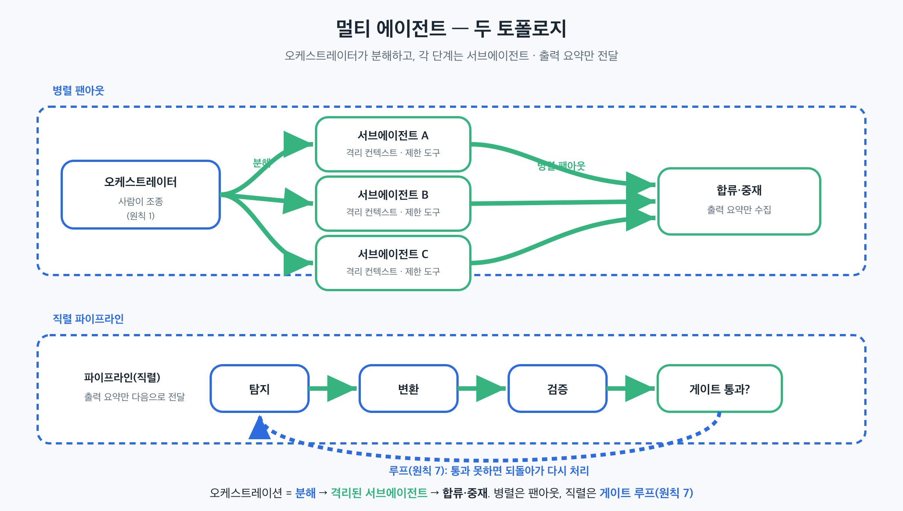

## 이 장에서 배우는 것

이 장을 끝내면 **복잡한 작업을 단일 에이전트의 한 컨텍스트에 욱여넣는 대신, 격리된 컨텍스트를 가진 여러 서브에이전트로 분해해 오케스트레이터가 지휘하는 법**을 압니다. 원칙 1(사람이 조종하고 에이전트가 실행한다)과 원칙 7(자율 루프를 시스템에 인코딩하라)을 합쳐, 사람이 분해와 게이트를 조종하고 여러 에이전트가 병렬·직렬로 실행하는 패턴을 배웁니다. 이 패턴은 3부의 마지막이자, 4부에서 해부할 이 책 자신의 검증 파이프라인의 뼈대입니다.

## 핵심 개념

이 패턴의 한 줄: *복잡한 작업은 한 에이전트의 한 컨텍스트에 다 넣지 말고, 각자 자기 컨텍스트를 가진 서브에이전트로 쪼개 오케스트레이터가 분해·합류·게이트를 지휘한다.* 여기서 **서브에이전트**는 자기만의 컨텍스트 윈도와 커스텀 시스템 프롬프트, 제한된 도구 권한을 가지고 위임받은 작업만 수행한 뒤 결과 요약을 메인 대화로 돌려주는 일꾼입니다(Claude Code의 서브에이전트가 그렇게 동작합니다).

핵심은 **컨텍스트 격리**입니다. 한 에이전트에 모든 파일·중간 산출·역할을 쌓으면 컨텍스트가 포화되고, 앞부분을 잊고, 역할이 뒤섞입니다. 작업을 격리된 서브에이전트로 나누면 각자 자기 일만 자기 컨텍스트에서 보고, 메인은 요약만 받아 깨끗하게 유지됩니다. 많은 파일을 읽어야 하는 큰 탐색은 서브에이전트 안에 가두고, 독립적인 하위작업은 동시에 돌립니다.

비유하면 팀입니다. 리드 한 명이 모든 일을 다 하는 게 아니라, 일을 쪼개 전문가들에게 맡기고, 각자 자기 책상, 곧 자기 컨텍스트에서 독립적으로 일한 뒤 결과 요약만 가져옵니다. 검토는 글쓴이 본인이 아니라 다른 사람이 합니다(ch13의 모델 다양성). 리드는 누구에게 무엇을 맡길지, 언제 합칠지, 어느 게이트를 통과해야 다음으로 갈지를 정합니다. 그 리드가 오케스트레이터이고, 그 역할은 사람이 조종합니다(원칙 1).

오케스트레이션은 보통 세 가지 모양으로 조합됩니다.

- **위임(오케스트레이터-워커).** 메인이 작업을 분해해 서브에이전트에 맡기고 요약만 회수한다. 큰 탐색을 메인 밖으로 격리하는 방식이다.
- **파이프라인(직렬).** 단계가 서로 의존할 때 쓴다. 탐지의 출력이 변환의 입력이 되고, 변환의 출력이 다시 검증으로 넘어가는 식으로 앞 단계 결과가 다음 단계의 입력이 된다.
- **병렬 팬아웃.** 하위작업이 서로 독립일 때 동시에 실행하고, 끝나면 한 곳에서 합류·중재한다.

## 왜 중요한가

이 패턴을 어기는 흔한 길은 단일 거대 에이전트에 전부 떠넘기는 것입니다. 한 에이전트에게 "조사하고, 쓰고, 검토하고, 고쳐라"를 한 컨텍스트에서 시킵니다. 데모에서는 동작하지만, 작업이 커지면 무너집니다.

- **컨텍스트가 포화된다.** 모든 파일·중간 결과를 한 컨텍스트에 쌓으면, 윈도가 차면서 앞 내용을 잊고 품질이 떨어집니다. 격리된 서브에이전트는 자기 작업분만 들고 있어 메인이 가벼워집니다.
- **병렬이 불가능해진다.** 한 에이전트는 직렬로만 일합니다. 독립적인 다섯 가지 조사를 차례로 하면 다섯 배 느립니다. 팬아웃하면 동시에 끝납니다.
- **역할이 섞여 독립성이 깨진다.** 같은 에이전트가 쓰고 검토하면, 자기 사각지대를 자기가 통과시킵니다(ch13). 검증자를 다른 서브에이전트, 다른 모델로 분리해야 교차검증이 성립합니다.
- **사람이 조종할 지점이 사라진다.** 한 거대 에이전트가 불투명하게 전부 처리하면, 사람은 어느 단계에서 개입할지 모릅니다(원칙 1 위반). 작업을 단계로 쪼개고 게이트를 두면, 사람이 게이트마다 조종합니다.

규모에서 이게 중요한 이유는, 멀티 에이전트가 단순히 "더 빠른 한 에이전트"가 아니라 통제 가능한 구조이기 때문입니다. 분해된 단계마다 사람이 승인·차단할 수 있고, 검증이 자율 루프 안에 인코딩됩니다(원칙 7). 거대 단일 에이전트는 빠를 수 있어도, 어디서 틀렸는지·어디서 멈출지를 사람이 잡을 수 없습니다.

## 하네스에 적용하기

멀티 에이전트 오케스트레이션은 "작업을 역할로 분해하고, 각 역할을 격리된 서브에이전트에 맡기고, 오케스트레이터가 합류와 게이트를 지휘하는" 구조입니다.

```text
                      ┌─ [서브에이전트 A] (격리 컨텍스트·제한 도구) ─┐
오케스트레이터 ──분해──┼─ [서브에이전트 B] ─────────── 병렬 팬아웃 ──┼─▶ 합류·중재
 (사람이 조종, 원칙1)   └─ [서브에이전트 C] ──────────────────────────┘     │
        │                                                                   ▼
        └────── 파이프라인(직렬): 탐지 ─▶ 변환 ─▶ 검증 ─▶ 게이트 통과? ──── 루프(원칙7)
                 각 단계는 서브에이전트, 출력 요약만 다음으로 전달
```



핵심 규칙 셋입니다. (1) 역할마다 서브에이전트를 두고 커스텀 시스템 프롬프트와 제한된 도구를 준다 — 검증자에게 쓰기 권한을 주지 않는 식으로. (2) 서브에이전트는 요약만 메인에 반환해 컨텍스트를 격리한다. (3) 의존 단계는 파이프라인으로, 독립 단계는 병렬로 배치하고, 오케스트레이터가 결과를 합류·중재한다. 단순히 던지기만 하고 합치지 않으면 오케스트레이션이 아닙니다.

검증자는 특히 작성자와 다른 역할이어야 하고, 적어도 하나는 다른 모델이어야 합니다(ch13). 같은 모델·같은 프롬프트의 서브에이전트를 하나 더 띄워 "교차검증"이라 부르면, 사각지대가 겹쳐 독립이 아닙니다. 역할을 나눈다는 건 권한·프롬프트·가능하면 모델까지 나눈다는 뜻입니다.

> **자기참조 — 이 책의 검증 게이트가 멀티 에이전트 오케스트레이션입니다.** 한 장을 reviewed로 올릴 때, 집필(메인)에 이어 기술 검수·독립 모델(codex) 교차검증·문체 검수가 각자 별도 단계로 분리되어 실행됩니다. 어떤 단계는 독립 모델 CLI(codex)이고, 문체 검수는 탐지 → 윤문 → (내용 감사·자연스러움 리뷰) 병렬이라는 여러 서브에이전트의 파이프라인입니다. 각 에이전트는 자기 역할만 보고 요약을 반환하며, 사람은 게이트마다 통과·차단을 조종합니다(원칙 1·7). 이 게이트가 합의해야 비로소 다음 단계로 갑니다. (오케스트레이션 구성과 도구 전체는 4부 케이스 스터디에서 해부합니다.)

이 패턴은 코드 작업에서도 같습니다. 큰 코드베이스 탐색은 서브에이전트에 격리해 메인 컨텍스트를 아끼고(Claude Code의 빌트인 Explore가 그런 역할입니다), 독립적인 여러 분석은 병렬로 팬아웃하고, 리뷰는 작성자와 다른 에이전트에 맡깁니다. 무엇이든, 사람이 분해와 게이트를 쥐고 에이전트들이 실행합니다.

## 안티패턴과 함정

- **단일 거대 에이전트.** 조사·집필·검토·수정을 한 컨텍스트에 다 시키는 것. 컨텍스트가 포화되고, 병렬이 안 되고, 역할이 섞입니다. 역할로 분해해 격리된 서브에이전트에 맡기세요.
- **컨텍스트 누수.** 서브에이전트에 불필요한 전체 맥락을 통째로 넘기면 격리의 이점이 사라집니다. 필요한 입력과 요약만 전달하세요.
- **독립성 착각.** 같은 모델·같은 프롬프트의 서브에이전트를 하나 더 띄워 교차검증이라 부르는 것. 사각지대가 겹칩니다(ch13). 검증자는 다른 역할로, 가능하면 다른 모델로 분리하세요.
- **합류 없는 병렬.** 여러 서브에이전트를 띄우기만 하고 결과를 모으고 중재하지 않는 것. 결과를 다시 합치고 중재하는 단계가 있어야 오케스트레이션입니다.
- **사람 게이트 제거.** 전부 자동 위임만 하고 사람이 조종·차단할 지점을 안 두는 것(원칙 1 위반). 단계마다 통과 기준을 두고 사람이 게이트를 쥐세요.

## 핵심 정리 / 체크리스트

- [ ] 복잡한 작업은 한 컨텍스트에 욱여넣지 말고 **격리된 서브에이전트로 분해**한다(자기 컨텍스트·시스템 프롬프트·제한 도구).
- [ ] 서브에이전트는 결과 **요약만** 메인에 반환해 컨텍스트를 격리한다.
- [ ] 의존 단계는 **파이프라인**, 독립 단계는 **병렬 팬아웃**으로 배치하고 결과를 **합류·중재**한다.
- [ ] 검증자는 작성자와 **다른 역할**로, 적어도 하나는 **다른 모델**로(ch13 모델 다양성) — 같은 프롬프트 복제는 독립이 아니다.
- [ ] 오케스트레이터는 **사람이 조종**한다 — 분해·합류·게이트를 쥐고, 검증을 자율 루프에 인코딩한다(원칙 1·7).

## 공식 출처

- https://code.claude.com/docs/en/sub-agents
