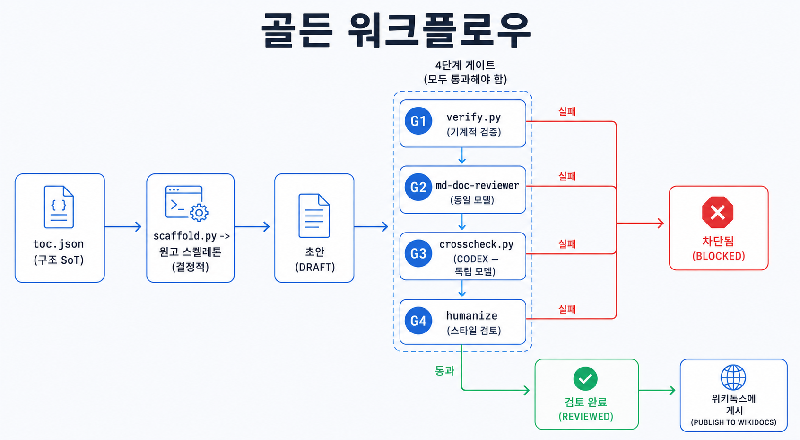

## 이 장에서 배우는 것

이 장을 끝내면 **이 책 집필에 사용한 프로젝트 저장소를 열어 앞에서 배운 8원칙과 4가지 패턴이 하네스로 어떻게 구축되어 있는지** 알게 됩니다. 1~3부에서 올바른 하네스 구축을 위한 원칙과 패턴을 소개했다면, 4부는 하네스에 대한 *증거*입니다. 추상적이었던 하네스가 실제 코드가 되는 지점을 한 파일씩 자세히 살펴보겠습니다. 지금까지 본문은 이 책 집필에 사용한 프로젝트의 하네스를 의도적으로 가렸지만, 케이스 스터디인 4부에서는 가림막을 걷고 하네스를 자세히 해부하겠습니다.

## 핵심 개념

이 프로젝트 저장소는 한 줄로 **코드가 진실의 원천(SoT)이 되어 "책 원고"를 산출물로 만드는 하네스이다.** 빈 디렉토리에서 시작해, 에이전트가 안정적으로 한 장씩 써 내려가도록 계획, 작성, 검증, 상태 기록을 하네스로 구축했습니다. 이 책의 프로젝트 저장소는 다음 주소에서 볼 수 있으니(<https://github.com/aiiiiiiiden/harness_engineering_8_priciples>), 이 장을 읽으며 실제 파일을 함께 열어 보면 좋습니다. 이 책의 하네스를 워크플로우로 표시하면 아래와 같습니다.



워크플로우의 각 요소는 앞 장의 하네스 원칙과 패턴에 대응됩니다. `toc.json`은 책의 구조를 진실의 원천(원칙 3, ch12)으로 다루게 하고, `scaffold.py`는 책의 각 장의 골격을 결정론적 산출물(ch14)로 생성합니다. `verify.py`는 규칙을 기계적으로 강제하고(원칙 5), `crosscheck.py`는 Codex로 책의 컨텐츠를 교차검증합니다(원칙 1·ch13의 모델 다양성). 이 장에서는 워크플로우의 부품들을 자세히 뜯어보겠습니다.

이 하네스를 비유하면 **설계도를 설명하기 위해 설계도대로 지어진 집**입니다. 이 책은 8원칙을 설명하는데, 책을 작성한 환경이 8원칙으로 구성되었습니다. 그래서 이 책을 작성한 환경을 구경하는 것이 곧 하네스 8원칙과 패턴의 실물을 보는 일입니다.

## 왜 중요한가

"아는것"과 "사용하는것" 사이에는 큰 간극이 있습니다. 이 프로젝트 저장소의 하네스 없이 그냥 LLM을 사용해 "이런 책 한 권 써줘"라고 했다면 무엇이 무너지는지가 이 장의 동기입니다.

- **사실이 장마다 어긋난다.** 원칙 번호, 지식, 출처를 매번 모델에 의존하면, 5장과 12장이 다른 정의를 쓸 수 있습니다. 이 프로젝트는 사실을 `docs/verified-facts.md` 한 곳에 두어 진실의 원천이 되게 하고, 이를 `verify.py`를 사용해 기계적으로 검증합니다.
- **진행 상태를 잃어버린다.** 어디까지 썼는지 사람의 기억이나 외부 메모되어 있으면 세션이 끊길 때 휘발됩니다. 이 프로젝트 저장소에서는 각 챕터의 상태를 각 원고의 front-matter에 두고 `status.py`가 스캔해 마지막 상태를 복원합니다(원칙 3).
- **모델의 사각지대에 의해 오류를 검출하지 못한다.** 컨텐츠를 생성하는 모델이 스스로 검토하면 모델의 사각지대에 의해 오류를 검출하지 못합니다(ch13). 이 프로젝트 저장소는 `crosscheck.py`로 집필에 사용한 모델과 다른 모델을 사용합니다.
- **AI Slop이 그대로 발행된다.** 사실이 맞아도 번역체·기계적 리듬이 남으면 한글 기술서로서 신뢰를 잃습니다. 이 프로젝트 저장소는 humanize 스킬을 사용해 내용은 변경하지 않고 문체만 자연스럽게 변경합니다.

요컨대 하네스가 없으면 그럴듯한 초안은 나오지만 **점진적인 문제 발생, 진행 상태를 유실, 사각지대에 의한 오류 발생, AI 스러운 컨텐츠**에 의해 문제가 점진적으로 커집니다. 이 프로젝트 저장소는 그 넷을 각각 코드로 막습니다.

## 하네스에 적용하기

부품을 파일 단위로 해부합니다. 모두 이 프로젝트 저장소의 실제 파일입니다.

**`docs/toc.json` — 책 구조의 진실의 원천 (원칙 3, ch12).** 부, 장, 공식 링크를 단일 진실의 원천으로 관리합니다. 수정 시 원고 파일을 직접 수정하지 않고, 구조를 바꿀 땐 이 파일을 고칩니다.

```json
{
  "book": {
    "subject": "8원칙으로 살펴보는 하네스 엔지니어링 — 에이전트가 일하는 코드베이스 만들기",
    "summary": "코딩 에이전트가 실패할 때 ... (생략)",
    "open_yn": "Y",
    "wikidocs_book_id": 20064
  },
  "parts": [
    {
      "part": 1,
      "title": "하네스 엔지니어링 입문",
      "chapters": [
        { "chapter": 1, "slug": "ch01-what-is-harness",        "title": "하네스 엔지니어링이란?",        "official_links": ["…"] },
        { "chapter": 2, "slug": "ch02-why-harness-engineering", "title": "왜 하네스 엔지니어링이 필요한가", "official_links": ["…"] },
        { "chapter": 3, "slug": "ch03-anatomy-of-a-harness",    "title": "하네스 엔지니어링 미리보기",      "official_links": ["…"] }
      ],
      "wikidocs_page_id": 363213
    }
    // … 2~5부(8원칙·패턴·케이스 스터디·부록)도 같은 구조로 이어진다. 전체는 프로젝트 저장소의 docs/toc.json 참고 …
  ]
}
```

**`scripts/scaffold.py` — 결정론적으로 새로운 문서의 골격 생성 (ch14).** `toc.json`을 읽어 새로운 문서의 골격(front-matter + 표준 6개 섹션)을 결정론적으로 생성합니다. 핵심은 **멱등성**입니다. 몇 번을 돌려도 같은 상태의 골격 문서가 생성됩니다.

```python
# scaffold.py — 이미 존재하는 파일은 보호, 누락분만 생성 (멱등)
for part, ch in iter_toc_chapters(toc):
    path = chapter_path(ch["slug"])
    if os.path.exists(path):
        skipped += 1
        continue            # ← 작성 중 원고를 덮어쓰지 않는다
    ...                     # toc의 official_links를 골격 front-matter에 박아 넣음
```

**각 원고의 front-matter — 기록 시스템 (원칙 3).** `status`(skeleton→draft→reviewed→published), `crosscheck`/`humanized` 상태 저장, `wikidocs_page_id`를 원고 안에 작성해 wikidocs mcp를 사용해 문서를 처리합니다. 만약 이러한 상태값이 여러 파일에 분리 관리된다면 진행 상태가 여러 곳에 흩어져 어긋날 일이 발생할 수 있습니다(ch12).

**`scripts/status.py` — 관측성 (원칙 4).** 상태를 별도의 파일을 다루지 않고, 모든 원고의 front-matter를 `toc.json` 순서 기반의 진행도를 만들어 처리합니다. 상태의 SoT가 front-matter이므로, status는 그걸 비추는 파생 데이터가 됩니다(ch14).

**`scripts/verify.py` — 기계적 검증 (원칙 5).** 불변식을 기계적으로 검증한게 핵심 게이트입니다. 검사 항목: 필수 front-matter 키, 파일명과 `slug` 일치, `official_links`가 `toc.json`과 일치, denylist(폐기된 구 주제명·구 출처명, 원문이 원칙을 번호로 못박았다는 식의 단정), 그리고 이를 기계적 검증으로 강제합니다. 예를 들어 `reviewed`/`published`인데 교차검증, 윤문이 진행되어 있지 않았다면 검증 게이트를 통과하지 못하도록 합니다.

```python
# verify.py — reviewed/published는 두 게이트 도장을 강제
GATED_STATUS = {"reviewed", "published"}
if status in GATED_STATUS and fm.get("crosscheck") != "pass":
    errors.append(f"{rel}: crosscheck != pass — crosscheck.py 통과 필요")
if status in GATED_STATUS and fm.get("humanized") != "pass":
    errors.append(f"{rel}: humanized != pass — /humanize 윤문 필요")
```

이 강제 덕에, 발행 시 검증을 깜빡한 경우 발행이 막히게 됩니다. 발행 단계(`publish-chapter`)가 `verify.py` PASS와 `reviewed` 상태를 기계적으로 검사하기 때문입니다. 사람의 리뷰가 아니라 기계적인 검증이 가능한 코드를 사용해 게이트를 제어합니다.

**`scripts/crosscheck.py` — 모델 다양성 (원칙 1·ch13).** Claude로 기본 집필을 수행하고, 벤더가 다른 모델인 Codex로 사실만 검증한다. 신뢰성 장치가 셋이다. 특히 JSON 스키마를 강제해(`--output-schema`) 구조화된 결과를 보장하고, read-only 샌드박스라 Codex가 원고를 수정하지 못하며, 차단할 수준의 오류가 없으면 `crosscheck: pass`를 front-matter에 업데이트하도록 `verify.py`의 게이트와 맞물려 동작합니다. pass 도장을 손으로 변경하지 않는다는 게 핵심입니다. 검증을 실제로 통과해야만 pass로 갱신됩니다.

```python
#!/usr/bin/env python3
"""codex(독립 모델) 교차 검증 — 원고의 기술적 사실만 점검 (모델 다양성).

Claude(집필자)와 다른 모델(codex)이 같은 원고를 보게 해, 한 모델이 놓친
factor 번호·이름·정의·순서, API·명칭·출처 오류를 잡는다. 문체/톤은 보지 않는다.

신뢰성 장치:
  - codex exec --output-schema 로 JSON 스키마를 강제 → 구조화된 결과 보장
  - read-only 샌드박스 (원고를 수정하지 못함)
  - 결과를 .harness-cache/crosscheck/<slug>.json 에 보존

사용:
    python3 scripts/crosscheck.py <slug>          # 한 장 교차검증(+front-matter 도장)
    python3 scripts/crosscheck.py --facts         # 사실 레지스트리(docs/verified-facts.md) 자체 검증
    python3 scripts/crosscheck.py <slug> --model gpt-5
환경변수: CODEX_MODEL 로 모델 지정 가능.

종료코드: incorrect(high/critical) 발견 시 1, 그 외 0.
"""
from __future__ import annotations
import datetime
import json
import os
import subprocess
import sys

from _harness import ROOT, chapter_path, parse_front_matter, set_front_matter_key

CACHE_DIR = os.path.join(ROOT, ".harness-cache", "crosscheck")
FACTS_PATH = os.path.join(ROOT, "docs", "verified-facts.md")

SCHEMA = {
    "type": "object",
    "additionalProperties": False,
    "required": ["findings", "summary"],
    "properties": {
        "summary": {"type": "string"},
        "findings": {
            "type": "array",
            "items": {
                "type": "object",
                "additionalProperties": False,
                "required": ["claim", "verdict", "severity", "evidence", "fix"],
                "properties": {
                    "claim": {"type": "string", "description": "원고가 주장하는 기술적 사실"},
                    "verdict": {"type": "string", "enum": ["correct", "incorrect", "uncertain"]},
                    "severity": {"type": "string", "enum": ["critical", "high", "medium", "low"]},
                    "evidence": {"type": "string", "description": "판단 근거(공식문서/원문 등)"},
                    "fix": {"type": "string", "description": "incorrect/uncertain일 때 수정안, 아니면 빈 문자열"},
                },
            },
        },
    },
}

PROMPT_TMPL = """너는 한국어 기술서 **"8원칙으로 살펴보는 하네스 엔지니어링 — 에이전트가 일하는 코드베이스 만들기"**(개발자 대상)의 **독립 기술 검수자**다.
아래 원고의 **기술적 사실만** 검증하라. 문체·톤·맞춤법은 절대 언급하지 마라.

검증 대상:
- 하네스 엔지니어링 **원칙의 번호·이름·정의·순서** (원문: OpenAI "Harness Engineering", openai.com/index/harness-engineering, Ryan Lopopolo, 2026-02-11).
- 출처·명칭·실험 사실 (빈 레포→100만 줄, Codex, "사람이 조종·에이전트가 실행" 등). ⚠️ 원문은 원칙을 번호로 명시하지 않으므로, 원고가 "원문이 정한 N원칙"으로 단정하면 incorrect, "원문에서 도출한 8원칙"으로 표기하면 correct로 본다.
- 코드/의사코드의 정확성(린터·구조적 테스트·관측성·도구 스키마 등), API·CLI·도메인 표기.

기준이 되는 '검증된 사실 레지스트리'(이것과 어긋나면 incorrect):
<verified_facts>
{facts}
</verified_facts>

원고(<{slug}>):
<manuscript>
{body}
</manuscript>

각 기술적 주장에 대해 verdict(correct/incorrect/uncertain), severity, evidence(근거), fix(수정안)를 매겨
스키마에 맞는 JSON으로만 답하라. 확신이 없으면 uncertain으로, 추측으로 correct 처리하지 마라.
"""


def run_codex(prompt: str, schema_path: str, out_path: str, model: str | None) -> tuple[int, str]:
    cmd = ["codex", "exec", "--skip-git-repo-check",
           "-c", 'sandbox_mode="read-only"',
           "--output-schema", schema_path, "-o", out_path]
    if model:
        cmd += ["-m", model]
    cmd.append(prompt)
    # stdin을 닫지 않으면 codex exec가 "Reading additional input from stdin..."에서 멈춘다.
    proc = subprocess.run(cmd, capture_output=True, text=True, timeout=600,
                          stdin=subprocess.DEVNULL)
    return proc.returncode, proc.stderr


FACTS_PROMPT = """너는 한국어 기술서 "8원칙으로 살펴보는 하네스 엔지니어링 — 에이전트가 일하는 코드베이스 만들기"의 **독립 기술 검수자**다.
아래는 이 책 전체가 사실의 기준으로 삼는 '검증된 사실 레지스트리'다.
각 사실을 **공식 출처**(openai.com/index/harness-engineering, code.claude.com, modelcontextprotocol.io 등)에 비추어 검증하라.
특히 하네스 엔지니어링 원문(OpenAI, Ryan Lopopolo, 2026-02-11)의 출처·저자·실험 사실, 그리고 8원칙의 이름·순서가 원문 절과 일치하는지 본다.
⚠️ 원문은 원칙을 번호로 명시하지 않는다. 레지스트리가 8개를 "원문이 정한 것"으로 단정하면 incorrect, "이 책이 원문 절에서 도출한 것"으로 명시하면 correct로 본다.
값이 틀렸거나, 옛 정보이거나, 출처상 확인되지 않으면 incorrect/uncertain으로 표시하고 evidence에 근거 URL을, fix에 올바른 값을 적어라.
맞으면 correct. 추측으로 correct 처리하지 마라. claim에는 검증한 항목(key 또는 한 줄 요약)을 넣어라.

<verified_facts>
{facts}
</verified_facts>
스키마에 맞는 JSON으로만 답하라."""


def run_facts(model):
    with open(FACTS_PATH, encoding="utf-8") as f:
        facts = f.read()
    os.makedirs(CACHE_DIR, exist_ok=True)
    schema_path = os.path.join(CACHE_DIR, "_schema.json")
    with open(schema_path, "w", encoding="utf-8") as f:
        json.dump(SCHEMA, f)
    out_path = os.path.join(CACHE_DIR, "_verified-facts.json")
    print(f"⟳ codex로 사실 레지스트리 검증 중… (model={model or '기본'})")
    rc, err = run_codex(FACTS_PROMPT.format(facts=facts), schema_path, out_path, model)
    if not os.path.exists(out_path) or os.path.getsize(out_path) == 0:
        print(f"❌ codex 출력 없음 (rc={rc})\n{err[-500:]}")
        sys.exit(2)
    with open(out_path, encoding="utf-8") as f:
        data = json.load(f)
    findings = data.get("findings", [])
    print(f"\n🤖 codex 요약: {data.get('summary', '')}\n")
    bad = 0
    for fd in findings:
        icon = {"correct": "✅", "incorrect": "❌", "uncertain": "❓"}.get(fd["verdict"], "•")
        print(f"{icon} [{fd['severity']}] {fd['claim']}")
        if fd["verdict"] != "correct":
            print(f"     근거: {fd['evidence']}")
            if fd.get("fix"):
                print(f"     수정: {fd['fix']}")
            bad += 1
    print("\n" + "─" * 40)
    print(f"findings {len(findings)} · 의심/오류 {bad}  →  결과: {os.path.relpath(out_path)}")
    if bad:
        print("⚠️ 레지스트리에 검토 필요 항목이 있다. docs/verified-facts.md 를 확인/수정하라.")
        sys.exit(1)
    print("PASS ✅ (레지스트리 codex 기준)")


def main():
    model = os.environ.get("CODEX_MODEL")
    if "--model" in sys.argv:
        model = sys.argv[sys.argv.index("--model") + 1]
    if "--facts" in sys.argv:
        run_facts(model)
        return
    args = [a for a in sys.argv[1:] if not a.startswith("--")]
    if not args:
        sys.exit("사용법: python3 scripts/crosscheck.py <slug> | --facts [--model NAME]")
    slug = args[0]

    path = chapter_path(slug)
    if not os.path.exists(path):
        sys.exit(f"원고 없음: {path}")
    with open(path, encoding="utf-8") as f:
        _, body = parse_front_matter(f.read())
    with open(FACTS_PATH, encoding="utf-8") as f:
        facts = f.read()

    os.makedirs(CACHE_DIR, exist_ok=True)
    schema_path = os.path.join(CACHE_DIR, "_schema.json")
    with open(schema_path, "w", encoding="utf-8") as f:
        json.dump(SCHEMA, f)
    out_path = os.path.join(CACHE_DIR, f"{slug}.json")

    prompt = PROMPT_TMPL.format(facts=facts, slug=slug, body=body)
    print(f"⟳ codex 교차검증 실행 중… (slug={slug}, model={model or '기본'})")
    rc, err = run_codex(prompt, schema_path, out_path, model)
    if not os.path.exists(out_path) or os.path.getsize(out_path) == 0:
        print(f"❌ codex 출력 없음 (rc={rc})\n{err[-500:]}")
        sys.exit(2)
    with open(out_path, encoding="utf-8") as f:
        data = json.load(f)

    findings = data.get("findings", [])
    print(f"\n🤖 codex 요약: {data.get('summary', '')}\n")
    blockers = 0
    for fd in findings:
        icon = {"correct": "✅", "incorrect": "❌", "uncertain": "❓"}.get(fd["verdict"], "•")
        print(f"{icon} [{fd['severity']}] {fd['claim']}")
        if fd["verdict"] != "correct":
            print(f"     근거: {fd['evidence']}")
            if fd.get("fix"):
                print(f"     수정: {fd['fix']}")
        if fd["verdict"] == "incorrect" and fd["severity"] in ("critical", "high"):
            blockers += 1
    # 결과를 원고 front-matter에 도장 → verify.py가 reviewed/published에서 강제
    result = "fail" if blockers else "pass"
    today = datetime.date.today().isoformat()
    with open(path, encoding="utf-8") as f:
        src = f.read()
    src = set_front_matter_key(src, "crosscheck", result)
    src = set_front_matter_key(src, "crosscheck_date", today)
    with open(path, "w", encoding="utf-8") as f:
        f.write(src)

    print("\n" + "─" * 40)
    print(f"findings {len(findings)} · 차단급 incorrect {blockers}  →  결과: {os.path.relpath(out_path)}")
    print(f"front-matter 기록: crosscheck={result}, crosscheck_date={today}")
    if blockers:
        print("FAIL — 차단급 오류를 수정한 뒤 다시 crosscheck를 돌려야 reviewed로 올릴 수 있다.")
        sys.exit(1)
    print("PASS ✅ (codex 기준)")


if __name__ == "__main__":
    main()
```

**`scripts/_harness.py` — 공통 토대.** 의존성 zero(표준 라이브러리만)로 front-matter 파서와 `set_front_matter_key` 갱신 기능을 제공합니다. 검증 스크립트들이 이 유틸리티만 사용해 필요한 기능을 구현합니다.

이 일곱가지 부품이 빈 프로젝트 저장소에 점진적으로 쌓여 "에이전트가 한 장씩 안정적으로 써 내려가는" 하네스가 구축되었습니다.

## 안티패턴과 함정

이 하네스를 구축하며 피한 함정들입니다. 모두 앞 장 원칙의 위반에 해당합니다.

- **상태를 머릿속이나 에이전트가 접근 불가한 외부에 두기.** "어디까지 했는지"를 채팅 히스토리나 기억으로 남기기. 세션이 끊기면 휘발되기 때문에 상태를 front-matter에 두고 `status.py`로 복원합니다(원칙 3).
- **사실 복제.** 원칙에 대한 정의를 장마다 반복해서 작성하면, 언젠가 반드시 어긋나게 됩니다. `verified-facts.md` 한 곳에 두고 인용합니다(ch12).
- **게이트를 사람 규율에 맡기기.** "글을 발행하기 전 체크리스트를 만들고 사람이 검증하기"와 같은 규칙은 손쉽게 어기게 됩니다. `verify.py`가 도장 없으면 차단(원칙 5)하는것과 같이 기계적으로 검증 가능한 게이트를 두어야 합니다.
- **pass 도장을 직접 수정하기.** `crosscheck: pass`를 검증 없이 직접 작성하면 게이트는 명목만 남습니다. 검증에 사용된 스크립트가 실제 통과 시에만 자동으로 갱신하도록 해야 합니다.
- **스스로 검증하는 것을 교차검증이라 부르기.** 컨텐츠를 작성하는 모델에게 "검증해줘 "라고만 한다면 사각지대에 의해 문제가 발견되지 않습니다(ch13). 벤더가 다른 모델(codex)을 사용해 검증해야 사각지대에 의해 발생하는 문제를 줄일 수 있습니다.

## 핵심 정리 / 체크리스트

- [ ] 이 프로젝트 저장소는 **원고를 산출물로 삼는 하네스**입니다. 8원칙·3부 패턴이 구현돼 있습니다.
- [ ] 구조는 `toc.json`(SoT) → `scaffold.py`(결정론 생성) → 원고 골격 생성(원칙 3·ch12·ch14) 과정에 의해 처리됩니다.
- [ ] 진행 상태는 **원고의 front-matter에 작성**하고 `status.py`가 스캔해 마지막 상태를 복원합니다.(별도 매니페스트 없음, 원칙 3).
- [ ] `verify.py`가 기계적인 검증을 강제하고, `reviewed`는 **교차검증·윤문 검증이 완료**되야 통과합니다(원칙 5).
- [ ] `crosscheck.py`는 **다른 모델(Codex)**을 사용해 사실을 검증하고 통과 시에만 pass 도장을 찍습니다(원칙 1·ch13).

## 공식 출처

- https://openai.com/index/harness-engineering/
- 이 책의 프로젝트 저장소(이 장에서 해부한 하네스): https://github.com/aiiiiiiiden/harness_engineering_8_priciples
