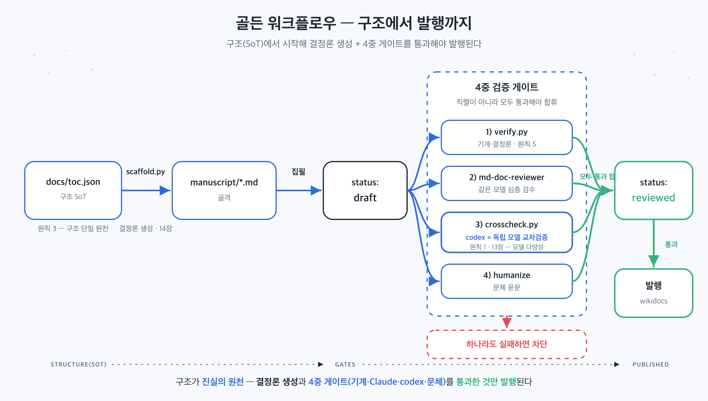

## 이 장에서 배우는 것

이 장을 끝내면 **이 책을 집필한 하네스(바로 이 레포)를 직접 열어, 앞에서 배운 8원칙과 3부 패턴이 실제 파일·스크립트로 어떻게 구현됐는지** 알게 됩니다. 1~3부가 원칙과 패턴이었다면, 4부는 *증거*입니다. 추상이 코드가 되는 지점을 한 파일씩 해부합니다. 지금까지 본문은 이 레포의 사적 도구를 가렸지만, 케이스 스터디인 이 장과 다음 장은 의도적으로 그 가림을 걷습니다.

## 핵심 개념

이 레포의 한 줄 정체: *코드가 아니라 "책 원고"를 산출물로 삼는 하네스다.* 빈 레포에서 시작해, 에이전트(집필자)가 안정적으로 한 장씩 써 내려가도록 구조·검증·기록을 코드로 짜 넣었습니다. 부품을 골든 워크플로우 순서로 늘어놓으면 이렇습니다.

```text
docs/toc.json ─ scaffold.py ─▶ manuscript/*.md(골격) ─ 집필 ─▶ draft
   (구조 SoT)   (결정론 생성)                                    │
                                                4중 검증 게이트 ─┤
   verify.py · md-doc-reviewer · crosscheck.py(codex) · humanize │
                                                                 ▼
                                          status: reviewed ─▶ 발행(wikidocs)
```



각 부품은 앞 장의 원칙·패턴과 1:1로 대응합니다. `toc.json`은 구조의 진실의 원천(원칙 3, ch12)이고, `scaffold.py`는 거기서 골격을 *생성*하는 결정론적 산출물(ch14)이며, `verify.py`는 규약을 기계로 강제하고(원칙 5), `crosscheck.py`는 다른 모델로 사실을 교차검증합니다(원칙 1·ch13의 모델 다양성). 이 장은 그 부품들을 하나씩 뜯어봅니다.

비유하면 **자기 설계도대로 지어진 집**입니다. 이 책은 8원칙을 설명하는데, 그 책을 만든 작업장 자체가 8원칙으로 지어졌습니다. 그래서 작업장을 구경하는 것이 곧 원칙의 실물을 보는 일입니다.

## 왜 중요한가

원칙을 "안다"와 "구현했다" 사이에는 큰 간극이 있습니다. 이 레포가 *없었다면*, 즉 하네스 없이 그냥 LLM에 "이런 책 한 권 써줘"라고 맡겼다면 무엇이 무너지는지가 이 장의 동기입니다.

- **사실이 장마다 어긋난다.** 원칙 번호·이름·출처를 매번 모델 기억에 의존하면, 5장과 12장이 다른 정의를 씁니다. 이 레포는 사실을 `docs/verified-facts.md` 한 곳에 두고(ch12) 어긋나면 `verify.py`가 잡습니다.
- **진행 상태를 잃어버린다.** "어디까지 썼더라"가 사람 머리나 외부 메모에 있으면 세션이 끊길 때 증발합니다. 이 레포는 상태를 각 원고의 front-matter에 두고 `status.py`가 스캔해 복원합니다(원칙 3).
- **한 모델의 사각지대가 그대로 출판된다.** 집필 모델이 자기 글을 자기가 검토하면 틀린 확신이 통과합니다(ch13). 이 레포는 `crosscheck.py`로 다른 모델(codex)을 붙입니다.
- **AI 티가 그대로 나간다.** 사실이 맞아도 번역투·기계적 리듬이 남으면 한글 기술서로서 신뢰를 잃습니다. 이 레포는 humanize 게이트를 강제합니다(내용 불변).

요컨대 하네스가 없으면 "그럴듯한 초안"은 나오지만 *드리프트·망각·사각지대·AI 티*가 누적됩니다. 이 레포는 그 넷을 각각 코드로 막습니다.

## 하네스에 적용하기

부품을 파일 단위로 해부합니다. 모두 이 레포의 실제 파일입니다.

**`docs/toc.json` — 구조의 진실의 원천 (원칙 3, ch12).** 부·장·슬러그·공식 링크가 여기 한 곳에 산다. 원고 파일을 손으로 만들지 않고, 구조를 바꿀 땐 *여기를 먼저* 고친다.

**`scripts/scaffold.py` — 결정론적 골격 생성 (ch14).** `toc.json`을 읽어 누락된 장의 골격(front-matter + 표준 6개 섹션)을 만든다. 핵심은 **멱등성**이다. 이미 있는 파일은 건드리지 않아(작성 중 원고 보호) 몇 번을 돌려도 같은 상태로 수렴한다.

```python
# scaffold.py — 이미 존재하는 파일은 보호, 누락분만 생성 (멱등)
for part, ch in iter_toc_chapters(toc):
    path = chapter_path(ch["slug"])
    if os.path.exists(path):
        skipped += 1
        continue            # ← 작성 중 원고를 덮어쓰지 않는다
    ...                     # toc의 official_links를 골격 front-matter에 박아 넣음
```

**각 원고의 front-matter — 기록 시스템 (원칙 3).** `status`(skeleton→draft→reviewed→published), `crosscheck`/`humanized` 도장, `wikidocs_page_id`가 *원고 안에* 산다. 진행 상태를 위한 별도 매니페스트가 없다. 그래야 진행 상태가 두 곳에 적혀 어긋날 일을 원천 차단한다(ch12).

**`scripts/status.py` — 관측성 (원칙 4).** 별도 상태 파일을 읽는 게 아니라, 모든 원고의 front-matter를 `toc.json` 순서대로 *스캔해* 진척표를 만든다. 상태의 SoT가 front-matter이므로, status는 그걸 비추는 파생 뷰일 뿐이다(ch14).

**`scripts/verify.py` — 기계적 강제 (원칙 5).** 불변식을 코드로 박은 핵심 게이트다. 검사 항목: 필수 front-matter 키, 파일명과 `slug` 일치, `official_links`가 `toc.json`과 일치, denylist(폐기된 구 주제명·구 출처명, 정본이 원칙을 번호로 못박았다는 식의 단정), 그리고 *게이트 강제* — `reviewed`/`published`인데 교차검증·윤문 도장이 안 찍혔으면 실패시킨다.

```python
# verify.py — reviewed/published는 두 게이트 도장을 강제
GATED_STATUS = {"reviewed", "published"}
if status in GATED_STATUS and fm.get("crosscheck") != "pass":
    errors.append(f"{rel}: crosscheck != pass — crosscheck.py 통과 필요")
if status in GATED_STATUS and fm.get("humanized") != "pass":
    errors.append(f"{rel}: humanized != pass — /humanize 윤문 필요")
```

이 강제 덕에, 정상 발행 절차에서는 "검증을 깜빡하고 발행"이 막힌다. 발행 단계(`publish-chapter`·런북)가 `verify.py` PASS와 `reviewed` 상태를 전제로 삼기 때문이다. 사람의 규율이 아니라 코드가 게이트를 쥔다.

**`scripts/crosscheck.py` — 모델 다양성 (원칙 1·ch13).** 집필자(Claude)와 *다른 모델*(codex)에게 같은 원고를 보여 사실만 검증시킨다. 신뢰성 장치가 셋이다. (1) JSON 스키마를 강제해(`--output-schema`) 구조화된 결과를 보장하고, (2) read-only 샌드박스라 codex가 원고를 수정하지 못하며, (3) 차단급 오류가 없으면 `crosscheck: pass`를 front-matter에 *자동으로 도장* 찍어 `verify.py`의 게이트와 맞물린다. 도장을 손으로 적지 않는다는 게 핵심이다. 검증을 실제로 통과해야만 도장이 찍힌다.

**`scripts/_harness.py` — 공통 토대.** 의존성 zero(표준 라이브러리만)로 front-matter 파서와 `set_front_matter_key`(도장 찍기)를 제공한다. 검증 스크립트들이 이 한 토대를 공유해, 같은 규약을 같은 코드로 읽고 쓴다.

이 일곱 조각이 맞물려, 빈 레포가 "에이전트가 한 장씩 안정적으로 써 내려가는" 작업장이 됩니다. 그리고 이 장 자신도 예외가 아니어서, 같은 4중 게이트를 통과한 뒤에야 reviewed가 됩니다.

## 안티패턴과 함정

이 하네스를 만들며 *피한* 실수들입니다. 모두 앞 장 원칙의 위반에 해당합니다.

- **상태를 머릿속·외부에 두기.** "어디까지 했는지"를 채팅 기록이나 사람 기억에 두는 것. 세션이 끊기면 증발한다. → 상태를 front-matter에 두고 `status.py`로 복원(원칙 3).
- **사실 복제.** 원칙 정의를 장마다 다시 적으면, 언젠가 반드시 어긋난다. → `verified-facts.md` 한 곳에 두고 인용(ch12).
- **게이트를 사람 규율에 맡기기.** "발행 전에 검증하기로 약속"한다. 그래도 사람은 깜빡한다. → `verify.py`가 도장 없으면 차단(원칙 5).
- **도장을 손으로 찍기.** `crosscheck: pass`를 검증 없이 직접 적는 것. 그러면 게이트가 명목만 남는다. → 스크립트가 실제 통과 시에만 자동 기록.
- **자기 검토를 교차검증이라 부르기.** 집필 모델에게 "다시 봐줘"라고만 한다. 그러면 사각지대가 겹친다(ch13). → 다른 모델(codex)을 붙임.

## 핵심 정리 / 체크리스트

- [ ] 이 레포는 **원고를 산출물로 삼는 하네스**다 — 8원칙·3부 패턴이 실제 파일로 구현돼 있다.
- [ ] 구조는 `toc.json`(SoT) → `scaffold.py`(결정론 생성) → 원고 골격으로 흐른다(원칙 3·ch12·ch14).
- [ ] 진행 상태는 **front-matter에 살고** `status.py`가 스캔해 복원한다(별도 매니페스트 없음, 원칙 3).
- [ ] `verify.py`가 불변식을 강제하고, `reviewed`는 **교차검증·윤문 도장**이 있어야 통과한다(원칙 5).
- [ ] `crosscheck.py`가 **다른 모델(codex)** 로 사실을 검증하고 통과 시에만 도장을 찍는다(원칙 1·ch13).

## 공식 출처

- https://openai.com/index/harness-engineering/
