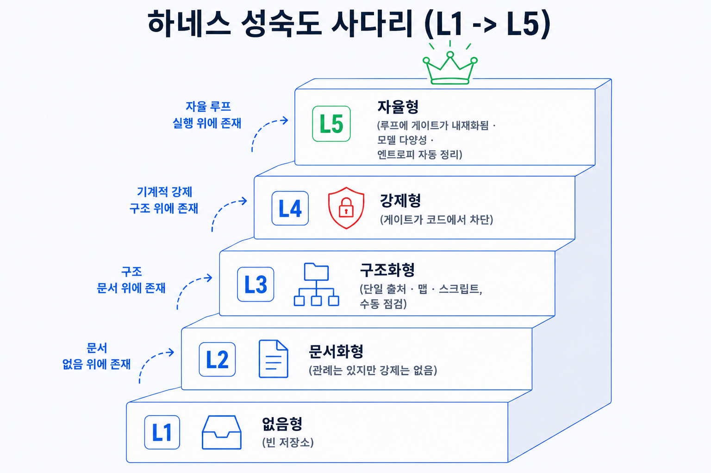

## 이 장에서 배우는 것

이 장을 끝내면 8원칙을 L1→L5 성숙도 루브릭으로 바꿔, 자기 하네스를 원칙별로 채점하는 법을 알게 되고, 그 루브릭으로 *이 레포 자신을 정직하게 채점한 실례*를 봅니다. 핵심은 점수 자랑이 아니라 정직이다. 전부 L5라고 적는 순간 스코어카드는 거짓말이 됩니다. 책의 마지막 장답게, 앞에서 만든 도구로 우리 자신을 측정합니다.

## 핵심 개념

스코어카드의 한 줄: *"좋은 하네스인가?"라는 느낌의 질문을 원칙별 성숙도 점수라는 측정 가능한 질문으로 바꾼다.* "에이전트 친화적이야"는 검증할 수 없지만, "원칙 3은 L4, 원칙 8은 L2"는 근거와 함께 검증할 수 있습니다. 측정의 단위는 8원칙이고, 척도는 다음 다섯 단계입니다.

```text
L1 없음(Absent)     암묵지. 사람 머릿속. 구조·기록·검증 없음. 빈 레포.
L2 문서화(Documented) 규약·사실이 글로는 있으나 강제는 없다. 사람이 지키기로 약속.
L3 구조화(Structured) SoT·맵·스크립트가 있다. 도구로 점검 가능하나 수동 실행.
L4 강제(Enforced)    게이트가 코드로 강제된다. 통과 못 하면 차단(스크립트/CI).
L5 자율(Autonomous)  게이트가 루프에 인코딩되고, 모델 다양성·엔트로피 자동 GC까지. 자가개선.
```



비유하면 **건강검진표**다. "건강해 보인다"가 아니라 항목별 수치(혈압·혈당)로 약한 곳을 콕 집습니다. 좋은 검진표의 가치는 *나쁜 수치를 숨기지 않는 데* 있습니다. 스코어카드도 똑같습니다. L2가 두 개 나왔다는 사실이 바로 다음에 무엇을 고쳐야 하는지를 알려줍니다. 정직이 곧 유용성입니다.

## 왜 중요한가

채점하지 않으면 약점이 보이지 않습니다. "우리 하네스 괜찮은데?"라는 느낌으로 넘어가면, 잘된 부분(보통 눈에 띄는 SoT·맵)만 보고 구멍(보통 안 보이는 처리량·가비지 컬렉션)을 놓칩니다.

- **느낌은 강한 곳만 본다.** SoT와 맵이 그럴듯하면 "잘 돼 있다"고 느끼지만, 그건 8원칙 중 둘일 뿐입니다. 나머지 여섯에 L2가 숨어 있어도 느낌으로는 안 잡힙니다.
- **루브릭이 없으면 점수가 자의적이다.** "이 정도면 좋은 편"은 사람마다 다릅니다. L1~L5를 글로 못박아야 두 사람이 같은 하네스를 비슷하게 채점합니다(원칙 5의 정신 — 기준을 기계적으로).
- **한 번 보고 안 갱신하면 스테일이 된다.** 하네스는 자라거나 썩습니다. 분기마다 다시 채점하지 않으면, 작년의 L4가 올해도 L4라는 보장이 없습니다(원칙 8).

스코어카드가 없으면 하네스 개선은 *느낌 기반*이 된다. 어디가 약한지 모르니 아무 데나 손대고, 정작 L2인 곳은 방치됩니다. 측정이 있어야 개선이 *우선순위*를 가집니다.

## 하네스에 적용하기

루브릭을 적용하는 법은 단순합니다. 8원칙 각각에 대해 "지금 어느 레벨인가"를 *근거와 함께* 매기고, "다음 레벨로 가려면 무엇이 필요한가"를 적습니다. 아래는 이 책을 집필한 레포(ch16에서 해부한 그 레포)를 그 루브릭으로 채점한 표입니다. 점수를 부풀리지 않았습니다.

```text
원칙                         레벨   근거(이 레포)                              다음 레벨로
────────────────────────────────────────────────────────────────────────────────────────
1 사람조종·에이전트실행        L4   사람이 게이트마다 조종, 에이전트가 집필·검증 실행   루프 완전 자동화
2 앱을 에이전트가 읽게         L3   산출물이 원고라 '앱' 개념이 약함. 맵·구조로 가독   검증상태 더 기계가독으로
3 리포=기록 시스템            L4   front-matter 상태·verified-facts SoT·ADR·복원     기록 자동 감사
4 에이전트 가독성             L4   진입점 맵(약 100줄)·지도 테이블·골든 워크플로우     (강점) 유지
5 기계적 강제                L3   verify.py 게이트·denylist 존재. 단 CI/훅 미연결    pre-commit/CI로 자동화
6 처리량→병합 철학            L2   브랜치 2개·커밋 약 12개. 고처리량 병합 미관측       병렬 집필·자동 병합 게이트
7 자율 루프 인코딩            L3   4중 게이트가 워크플로우에 인코딩. 단 사람이 트리거   단계 자동 연쇄
8 엔트로피 가비지 컬렉션       L2   작업 산출물은 무시(gitignore)뿐, 자동 가드닝 없음   GC 에이전트 도입
────────────────────────────────────────────────────────────────────────────────────────
종합: 평균 ≈ L3.  강점 원칙 3·4(기록·가독성).  약점 원칙 6·8(처리량·GC), 그리고 원칙 5의 'CI 미연결'.
```

이 표가 정직하다는 게 핵심입니다. 이 레포는 SoT(원칙 3)와 진입점 맵(원칙 4)은 L4로 단단하지만, **원칙 6은 L2**입니다. 브랜치 2개·커밋 약 12개 규모라 "처리량이 병합 철학을 바꾼다"는 상황 자체가 아직 관측되지 않았습니다. 원칙 8도 L2입니다. 작업 중 산출물을 무시 목록으로 빼는 정도일 뿐, 낡은 문서를 자동으로 솎아내는 가드닝은 없다. 원칙 5는 L3에 머뭅니다. `verify.py`는 규약·denylist와 교차검증·윤문 도장을 검사하고, 4중 게이트 전체는 워크플로우와 발행 절차에 묶여 있습니다. 그 강제의 *논리*는 있지만, 커밋 훅이나 CI에 연결돼 *자동으로* 돌지는 않습니다. 지금은 워크플로우가 사람·에이전트의 손으로 그 스크립트를 실행해야 강제됩니다.

이 표를 전부 L5로 칠했다면, 그건 ch13이 경고한 바로 그 실패입니다. 자기가 만든 것을 자기가 후하게 채점하는 사각지대. 그러니 채점에도 *독립 근거*를 답니다. "L4라고 주장" 옆에 "어떤 파일·어떤 강제가 그 근거인가"를 붙여, 점수가 느낌이 아니라 증거에 묶이게 합니다.

여러분의 하네스에 적용할 때도 같은 두 칸을 채우면 됩니다. 레벨(근거가 되는 실제 파일·강제 장치를 옆에 적기)과 다음 레벨로 가는 한 걸음. 8행을 다 채우고 나면, 평균 점수보다 *가장 낮은 행*을 먼저 봅니다. 하네스의 신뢰도는 가장 약한 원칙이 결정하기 때문입니다.

## 안티패턴과 함정

- **자기 채점 부풀리기.** 만든 사람이 후하게 매겨 전부 L4~L5로 칠하는 것. ch13의 사각지대 공유다. 각 점수에 *증거*(파일·강제 장치)를 붙이고, 가능하면 다른 눈으로 검증하세요.
- **평균만 보기.** "평균 L3.5니까 괜찮네"로 넘어가는 것. 신뢰도는 평균이 아니라 *가장 약한 원칙*이 정합니다. 최저 행을 먼저 보세요.
- **루브릭 없이 채점.** L1~L5를 글로 정의하지 않고 "느낌상 4점" 매기는 것. 기준이 없으면 점수가 자의적입니다. 레벨을 먼저 못박으세요(원칙 5).
- **한 번 채점하고 방치.** 스코어카드를 한 번 만들고 갱신하지 않는 것. 하네스는 썩습니다(원칙 8). 분기마다 다시 채점해 델타를 보세요.
- **점수를 개선으로 착각.** 채점만 하고 가장 약한 행에 손대지 않는 것. 측정의 목적은 *다음 한 걸음*입니다. L2 하나를 L3으로 올리는 게 평균을 0.1 올리는 일보다 낫습니다.

## 핵심 정리 / 체크리스트

- [ ] 스코어카드는 **"좋은 하네스인가?"(느낌)를 원칙별 성숙도(측정)로** 바꾼다.
- [ ] 척도를 **L1(없음)→L5(자율)** 로 글에 못박는다 — 기준이 있어야 점수가 자의적이지 않다.
- [ ] 8원칙 각각에 **레벨 + 근거(실제 파일·강제 장치) + 다음 한 걸음**을 적는다.
- [ ] **가장 낮은 행을 먼저** 본다 — 신뢰도는 평균이 아니라 최약 원칙이 정한다.
- [ ] 자기 채점은 **부풀려진다**(ch13) — 증거에 묶고, 분기마다 다시 채점해 델타를 본다.

## 공식 출처

- https://openai.com/index/harness-engineering/
